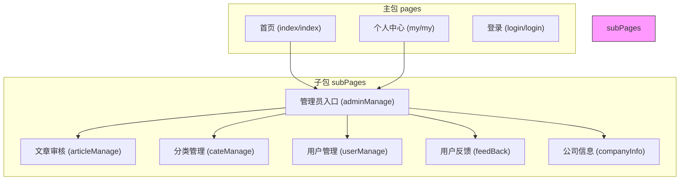
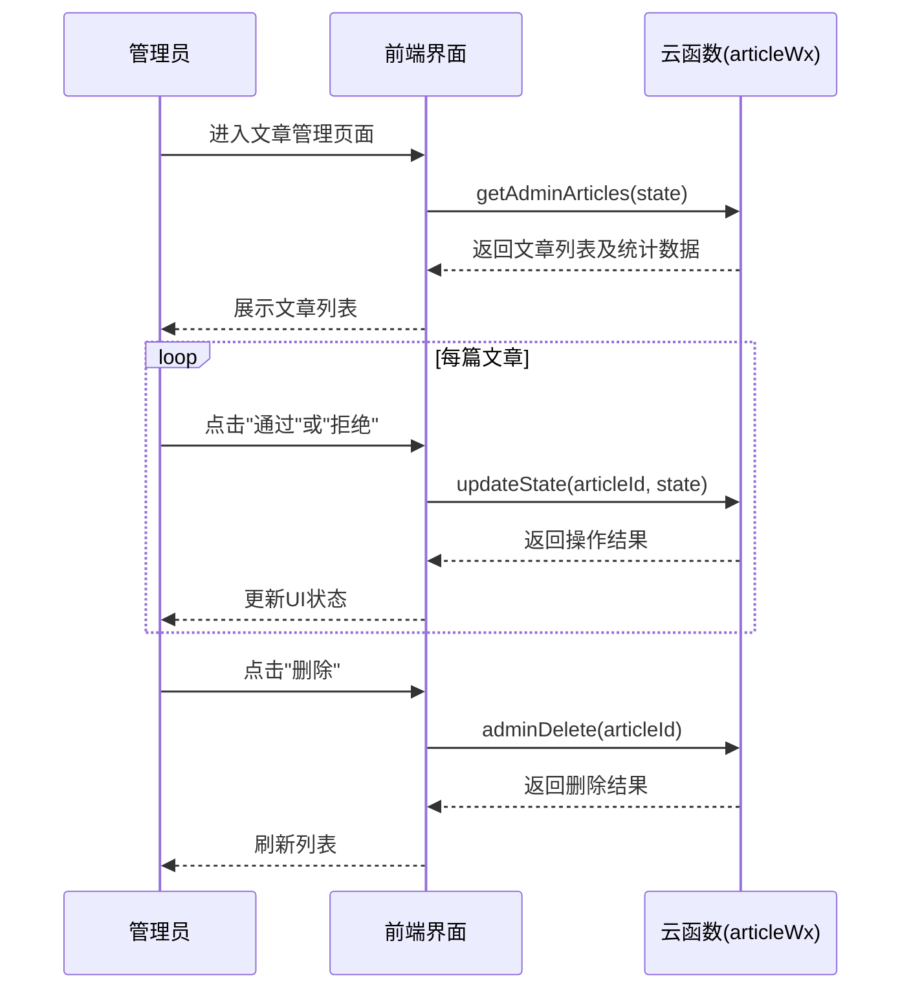
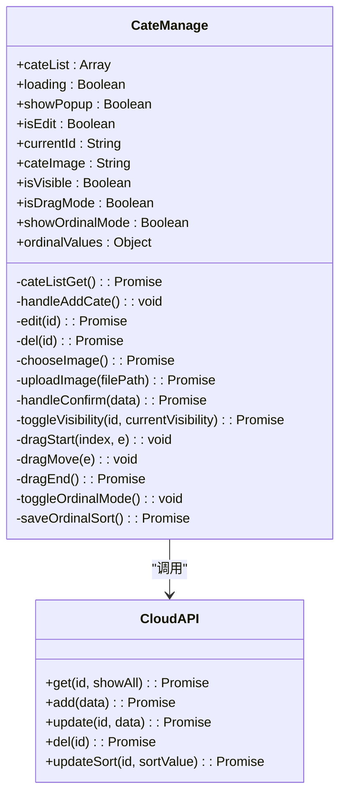
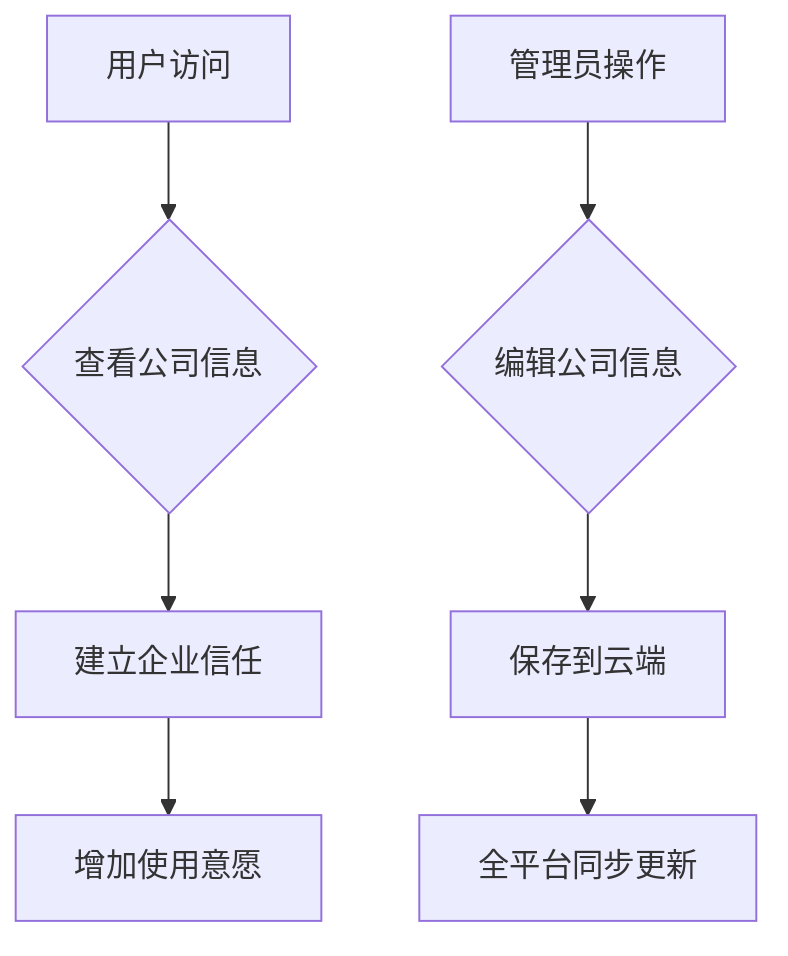

# 子包管理后台

<cite>
**本文档引用的文件**
- [pages.json](file://pages.json)
- [subPages/adminManage/adminManage.vue](file://subPages/adminManage/adminManage.vue)
- [subPages/articleManage/articleManage.vue](file://subPages/articleManage/articleManage.vue)
- [subPages/cateManage/cateManage.vue](file://subPages/cateManage/cateManage.vue)
- [subPages/userManage/userManage.vue](file://subPages/userManage/userManage.vue)
- [subPages/feedBack/feedBack.vue](file://subPages/feedBack/feedBack.vue)
- [subPages/companyInfo/companyInfo.vue](file://subPages/companyInfo/companyInfo.vue)
</cite>

## 目录
1. [项目结构](#项目结构)
2. [核心功能模块分析](#核心功能模块分析)
3. [权限控制策略与界面布局](#权限控制策略与界面布局)
4. [辅助功能业务价值](#辅助功能业务价值)
5. [子包拆分与性能优化](#子包拆分与性能优化)

## 项目结构

本项目采用uni-app框架构建，整体目录结构清晰，主要分为以下几个部分：

- `components/`：存放可复用的UI组件
- `pages/`：主包页面，包含首页、个人中心等核心功能
- `store/`：状态管理模块
- `style/`：全局样式和图标资源
- `subPages/`：后台管理子包，包含所有管理功能模块
- `uniCloud-aliyun/`：云端函数和数据库配置
- `uni_modules/`：第三方插件模块

其中，`subPages`目录作为独立的子包，专门承载后台管理系统的所有功能模块。



**图示来源**
- [pages.json](file://pages.json#L0-L186)

## 核心功能模块分析

### 管理员入口（adminManage）

管理员入口是整个后台管理系统的导航中枢。通过`adminManage.vue`文件实现，该页面提供了一个集中式的功能菜单，允许管理员快速访问各个管理模块。

```mermaid
flowchart TD
Start[管理员入口] --> Menu[功能菜单列表]
Menu --> CateManage["跳转至分类管理"]
Menu --> ArticleManage["跳转至文章管理"]
Menu --> UserManage["跳转至用户管理"]
Menu --> FeedManage["跳转至反馈管理"]
Menu --> CompanyInfo["跳转至公司信息"]
Menu --> UserInfoQuery["跳转至用户信息查询"]
Menu --> TogglePublish["发布按钮状态切换"]
Menu --> ToggleFloat["悬浮按钮状态切换"]
Menu --> ToggleAvatar["头像点击控制"]
Menu --> ToggleComment["评论功能控制"]
Menu --> ToggleLottery["抽奖模块控制"]
TogglePublish --> API[调用sendOn.update()]
ToggleFloat --> API
ToggleAvatar --> API
ToggleComment --> API
ToggleLottery --> API
API --> Event[广播状态变更事件]
Event --> OtherPages[其他页面监听并更新UI]
```

**图示来源**
- [subPages/adminManage/adminManage.vue](file://subPages/adminManage/adminManage.vue#L0-L460)

**本节来源**
- [subPages/adminManage/adminManage.vue](file://subPages/adminManage/adminManage.vue#L0-L460)

### 文章审核（articleManage）

文章审核模块负责对用户提交的内容进行审核管理。该模块提供了完整的审核工作流，包括待审核、已通过、已拒绝三种状态的统计与管理。



**图示来源**
- [subPages/articleManage/articleManage.vue](file://subPages/articleManage/articleManage.vue#L0-L451)

**本节来源**
- [subPages/articleManage/articleManage.vue](file://subPages/articleManage/articleManage.vue#L0-L451)

### 分类管理（cateManage）

分类管理模块提供了全面的分类体系维护功能，支持分类的增删改查、可见性控制以及排序管理。



**图示来源**
- [subPages/cateManage/cateManage.vue](file://subPages/cateManage/cateManage.vue#L0-L799)

**本节来源**
- [subPages/cateManage/cateManage.vue](file://subPages/cateManage/cateManage.vue#L0-L799)

### 用户管理（userManage）

用户管理模块实现了基础的用户信息查看功能，支持分页加载和下拉刷新。

```mermaid
flowchart LR
A[用户管理页面] --> B{页面挂载}
B --> C[getUserList()]
C --> D[调用user.getUserList()]
D --> E[返回用户数据]
E --> F[渲染用户列表]
G[下拉刷新] --> H[onPullDownRefresh()]
H --> I[重置页码并获取数据]
J[滚动到底部] --> K[loadMore()]
K --> L[页码+1并获取数据]
style A fill:#f9f,stroke:#333
style F fill:#bbf,stroke:#333
style E fill:#bbf,stroke:#333
```

**图示来源**
- [subPages/userManage/userManage.vue](file://subPages/userManage/userManage.vue#L0-L160)

**本节来源**
- [subPages/userManage/userManage.vue](file://subPages/userManage/userManage.vue#L0-L160)

## 权限控制策略与界面布局

### 权限控制策略

系统采用了基于角色的权限控制机制，不同管理功能对应不同的权限级别：

1. **管理员入口**：作为权限控制中心，可以动态开启/关闭多个功能开关
2. **文章审核**：需要审核权限才能执行通过、拒绝、删除操作
3. **分类管理**：需要分类管理权限才能进行增删改操作
4. **用户管理**：只读权限，仅能查看用户信息

权限验证主要通过`store/authSwitch.js`和`store/user.js`中的状态管理来实现，并在关键操作前进行登录状态检查。

### 界面布局原则

各管理模块遵循统一的设计语言和布局规范：

- **顶部区域**：显示模块标题和关键统计数据
- **内容区域**：采用卡片式布局，信息层次分明
- **操作区域**：按钮颜色区分操作类型（绿色=通过，红色=拒绝/删除）
- **交互反馈**：所有操作均有明确的成功/失败提示
- **响应式设计**：适配不同屏幕尺寸，保证移动端体验

## 辅助功能业务价值

### 用户反馈查看（feedBack）

用户反馈模块为产品迭代提供了重要的数据支持，其业务价值体现在：

- 收集用户对功能、界面、性能等方面的建议
- 建立用户与开发团队的直接沟通渠道
- 通过图片上传功能获取问题现场截图
- 提供联系方式便于后续跟进

该模块不仅是一个简单的表单提交功能，更是产品持续改进的重要输入源。

### 公司信息展示（companyInfo）

公司信息模块具有双重价值：

**对外价值**：
- 向用户展示企业基本信息，增强信任感
- 提供联系方式，方便商务合作
- 展示工作时间，管理用户服务预期

**对内价值**：
- 集中管理企业公开信息，避免信息不一致
- 支持动态更新，无需重新发布应用
- 统一品牌形象展示



**图示来源**
- [subPages/feedBack/feedBack.vue](file://subPages/feedBack/feedBack.vue#L0-L303)
- [subPages/companyInfo/companyInfo.vue](file://subPages/companyInfo/companyInfo.vue#L0-L203)

**本节来源**
- [subPages/feedBack/feedBack.vue](file://subPages/feedBack/feedBack.vue#L0-L303)
- [subPages/companyInfo/companyInfo.vue](file://subPages/companyInfo/companyInfo.vue#L0-L203)

## 子包拆分与性能优化

### 子包拆分优势

将后台管理功能拆分为独立子包带来了显著的性能提升：

1. **首屏加载优化**：主包体积减小，启动速度更快
2. **按需加载**：只有访问管理功能时才加载相关资源
3. **独立更新**：管理功能更新不影响主包稳定性
4. **内存优化**：非使用状态下自动释放子包内存

### 路由访问机制

通过`pages.json`中的`subPackages`配置实现子包路由：

```json
{
  "subPackages": [
    {
      "root": "subPages",
      "pages": [
        {
          "path": "adminManage/adminManage",
          "style": {
            "navigationBarTitleText": "后台管理"
          }
        },
        {
          "path": "articleManage/articleManage",
          "style": {
            "navigationBarTitleText": "文章管理"
          }
        }
        // 其他页面...
      ]
    }
  ]
}
```

当用户首次访问子包页面时，小程序会自动下载对应的子包资源；后续访问则从本地缓存加载，确保快速响应。

**本节来源**
- [pages.json](file://pages.json#L0-L186)