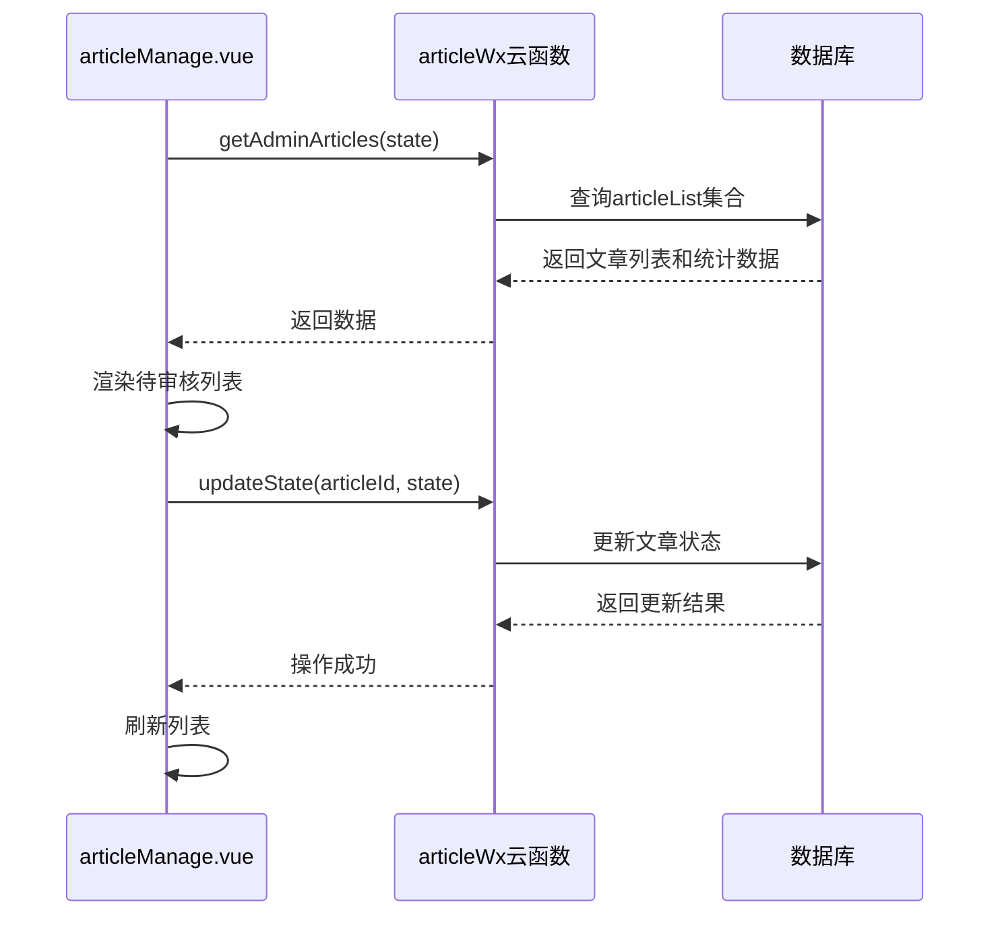
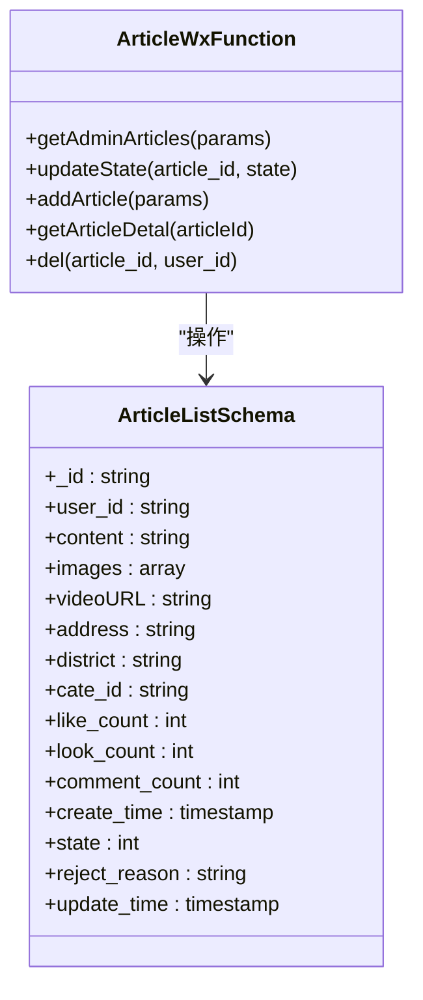
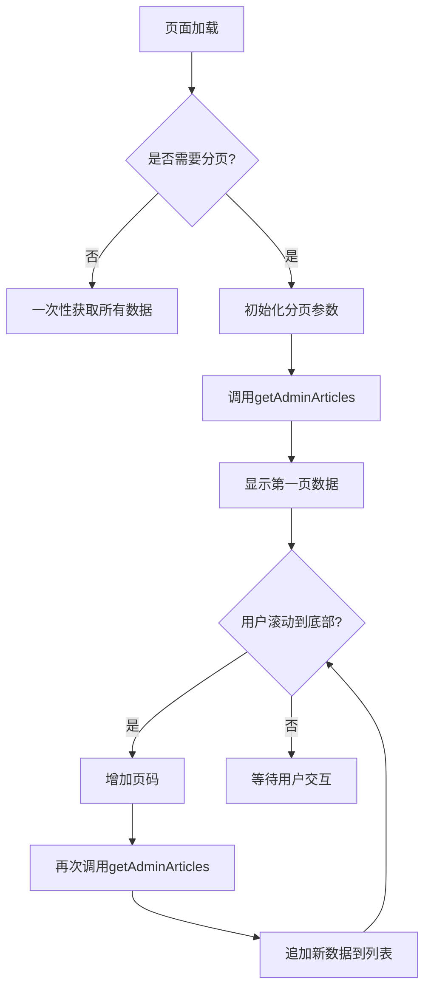
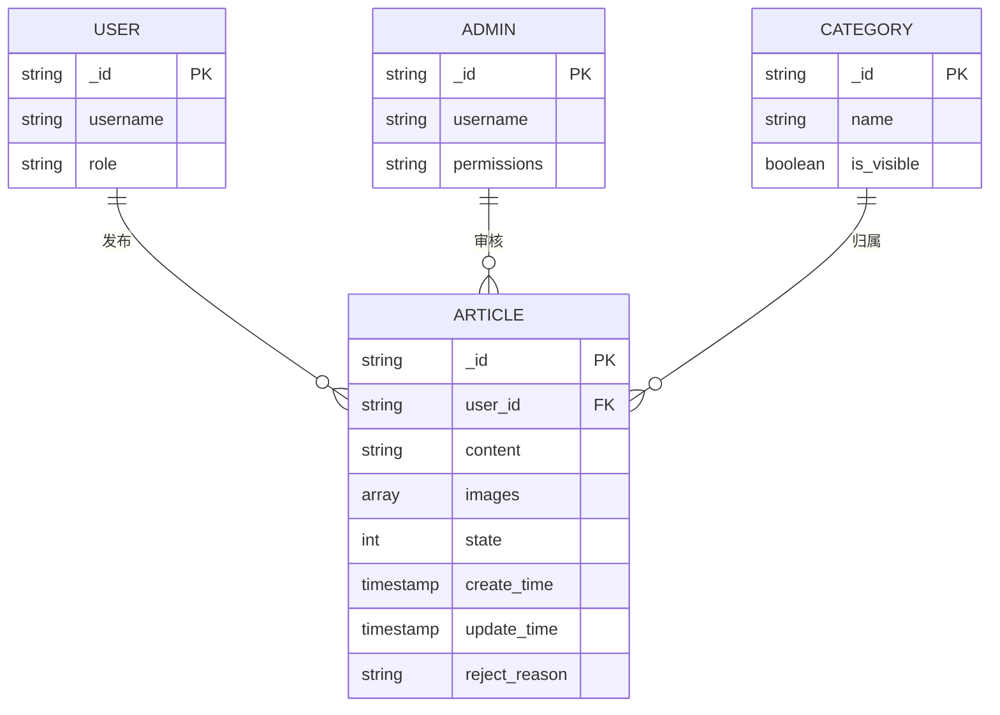

# 文章审核管理

<cite>
**本文档引用文件**   
- [articleManage.vue](file://subPages/articleManage/articleManage.vue)
- [articleWx/index.obj.js](file://uniCloud-aliyun/cloudfunctions/articleWx/index.obj.js)
- [articleList.schema.json](file://uniCloud-aliyun/database/articleList.schema.json)
- [z-paging.vue](file://uni_modules/z-paging/components/z-paging/z-paging.vue)
</cite>

## 目录
1. [简介](#简介)
2. [前端实现分析](#前端实现分析)
3. [后端实现分析](#后端实现分析)
4. [分页加载机制](#分页加载机制)
5. [权限控制与数据查询](#权限控制与数据查询)
6. [日志记录建议](#日志记录建议)
7. [性能优化策略](#性能优化策略)
8. [结论](#结论)

## 简介
本文档深入解析`articleManage.vue`实现的文章审核功能，涵盖待审核列表渲染、文章状态更新（通过调用`articleWx`云函数）、内容查看与驳回机制。详细说明前端如何通过`z-paging`组件实现高效分页加载，后端如何基于`articleList.schema.json`进行数据查询与权限控制。同时提供审核操作的日志记录建议和性能优化策略，确保在大规模内容场景下的响应速度。

**Section sources**
- [articleManage.vue](file://subPages/articleManage/articleManage.vue#L1-L450)

## 前端实现分析
`articleManage.vue`是文章审核管理的核心前端组件，采用Vue 3的组合式API实现。该组件主要包含三个核心功能：待审核列表展示、文章状态更新和内容预览。

组件通过`uniCloud.importObject('articleWx', { customUI: true })`导入`articleWx`云函数对象，建立前后端通信桥梁。页面初始化时，在`onMounted`钩子中调用`getArticleList()`方法获取待审核文章列表，并将结果存储在`articleList`响应式变量中。

文章状态切换通过`handleStatusChange`方法实现，用户点击"待审核"、"已通过"或"已拒绝"标签时，会更新`currentStatus`值并重新请求对应状态的文章列表。审核操作由`handleAudit`方法处理，当管理员点击"通过"或"拒绝"按钮时，该方法会调用`updateState`云函数，传入文章ID和目标状态（1表示通过，2表示拒绝）。

对于图片内容，组件实现了预览功能。`previewImage`方法利用`uni.previewImage` API，允许管理员点击缩略图查看原图，提升审核体验。删除功能通过`handleDelete`方法实现，调用`adminDelete`云函数前会弹出确认对话框，防止误操作。

**Diagram sources**
- [articleManage.vue](file://subPages/articleManage/articleManage.vue#L1-L450)
- [articleWx/index.obj.js](file://uniCloud-aliyun/cloudfunctions/articleWx/index.obj.js#L327-L374)

**Section sources**
- [articleManage.vue](file://subPages/articleManage/articleManage.vue#L1-L450)

## 后端实现分析
后端逻辑主要由`articleWx`云函数实现，该函数提供了完整的文章管理接口。核心方法包括`getAdminArticles`和`updateState`，分别用于获取管理后台文章列表和更新文章状态。

`getAdminArticles`方法接收一个包含`state`参数的对象，根据传入的状态值筛选文章。若未指定状态，则返回所有文章。查询结果按创建时间倒序排列，确保最新提交的文章优先显示。该方法还并发执行三个计数查询，分别统计待审核、已通过和已拒绝的文章数量，为前端提供实时统计数据。

`updateState`方法负责处理文章状态变更。在更新状态前，该方法会验证文章是否存在以及当前状态是否为"待审核"（state=0），防止重复审核。状态更新后，会设置`update_time`字段为当前时间戳。若状态为"拒绝"（state=2），还会添加默认的拒绝原因："您发布的内容不符合规范，请修改后重新发布"。

数据库模式由`articleList.schema.json`定义，其中`state`字段被约束为整数类型，取值范围为0-2，分别代表"待审核"、"已通过"和"已拒绝"三种状态。该模式还定义了`create_time`和`update_time`字段的默认值为当前时间戳，确保时间数据的准确性。

**Diagram sources**
- [articleWx/index.obj.js](file://uniCloud-aliyun/cloudfunctions/articleWx/index.obj.js#L327-L374)
- [articleList.schema.json](file://uniCloud-aliyun/database/articleList.schema.json#L0-L158)

**Section sources**
- [articleWx/index.obj.js](file://uniCloud-aliyun/cloudfunctions/articleWx/index.obj.js#L327-L374)
- [articleList.schema.json](file://uniCloud-aliyun/database/articleList.schema.json#L0-L158)

## 分页加载机制
前端通过`z-paging`组件实现高效的分页加载机制。虽然`articleManage.vue`中未直接使用`z-paging`组件，但项目中已集成该插件，可用于未来优化。

`z-paging`是一个高性能的分页组件，支持下拉刷新和上拉加载更多功能。其核心优势在于低耦合和高灵活性，能够自动管理分页逻辑，无需在页面data中定义分页相关变量。组件支持自定义下拉刷新效果、空数据图、主题模式切换等功能，并兼容Vue&NVue、Vue2&Vue3、JS&TS等多种技术栈。

在`articleManage.vue`中，虽然没有使用`z-paging`，但其实现了类似的分页思想。通过`getAdminArticles`云函数的简单调用，即可获取分页数据。未来可考虑集成`z-paging`以提升用户体验，特别是在处理大量待审核文章时，其虚拟列表功能可轻松渲染百万级列表数据，避免页面卡顿。

**Diagram sources**
- [z-paging.vue](file://uni_modules/z-paging/components/z-paging/z-paging.vue#L0-L538)

**Section sources**
- [z-paging.vue](file://uni_modules/z-paging/components/z-paging/z-paging.vue#L0-L538)

## 权限控制与数据查询
系统的权限控制主要在后端实现，通过`articleList.schema.json`中的`permission`字段定义。该字段规定了对`articleList`集合的读、创建、更新和删除权限，均要求用户已登录（`auth.uid != null`）。

在`articleWx`云函数中，`updateState`方法包含了额外的安全检查。它首先验证文章是否存在，然后检查当前状态是否为"待审核"，防止对已审核文章进行二次操作。这种双重验证机制有效避免了数据不一致问题。

数据查询方面，`getAdminArticles`方法采用了高效的查询策略。通过`where`条件筛选特定状态的文章，并使用`orderBy`按创建时间倒序排列。为了提高性能，该方法还使用`Promise.all`并发执行三个计数查询，减少了数据库往返次数。

**Diagram sources**
- [articleList.schema.json](file://uniCloud-aliyun/database/articleList.schema.json#L0-L158)

**Section sources**
- [articleList.schema.json](file://uniCloud-aliyun/database/articleList.schema.json#L0-L158)

## 日志记录建议
为了确保审核操作的可追溯性，建议实施以下日志记录策略：

1. **操作日志表设计**：创建独立的`audit_log`集合，记录每次审核操作的详细信息，包括操作人ID、操作时间、文章ID、原状态、目标状态和操作备注。

2. **云函数增强**：在`updateState`方法中，状态更新成功后，自动向`audit_log`集合插入一条记录。这可以通过数据库事务确保数据一致性。

3. **前端提示优化**：在审核成功提示中，除了显示"已通过"或"已拒绝"外，还可显示预计的生效时间，提升用户体验。

4. **批量操作支持**：未来可扩展支持批量审核功能，并在日志中记录批量操作的统计信息，如"批量通过5篇文章"。

5. **异常监控**：集成错误监控服务，捕获并记录审核过程中出现的任何异常，便于问题排查。

这些日志记录措施不仅能提高系统的透明度，还能在发生争议时提供可靠的审计依据。

**Section sources**
- [articleWx/index.obj.js](file://uniCloud-aliyun/cloudfunctions/articleWx/index.obj.js#L327-L374)

## 性能优化策略
针对大规模内容场景，建议采取以下性能优化策略：

1. **索引优化**：在`articleList`集合的`state`和`create_time`字段上创建复合索引，显著提升查询性能。可使用`db.collection('articleList').createIndex({state: 1, create_time: -1})`命令创建。

2. **缓存机制**：引入Redis等内存数据库，缓存热门分类的文章列表和统计数据，减少对主数据库的访问压力。

3. **分页优化**：对于待审核列表，可采用游标分页（Cursor-based Pagination）替代传统的偏移量分页，避免`skip`操作在大数据集上的性能退化。

4. **异步处理**：将非关键操作（如发送通知、更新统计）放入消息队列异步处理，缩短API响应时间。

5. **CDN加速**：为文章中的图片资源配置CDN，利用`thumbnailURL`参数获取缩略图，减少带宽消耗和加载时间。

6. **数据库读写分离**：在高并发场景下，可配置数据库读写分离，将查询请求路由到只读副本，减轻主库压力。

7. **连接池管理**：优化数据库连接池配置，合理设置最大连接数和超时时间，避免连接泄漏。

通过实施这些策略，可确保系统在面对海量内容时仍能保持快速响应，为管理员提供流畅的审核体验。

**Section sources**
- [articleWx/index.obj.js](file://uniCloud-aliyun/cloudfunctions/articleWx/index.obj.js#L327-L374)
- [articleList.schema.json](file://uniCloud-aliyun/database/articleList.schema.json#L0-L158)

## 结论
`articleManage.vue`实现了一套完整且高效的文章审核系统，从前端界面到后端逻辑都体现了良好的设计思路。通过`z-paging`组件的潜在集成，系统具备进一步优化用户体验的基础。后端基于`articleList.schema.json`的权限控制和数据查询机制确保了系统的安全性和可靠性。

建议未来重点关注日志记录和性能优化两个方面。完善的日志系统能提高操作的可追溯性，而针对性的性能优化策略则能确保系统在大规模内容场景下的稳定运行。随着业务增长，还可考虑引入机器学习算法进行内容预审，进一步提升审核效率。

**Section sources**
- [articleManage.vue](file://subPages/articleManage/articleManage.vue#L1-L450)
- [articleWx/index.obj.js](file://uniCloud-aliyun/cloudfunctions/articleWx/index.obj.js#L327-L374)
- [articleList.schema.json](file://uniCloud-aliyun/database/articleList.schema.json#L0-L158)