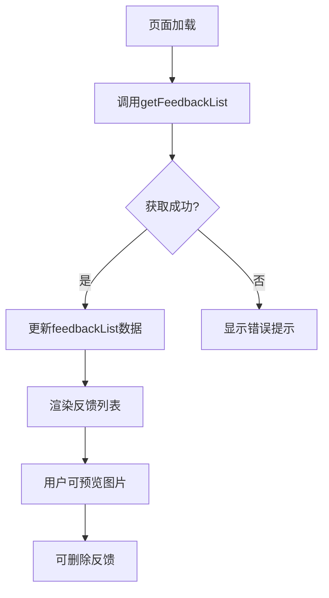
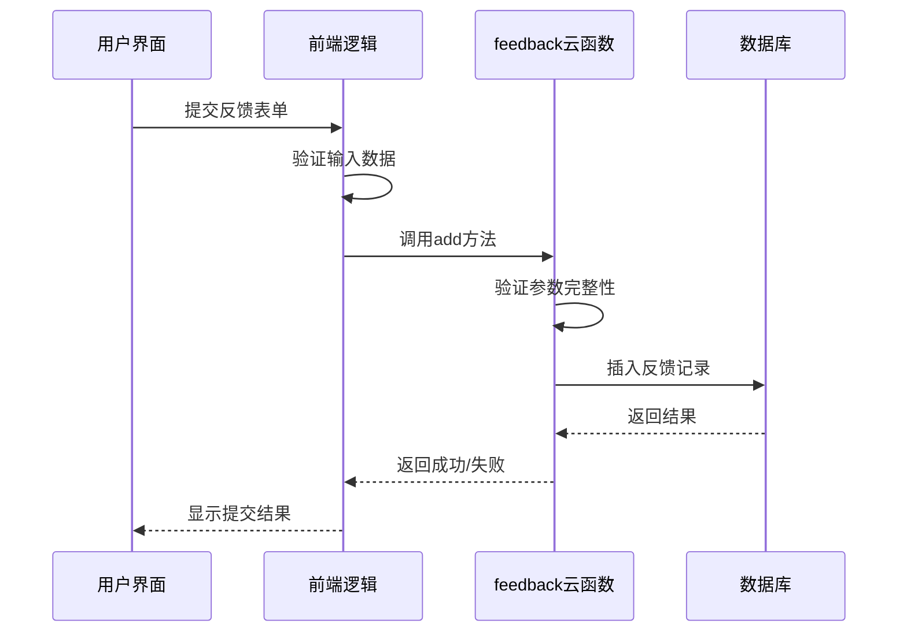
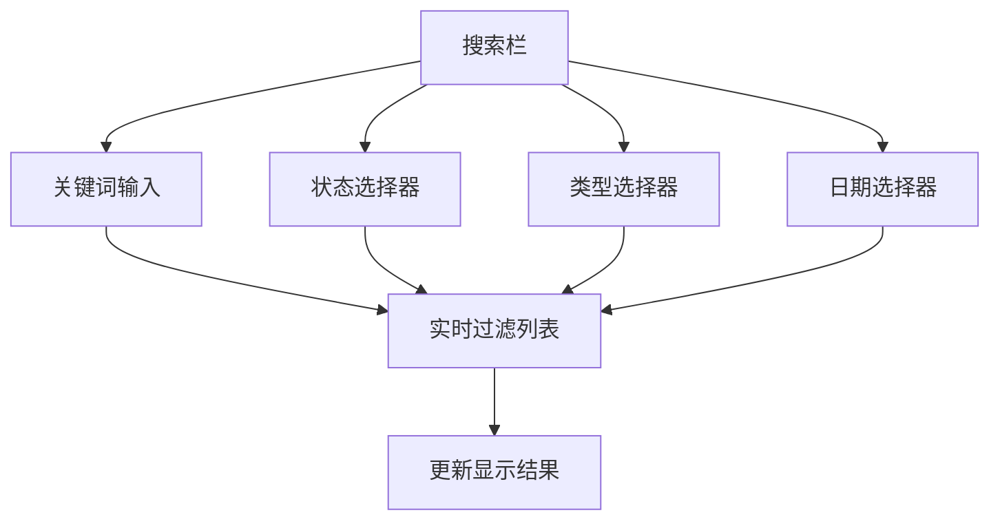

# 用户反馈查看

<cite>
**本文档引用的文件**
- [feedBack.vue](file://subPages/feedBack/feedBack.vue)
- [feedManage.vue](file://subPages/feedManage/feedManage.vue)
- [index.obj.js](file://uniCloud-aliyun/cloudfunctions/feedback/index.obj.js)
- [feedback.schema.json](file://uniCloud-aliyun/database/feedback.schema.json)
</cite>

## 目录
1. [简介](#简介)
2. [用户反馈功能实现](#用户反馈功能实现)
3. [前端与云函数交互逻辑](#前端与云函数交互逻辑)
4. [反馈数据结构解析](#反馈数据结构解析)
5. [运营功能增强建议](#运营功能增强建议)
6. [隐私保护措施](#隐私保护措施)
7. [总结](#总结)

## 简介
本项目中的用户反馈系统由前端页面、云函数和数据库三部分构成，实现了完整的用户意见反馈流程。系统包含两个核心页面：`feedBack.vue`用于用户提交反馈，`feedManage.vue`用于管理员查看和管理反馈。通过`feedback`云函数作为中间层，连接前端与数据库，确保数据的安全访问和处理。

## 用户反馈功能实现

### 反馈列表展示
`feedManage.vue`页面负责展示所有用户提交的反馈信息。该页面在加载时会调用`getList`方法获取反馈列表数据，并将其渲染为可视化的列表项。每个列表项包含反馈类型、提交时间、内容摘要、图片预览和联系方式等信息。

反馈列表按创建时间倒序排列，最新的反馈显示在最上方。对于包含图片的反馈，用户可以点击图片进行预览。页面还提供了删除功能，管理员可以通过确认对话框删除无效或已处理的反馈记录。



**Diagram sources**
- [feedManage.vue](file://subPages/feedManage/feedManage.vue#L0-L200)

**Section sources**
- [feedManage.vue](file://subPages/feedManage/feedManage.vue#L0-L200)

### 详情查看
当用户点击反馈列表中的某一项时，可以查看该反馈的详细信息。详情包括完整的反馈内容、所有上传的图片、联系方式以及反馈的基本信息（如类型和提交时间）。图片采用网格布局展示，支持点击放大预览。

### 处理状态标记
目前系统中反馈的处理状态通过`status`字段表示，定义了三种状态：0-未处理、1-处理中、2-已处理。虽然当前界面没有直接提供状态修改功能，但数据库结构已经支持这一特性，为后续功能扩展奠定了基础。

## 前端与云函数交互逻辑

### 云函数调用机制
前端通过`uniCloud.importObject('feedback')`方式导入并调用`feedback`云函数。这种设计模式将业务逻辑封装在云端，提高了系统的安全性和可维护性。

在`feedBack.vue`中，用户提交反馈时会执行以下步骤：
1. 检查用户登录状态
2. 验证输入内容（至少10个字）
3. 验证联系方式格式（手机号或邮箱）
4. 调用云函数`add`方法提交数据



**Diagram sources**
- [feedBack.vue](file://subPages/feedBack/feedBack.vue#L0-L302)
- [index.obj.js](file://uniCloud-aliyun/cloudfunctions/feedback/index.obj.js#L0-L106)

**Section sources**
- [feedBack.vue](file://subPages/feedBack/feedBack.vue#L0-L302)
- [index.obj.js](file://uniCloud-aliyun/cloudfunctions/feedback/index.obj.js#L0-L106)

### 错误处理与用户体验
系统实现了完善的错误处理机制。无论是网络问题、数据验证失败还是服务器错误，都会通过`uni.showToast`向用户显示友好的提示信息。同时，通过设置`isSubmitting`状态防止重复提交，提升了用户体验。

## 反馈数据结构解析

### Schema结构分析
`feedback.schema.json`文件定义了反馈数据的完整结构和约束条件：

```json
{
  "bsonType": "object",
  "required": ["type", "content", "user_id", "create_time"],
  "properties": {
    "type": {
      "bsonType": "string",
      "enum": ["功能建议", "界面设计", "性能问题", "其他"]
    },
    "content": {
      "bsonType": "string",
      "minLength": 10,
      "maxLength": 500
    },
    "contact": {
      "bsonType": "string",
      "maxLength": 50
    },
    "images": {
      "bsonType": "array",
      "maxItems": 3,
      "items": {
        "bsonType": "object",
        "properties": {
          "name": {"bsonType": "string"},
          "url": {"bsonType": "string"}
        }
      }
    },
    "user_id": {"bsonType": "string"},
    "create_time": {"bsonType": "timestamp"},
    "status": {
      "bsonType": "int",
      "minimum": 0,
      "maximum": 2,
      "defaultValue": 0
    }
  }
}
```

**Diagram sources**
- [feedback.schema.json](file://uniCloud-aliyun/database/feedback.schema.json#L0-L0)

**Section sources**
- [feedback.schema.json](file://uniCloud-aliyun/database/feedback.schema.json#L0-L0)

### 上报内容结构说明
- **问题类型**: 限定为四种枚举值，确保分类统一
- **反馈内容**: 必填字段，长度限制在10-500字之间
- **截图附件**: 最多可上传3张图片，每张图片包含名称和URL
- **联系方式**: 可选填写，支持手机号或邮箱格式验证
- **用户标识**: 自动关联提交用户的ID，便于追溯
- **时间戳**: 记录创建时间，用于排序和统计分析

## 运营功能增强建议

### 搜索过滤功能
建议在`feedManage.vue`中增加搜索和过滤功能，提升运营效率：

1. **关键词搜索**: 支持按反馈内容、联系方式等字段进行模糊搜索
2. **状态筛选**: 添加下拉菜单，按"未处理"、"处理中"、"已处理"状态筛选
3. **类型筛选**: 按反馈类型（功能建议、界面设计等）进行筛选
4. **时间范围**: 支持按日期范围查询反馈记录



### 导出功能
建议增加数据导出功能，便于离线分析和存档：

1. **导出格式**: 支持CSV或Excel格式
2. **导出内容**: 包含所有反馈字段，特别是图片URL需要完整导出
3. **批量操作**: 支持全量导出或按筛选条件导出
4. **导出记录**: 记录每次导出的时间和操作人，确保数据安全

## 隐私保护措施

### 数据最小化原则
系统遵循数据最小化原则，仅收集必要的反馈信息：
- 联系方式为选填项，尊重用户隐私选择
- 不收集用户设备信息、位置等敏感数据
- 图片上传经过压缩处理，减少元数据泄露风险

### 访问权限控制
通过数据库权限配置确保数据安全：
- 读取权限公开，便于管理员查看
- 创建权限限制为已登录用户
- 更新和删除权限关闭，防止数据篡改

### 敏感信息处理
建议进一步加强隐私保护：
1. **联系方式脱敏**: 在列表展示时对手机号和邮箱进行脱敏处理（如138****1234）
2. **自动清理**: 设置过期策略，定期清理已处理超过一定期限的反馈
3. **访问日志**: 记录管理员对反馈数据的访问和操作日志
4. **加密存储**: 对联系方式等敏感字段考虑加密存储

## 总结
当前的用户反馈系统已经实现了基本的提交、查看和管理功能，架构清晰，安全性良好。通过引入搜索过滤和数据导出功能，可以显著提升运营效率。同时，建议进一步完善隐私保护措施，特别是在敏感信息处理和访问控制方面，以符合日益严格的隐私保护要求。

系统的模块化设计为未来功能扩展提供了良好基础，如增加回复功能、满意度调查、自动化分类等，都可以在此架构上逐步实现。