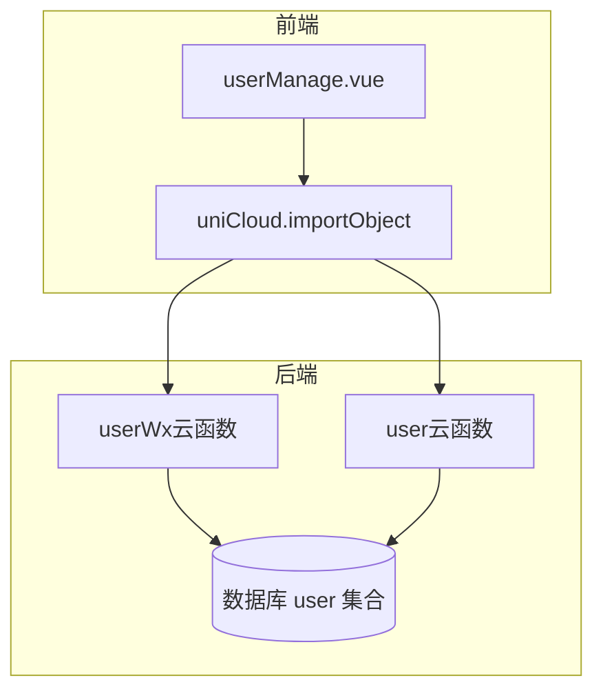
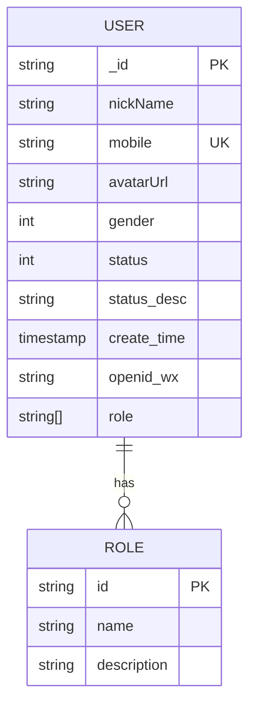
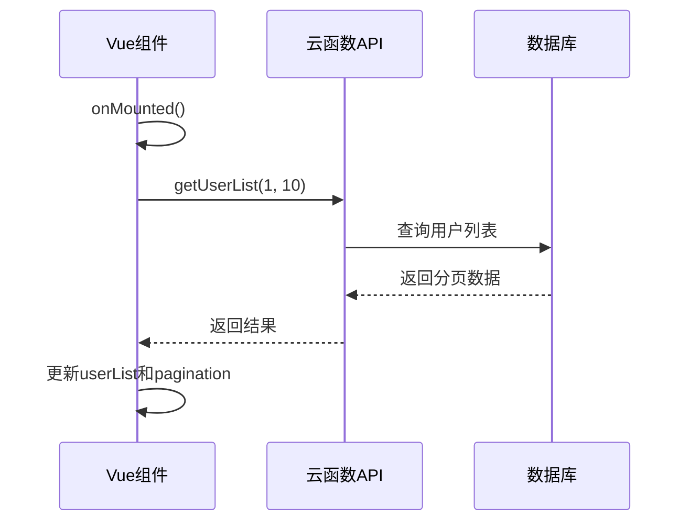
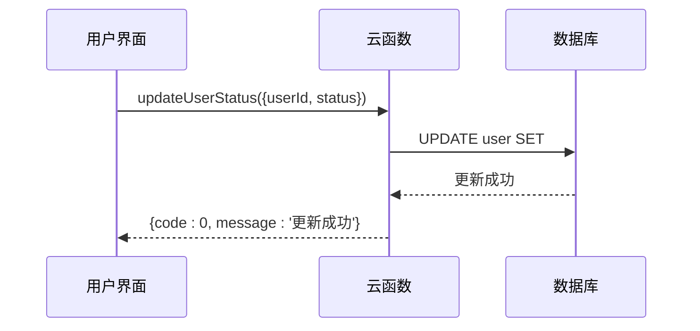
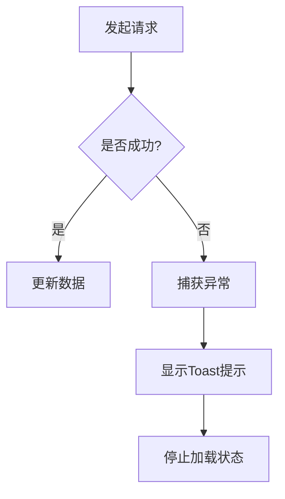

# 用户管理

<cite>
**本文档引用文件**   
- [userManage.vue](file://subPages/userManage/userManage.vue)
- [userWx/index.obj.js](file://uniCloud-aliyun/cloudfunctions/userWx/index.obj.js)
- [user/index.obj.js](file://uniCloud-aliyun/cloudfunctions/user/index.obj.js)
- [user.schema.json](file://uniCloud-aliyun/database/user.schema.json)
- [userDetail.vue](file://subPages/userDetail/userDetail.vue)
</cite>

## 目录
1. [项目结构](#项目结构)
2. [核心组件分析](#核心组件分析)
3. [用户数据模型解析](#用户数据模型解析)
4. [前端界面交互逻辑](#前端界面交互逻辑)
5. [后端云函数接口调用流程](#后端云函数接口调用流程)
6. [分页加载与搜索过滤实现](#分页加载与搜索过滤实现)
7. [状态启用/禁用操作机制](#状态启用禁用操作机制)
8. [错误处理机制](#错误处理机制)
9. [性能优化建议](#性能优化建议)

## 项目结构

根据项目目录结构，用户管理功能主要分布在以下路径：
- 前端页面：`subPages/userManage/userManage.vue`
- 后端云函数：`uniCloud-aliyun/cloudfunctions/userWx/` 和 `uniCloud-aliyun/cloudfunctions/user/`
- 数据库模型定义：`uniCloud-aliyun/database/user.schema.json`

该系统采用前后端分离架构，前端通过uniCloud的云对象调用方式与后端进行通信。



**图示来源**
- [userManage.vue](file://subPages/userManage/userManage.vue)
- [userWx/index.obj.js](file://uniCloud-aliyun/cloudfunctions/userWx/index.obj.js)
- [user/index.obj.js](file://uniCloud-aliyun/cloudfunctions/user/index.obj.js)

## 核心组件分析

### 用户列表管理组件 (userManage.vue)

`userManage.vue` 是用户管理的核心前端组件，实现了用户列表的展示、分页加载和基本交互功能。

**关键特性：**
- 使用 Vue 3 的 Composition API (`setup` 语法)
- 集成 `uni-load-more` 组件实现滚动加载
- 支持下拉刷新功能
- 响应式数据绑定

```mermaid
classDiagram
class UserManage {
+ref userList
+ref loading
+ref pagination
+function getUserList()
+function onPullDownRefresh()
+function loadMore()
+function formatDate()
}
UserManage --> "1" "n" uniCloud.importObject : 调用
UserManage --> "1" "1" uni-load-more : 使用
```

**组件来源**
- [userManage.vue](file://subPages/userManage/userManage.vue)

## 用户数据模型解析

### user.schema.json 数据模型详解

`user.schema.json` 定义了用户数据的完整结构、验证规则和权限控制。

#### 字段含义说明

| 字段名 | 类型 | 必填 | 描述 |
|-------|------|-----|------|
| _id | string | 是 | 系统自动生成的唯一标识 |
| nickName | string | 否 | 用户昵称 |
| mobile | string | 是 | 手机号，需符合正则 `^1[3-9]\d{9}$` |
| avatarUrl | string | 否 | 头像地址 |
| gender | int | 否 | 性别：0-未知，1-男，2-女 |
| status | int | 否 | 账号状态：0-正常，1-禁用，2-封禁 |
| status_desc | string | 否 | 状态说明（如封禁原因） |
| create_time | timestamp | 否 | 创建时间，默认为当前时间 |
| openid_wx | string | 否 | 微信OpenID |
| role | array[string] | 否 | 角色列表，可选值：user, vip, admin |

#### 权限规则

```json
"permission": {
    "read": true,
    "create": true,
    "update": true,
    "delete": false
}
```

- **读取权限**：所有用户均可读取
- **创建权限**：允许创建新用户
- **更新权限**：允许更新用户信息
- **删除权限**：禁止删除用户记录（数据安全考虑）

#### 索引设置

虽然 schema 文件中未显式定义索引，但从查询逻辑可推断出以下隐式索引需求：



**数据模型来源**
- [user.schema.json](file://uniCloud-aliyun/database/user.schema.json)

## 前端界面交互逻辑

### 数据流与生命周期



### 关键方法分析

- `getUserList()`：获取用户列表主方法
- `onPullDownRefresh()`：下拉刷新触发器
- `loadMore()`：滚动到底部时加载更多
- `formatDate()`：时间戳格式化工具

这些方法共同构成了流畅的用户体验。

**界面逻辑来源**
- [userManage.vue](file://subPages/userManage/userManage.vue)

## 后端云函数接口调用流程

### 云函数调用链路

```mermaid
flowchart TD
A[userManage.vue] --> B["importObject('user')"]
B --> C[/cloudfunctions/user/index.obj.js/]
C --> D[getUserList()]
D --> E[databaseForJQL]
E --> F[(user collection)]
F --> G{返回结果}
G --> H[userManage.vue]
```

### 接口映射关系

| 前端调用 | 后端实现 | 功能描述 |
|---------|----------|--------|
| userApi.getUserList() | user/index.obj.js::getUserList | 获取分页用户列表 |
| userApi.queryUsers() | user/index.obj.js::queryUsers | 搜索过滤用户 |
| userApi.updateUserStatus() | user/index.obj.js::updateUserStatus | 更新用户状态 |

**接口调用来源**
- [userManage.vue](file://subPages/userManage/userManage.vue)
- [user/index.obj.js](file://uniCloud-aliyun/cloudfunctions/user/index.obj.js)

## 分页加载与搜索过滤实现

### 分页参数设计

```javascript
const pagination = ref({
    page: 1,
    pageSize: 10,
    total: 0
})
```

- **page**: 当前页码
- **pageSize**: 每页数量
- **total**: 总记录数

### 分页查询实现

后端使用标准的分页查询模式：

```sql
SELECT * FROM user 
ORDER BY create_time DESC 
LIMIT pageSize OFFSET (page-1)*pageSize
```

### 搜索过滤逻辑

虽然当前 `userManage.vue` 未实现搜索功能，但 `user/index.obj.js` 中提供了 `queryUsers` 方法支持按手机号和昵称搜索：

```javascript
if (mobile) {
    where.mobile = new RegExp(mobile);
}
if (nickName) {
    where.nickName = new RegExp(nickName);
}
```

**分页与搜索来源**
- [userManage.vue](file://subPages/userManage/userManage.vue#L6-L12)
- [user/index.obj.js](file://uniCloud-aliyun/cloudfunctions/user/index.obj.js#L50-L75)

## 状态启用/禁用操作机制

### 状态字段设计

用户状态通过 `status` 字段管理：
- **0**: 正常
- **1**: 禁用
- **2**: 封禁

配合 `status_desc` 字段提供详细说明。

### 状态更新流程



### 实际应用示例

在 `userDetail.vue` 中可以看到完整的状态管理UI：

```javascript
const updateUserStatus = async (status) => {
    try {
        await userApi.updateUserStatus({
            userId: userId.value,
            status: status
        });
        // 成功后重新获取用户信息
        getUserDetail();
    } catch (e) {
        // 错误处理
    }
};
```

**状态管理来源**
- [user.schema.json](file://uniCloud-aliyun/database/user.schema.json#L25-L35)
- [user/index.obj.js](file://uniCloud-aliyun/cloudfunctions/user/index.obj.js#L85-L115)
- [userDetail.vue](file://subPages/userDetail/userDetail.vue#L46-L72)

## 错误处理机制

### 前端错误处理



具体实现：

```javascript
try {
    const result = await userApi.getUserList(...)
    if (result.code === 0) {
        // 成功处理
    } else {
        uni.showToast({ title: result.msg })
    }
} catch (e) {
    uni.showToast({ 
        title: e.message || '获取数据失败',
        icon: 'none' 
    })
} finally {
    loading.value = false
}
```

### 后端错误处理

后端统一返回标准化错误响应：

```json
{
    "code": -1,
    "msg": "错误信息",
    "data": null
}
```

**错误处理来源**
- [userManage.vue](file://subPages/userManage/userManage.vue#L14-L38)
- [user/index.obj.js](file://uniCloud-aliyun/cloudfunctions/user/index.obj.js#L25-L40)

## 性能优化建议

### 当前性能特征分析

| 指标 | 现状 | 建议 |
|------|------|------|
| 数据查询 | 全量字段查询 | 只查询必要字段 |
| 网络传输 | 无压缩 | 启用GZIP压缩 |
| 缓存策略 | 无缓存 | 添加Redis缓存 |
| 索引优化 | 依赖默认索引 | 为mobile和status添加索引 |

### 具体优化方案

1. **数据库查询优化**
   ```javascript
   // 修改为只查询需要的字段
   .field({
       _id: true,
       nickName: true,
       mobile: true,
       status: true,
       create_time: true
   })
   ```

2. **添加搜索索引**
   ```json
   // 在schema中建议添加索引配置
   "indexes": [
       {
           "key": {
               "mobile": 1
           },
           "name": "idx_mobile"
       },
       {
           "key": {
               "status": 1
           },
           "name": "idx_status"
       }
   ]
   ```

3. **实现本地缓存**
   ```javascript
   // 在getUserList中添加缓存逻辑
   const cacheKey = `userList_${page}_${pageSize}`
   const cached = uni.getStorageSync(cacheKey)
   if (cached && Date.now() - cached.timestamp < 300000) { // 5分钟内有效
       return cached.data
   }
   ```

4. **虚拟滚动优化**
   对于大量用户数据，建议使用虚拟滚动代替普通列表渲染。

**性能优化来源**
- [userManage.vue](file://subPages/userManage/userManage.vue)
- [user/index.obj.js](file://uniCloud-aliyun/cloudfunctions/user/index.obj.js)
- [user.schema.json](file://uniCloud-aliyun/database/user.schema.json)