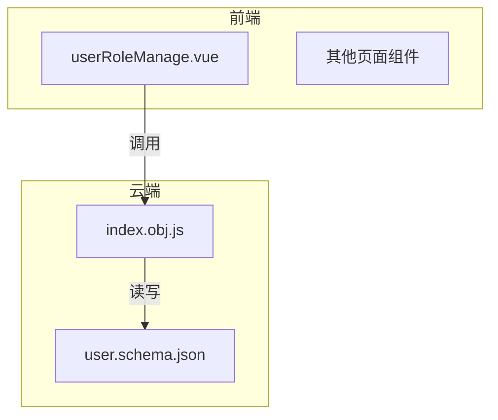
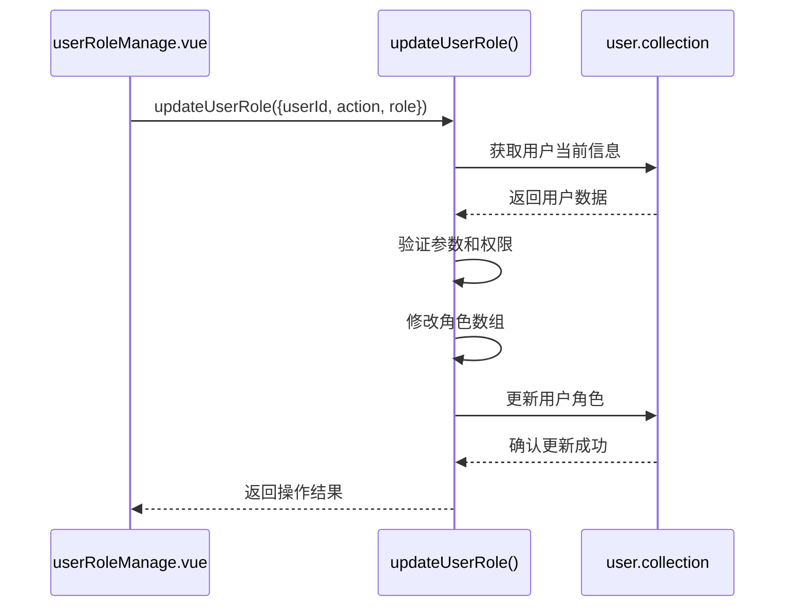
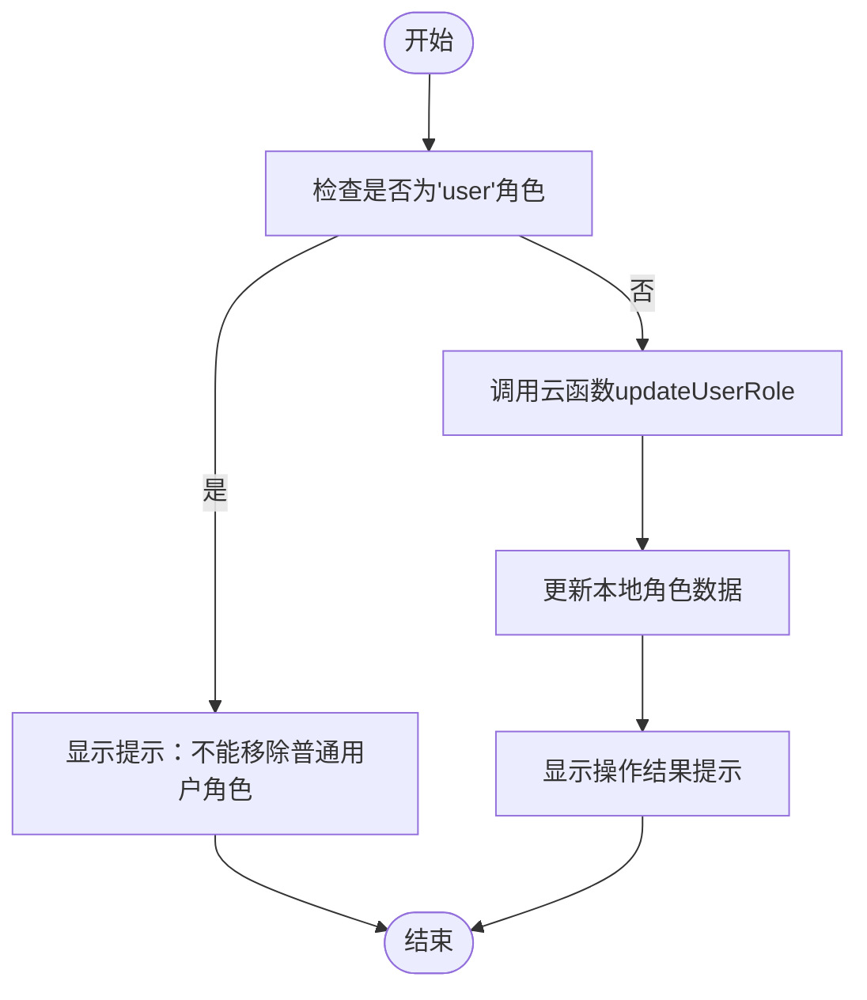
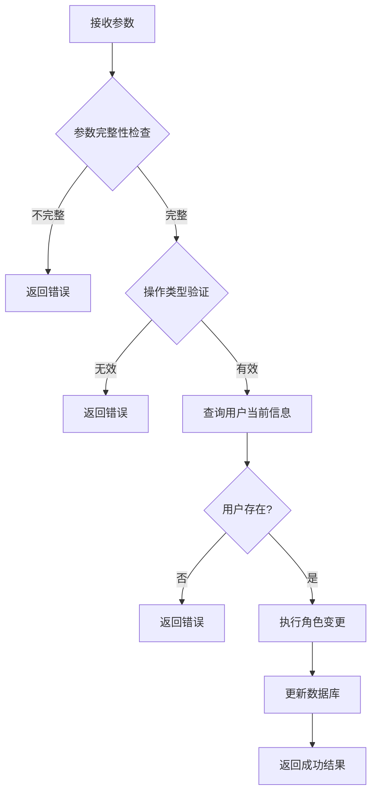
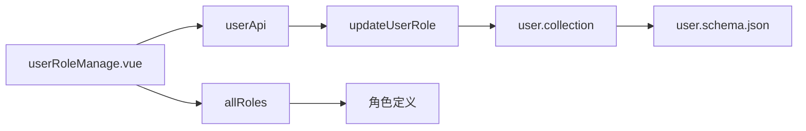

# 角色权限管理

<cite>
**Referenced Files in This Document **   
- [userRoleManage.vue](file://subPages/userRoleManage/userRoleManage.vue)
- [user.schema.json](file://uniCloud-aliyun/database/user.schema.json)
- [index.obj.js](file://uniCloud-aliyun/cloudfunctions/user/index.obj.js)
</cite>

## 目录
1. [简介](#简介)
2. [项目结构](#项目结构)
3. [核心组件](#核心组件)
4. [架构概述](#架构概述)
5. [详细组件分析](#详细组件分析)
6. [依赖分析](#依赖分析)
7. [性能考虑](#性能考虑)
8. [故障排除指南](#故障排除指南)
9. [结论](#结论)

## 简介
本文档详细说明了 `userRoleManage.vue` 组件实现的角色分配与权限控制机制。文档解释了如何通过该界面为用户分配不同角色（如管理员、普通用户），并分析了 `role` 字段在 `user.schema.json` 中的定义及其对系统功能访问权限的影响。结合云函数调用流程，描述了角色更新的数据流转过程。同时提供了权限校验的最佳实践、前端功能可见性控制方案以及防止越权操作的安全策略。

## 项目结构
该项目采用模块化设计，主要分为以下几个部分：
- `components`: 存放可复用的UI组件
- `pages`: 主要页面入口
- `store`: 状态管理
- `subPages`: 子页面，包含管理类功能
- `uniCloud-aliyun`: 云端逻辑和数据库定义

特别地，角色管理功能位于 `subPages/userRoleManage/` 目录下，相关的数据模型定义在 `uniCloud-aliyun/database/` 目录中，而业务逻辑则由 `uniCloud-aliyun/cloudfunctions/` 下的云函数处理。

**Diagram sources**
- [userRoleManage.vue](file://subPages/userRoleManage/userRoleManage.vue)
- [index.obj.js](file://uniCloud-aliyun/cloudfunctions/user/index.obj.js)
- [user.schema.json](file://uniCloud-aliyun/database/user.schema.json)

**Section sources**
- [userRoleManage.vue](file://subPages/userRoleManage/userRoleManage.vue)
- [user.schema.json](file://uniCloud-aliyun/database/user.schema.json)
- [index.obj.js](file://uniCloud-aliyun/cloudfunctions/user/index.obj.js)

## 核心组件
本系统的核心是基于角色的访问控制(RBAC)机制，通过 `userRoleManage.vue` 实现用户界面，利用云函数进行后端处理，并通过数据库模式定义确保数据一致性。系统实现了灵活的角色管理体系，支持多角色分配，并保证每个用户至少拥有基础的"普通用户"角色。

**Section sources**
- [userRoleManage.vue](file://subPages/userRoleManage/userRoleManage.vue#L1-L285)
- [user.schema.json](file://uniCloud-aliyun/database/user.schema.json#L1-L107)

## 架构概述
系统采用前后端分离架构，前端通过Vue框架构建用户界面，后端使用UniCloud提供的云函数处理业务逻辑。数据存储采用NoSQL数据库，通过JSON Schema定义数据结构。整个角色管理流程遵循清晰的数据流：用户在前端界面上操作 → 调用云函数API → 云函数验证并处理请求 → 更新数据库 → 返回结果给前端。

**Diagram sources**
- [userRoleManage.vue](file://subPages/userRoleManage/userRoleManage.vue#L78-L94)
- [index.obj.js](file://uniCloud-aliyun/cloudfunctions/user/index.obj.js#L157-L222)

## 详细组件分析

### 用户角色管理界面分析
`userRoleManage.vue` 是一个基于Vue 3 Composition API的组件，提供了直观的用户角色管理界面。它从页面参数中获取用户ID，加载用户详情，并展示所有可用角色供管理员选择。

#### 角色切换逻辑

**Diagram sources**
- [userRoleManage.vue](file://subPages/userRoleManage/userRoleManage.vue#L60-L94)

#### 角色数据结构
系统定义了多种角色类型，每种角色具有不同的权限级别：
- `admin`: 管理员，拥有系统管理权限
- `vip`: VIP用户，拥有特殊内容访问权限
- `editor`: 编辑，可以编辑和发布内容
- `reviewer`: 审核员，可以审核内容
- `customer`: 客服，处理用户反馈
- `user`: 普通用户，基础用户权限

这些角色以数组形式存储在用户文档中，支持用户拥有多重身份。

**Section sources**
- [userRoleManage.vue](file://subPages/userRoleManage/userRoleManage.vue#L10-L20)

### 数据模型分析
用户数据模型在 `user.schema.json` 中定义，其中 `role` 字段是实现权限控制的关键。

#### Role字段定义
| 属性 | 值/说明 |
|------|--------|
| bsonType | array |
| title | 用户角色 |
| description | 用户角色列表，例：['user', 'vip', 'admin'] |
| defaultValue | ["user"] |
| items.enum | ["user", "vip", "admin"] |

该设计确保了：
1. 每个用户的角色都存储为字符串数组
2. 默认赋予"普通用户"角色
3. 限制只能使用预定义的角色值，防止非法角色注入

**Section sources**
- [user.schema.json](file://uniCloud-aliyun/database/user.schema.json#L90-L106)

### 云函数处理逻辑
`index.obj.js` 中的 `updateUserRole` 函数负责处理角色更新请求，实现了完整的事务性操作。

#### 云函数执行流程

**Diagram sources**
- [index.obj.js](file://uniCloud-aliyun/cloudfunctions/user/index.obj.js#L157-L222)

#### 参数验证规则
云函数实施了严格的输入验证：
- 必需参数：`userId`, `action`, `role`
- action必须为`add`或`remove`
- 角色变更前先查询当前状态
- 使用数据库事务确保数据一致性

这种设计有效防止了恶意请求和数据不一致问题。

**Section sources**
- [index.obj.js](file://uniCloud-aliyun/cloudfunctions/user/index.obj.js#L157-L175)

## 依赖分析
系统各组件之间存在明确的依赖关系：

前端组件依赖于云函数API，云函数依赖于数据库集合，而数据库集合又受Schema约束。这种分层依赖结构确保了系统的可维护性和扩展性。

**Diagram sources**
- [userRoleManage.vue](file://subPages/userRoleManage/userRoleManage.vue)
- [index.obj.js](file://uniCloud-aliyun/cloudfunctions/user/index.obj.js)
- [user.schema.json](file://uniCloud-aliyun/database/user.schema.json)

**Section sources**
- [userRoleManage.vue](file://subPages/userRoleManage/userRoleManage.vue#L33-L35)
- [index.obj.js](file://uniCloud-aliyun/cloudfunctions/user/index.obj.js#L157-L222)

## 性能考虑
系统在设计时考虑了以下性能因素：
- 使用`doc().get()`直接通过ID查询用户，提高检索效率
- 在角色变更时先获取再更新，避免全表扫描
- 前端缓存用户信息，减少重复请求
- 云函数中添加适当的日志记录，便于性能监控和问题排查

对于大规模用户系统，建议进一步优化：
- 添加Redis缓存常用用户信息
- 对频繁查询的字段建立数据库索引
- 实现批量角色更新接口以减少网络往返

## 故障排除指南
当遇到角色管理相关问题时，可按以下步骤排查：

1. **前端问题**
   - 检查页面参数是否正确传递用户ID
   - 确认云函数调用是否成功
   - 查看浏览器控制台是否有JavaScript错误

2. **云函数问题**
   - 检查云函数日志中的错误信息
   - 验证参数是否符合预期格式
   - 确认数据库连接是否正常

3. **数据一致性问题**
   - 检查`user.schema.json`定义是否最新
   - 验证数据库中用户文档的`role`字段格式
   - 确保默认角色逻辑正确执行

常见错误代码含义：
- `code: 1`: 参数错误或业务逻辑拒绝
- `code: -1`: 系统级错误，如数据库连接失败
- `message`字段提供具体的错误描述

**Section sources**
- [userRoleManage.vue](file://subPages/userRoleManage/userRoleManage.vue#L43-L58)
- [index.obj.js](file://uniCloud-aliyun/cloudfunctions/user/index.obj.js#L157-L222)

## 结论
本系统实现了一个安全、灵活的角色权限管理系统。通过前端友好的界面、健壮的云函数逻辑和严格的数据模型约束，确保了角色分配的准确性和安全性。关键优势包括：
- 强制每个用户至少拥有基础角色
- 防止关键角色被意外移除
- 清晰的错误处理和用户反馈
- 可扩展的角色体系设计

未来可考虑增加角色继承、权限细粒度控制等高级功能，以满足更复杂的业务需求。