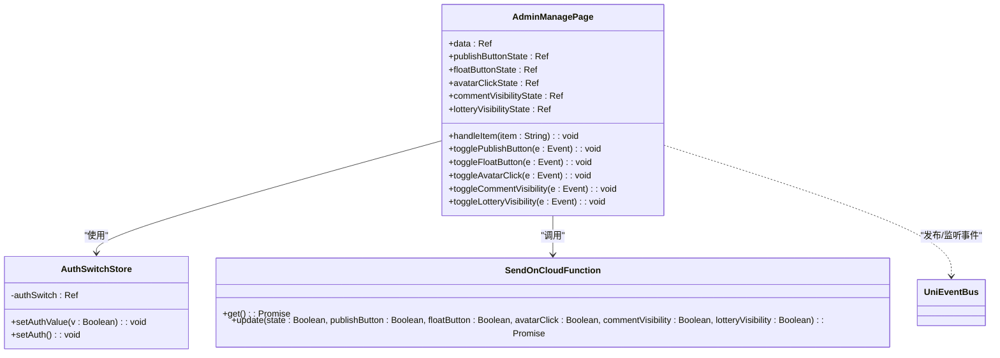

# 管理员入口管理

<cite>
**Referenced Files in This Document **   
- [adminManage.vue](file://subPages/adminManage/adminManage.vue)
- [pages.json](file://pages.json)
- [authSwitch.js](file://store/authSwitch.js)
- [sendOn/index.obj.js](file://uniCloud-aliyun/cloudfunctions/sendOn/index.obj.js)
- [my.vue](file://pages/my/my.vue)
- [user.js](file://store/user.js)
</cite>

## 目录
1. [简介](#简介)
2. [页面布局结构](#页面布局结构)
3. [导航菜单组织方式](#导航菜单组织方式)
4. [权限校验逻辑](#权限校验逻辑)
5. [模块集成与跳转机制](#模块集成与跳转机制)
6. [路由配置与界面绑定](#路由配置与界面绑定)
7. [首屏展示最佳实践](#首屏展示最佳实践)
8. [结论](#结论)

## 简介

`adminManage.vue`作为后台管理系统的核心入口，承担着统一管理和控制平台各项功能的重要职责。该页面通过集中式的界面设计，为管理员提供了一个操作中心，能够便捷地访问和管理各个子系统模块。本文件详细阐述了`adminManage.vue`的设计理念、实现方式以及与其他组件的交互关系。

**Section sources**
- [adminManage.vue](file://subPages/adminManage/adminManage.vue#L1-L460)

## 页面布局结构

`adminManage.vue`采用了简洁明了的列表式布局结构，将所有可管理的功能项以垂直列表的形式呈现。每个列表项包含左侧的功能名称和右侧的操作控件或导航指示符。

页面主要由以下几个部分构成：
- **顶部区域**：虽然在当前代码中未直接体现，但遵循了项目整体UI规范
- **内容区域**：核心的管理功能列表，使用`.content`类进行样式定义
- **列表项**：每个功能项都封装在一个`.item`容器内，具有统一的视觉风格

列表项内部采用Flex布局，分为左右两个部分：
- 左侧包含一个彩色标识块和功能名称文本
- 右侧根据功能类型显示不同的控件，如开关组件或导航箭头图标

这种布局方式确保了界面的一致性和易用性，使管理员能够快速识别和操作各项功能。


**Diagram sources **
- [adminManage.vue](file://subPages/adminManage/adminManage.vue#L1-L460)

**Section sources**
- [adminManage.vue](file://subPages/adminManage/adminManage.vue#L1-L460)

## 导航菜单组织方式

`adminManage.vue`中的导航菜单通过数据驱动的方式进行组织。菜单项的数据源定义在`data`响应式变量中，包含了所有可访问的管理功能：

```javascript
const data = ref( [ '分类管理', '文章管理', '用户反馈', '公司信息', '悬浮按钮控制', '发布按钮控制', '头像点击控制', '评论功能控制', '抽奖模块控制', '用户信息查询', '抽奖管理' ] )
```

菜单的渲染采用Vue的`v-for`指令遍历`data`数组，为每个菜单项创建对应的UI元素。菜单项的点击事件通过`handleItem`方法处理，该方法根据点击的菜单项名称执行相应的跳转逻辑。

特别的是，菜单中包含了两类不同类型的条目：
- **导航型条目**：点击后跳转到其他管理页面，如"分类管理"、"文章管理"等
- **控制型条目**：用于展示状态控制开关，如"发布按钮控制"、"悬浮按钮控制"等，在这些条目右侧显示了开关组件

这种混合式的菜单设计既提供了导航功能，又实现了实时的状态控制，提高了管理效率。

**Section sources**
- [adminManage.vue](file://subPages/adminManage/adminManage.vue#L1-L460)

## 权限校验逻辑

系统的权限校验逻辑采用了多层次的验证机制，确保只有具备管理员角色的用户才能访问后台管理功能。

### 前端权限判断

前端权限校验主要在`pages/my/my.vue`文件中实现，通过计算属性`isAdmin`来判断当前用户是否具有管理员权限：

```javascript
const isAdmin = computed(() => userStore.userInfo.role[0] === 'admin')
```

当用户尝试访问后台管理页面时，系统会检查`isAdmin`的值。如果为`false`，则弹出提示"您没有管理员权限"；如果为`true`，则允许导航到`adminManage`页面。

### 后端权限验证

除了前端验证外，系统还通过云函数进行后端权限验证。在`uni_modules/uni-pay/uniCloud/cloudfunctions/uni-pay-co/middleware/access-control.js`中定义了权限验证中间件，其中明确规定了只有`admin`角色的用户才能执行特定操作：

```javascript
if (userRole.includes('admin')) {
    return;
}
```

### 本地状态管理

权限状态也在本地进行了持久化存储。`store/authSwitch.js`文件中的`useAuthSwitchStore`定义了权限开关状态，并通过`uni.setStorageSync`将其保存在本地缓存中，确保应用重启后仍能保持之前的权限设置状态。

这种前后端结合的权限校验机制有效防止了未经授权的访问，提升了系统的安全性。


**Diagram sources **
- [my.vue](file://pages/my/my.vue#L250-L282)
- [adminManage.vue](file://subPages/adminManage/adminManage.vue#L5-L459)
- [access-control.js](file://uni_modules/uni-pay/uniCloud/cloudfunctions/uni-pay-co/middleware/access-control.js#L0-L49)

**Section sources**
- [my.vue](file://pages/my/my.vue#L250-L282)
- [adminManage.vue](file://subPages/adminManage/adminManage.vue#L5-L459)
- [authSwitch.js](file://store/authSwitch.js#L3-L52)
- [access-control.js](file://uni_modules/uni-pay/uniCloud/cloudfunctions/uni-pay-co/middleware/access-control.js#L0-L49)

## 模块集成与跳转机制

`adminManage.vue`作为统一的操作中心，集成了多个管理模块的跳转链接，形成了完整的管理生态系统。

### 跳转逻辑实现

跳转机制通过`handleItem`方法实现，该方法接收被点击的菜单项作为参数，并使用`switch`语句判断具体要跳转的目标页面：

```javascript
const handleItem = ( dataItem ) => {
    switch ( dataItem ) {
        case '分类管理':
            uni.navigateTo( {
                url: "/subPages/cateManage/cateManage"
            } )
            break
        // 其他case...
    }
}
```

### 集成的管理模块

目前`adminManage.vue`已集成以下管理模块：
- 分类管理 (`cateManage`)
- 文章管理 (`articleManage`)
- 用户反馈管理 (`feedManage`)
- 公司信息管理 (`companyInfo`)
- 用户信息查询 (`userInfoQuery`)
- 抽奖管理 (`subChoujiang`)

### 控制模块集成

除了导航跳转外，页面还集成了多个实时控制模块，允许管理员直接在首页调整系统状态：
- 发布按钮控制
- 悬浮按钮控制
- 头像点击控制
- 评论功能控制
- 抽奖模块控制

这些控制功能通过与云数据库的交互实现状态的持久化保存，确保设置的全局有效性。

**Section sources**
- [adminManage.vue](file://subPages/adminManage/adminManage.vue#L1-L460)

## 路由配置与界面绑定

### 路由配置

系统的路由配置在`pages.json`文件中定义，`adminManage.vue`作为分包页面被正确注册：

```json
{
    "root": "subPages",
    "pages": [
        {
            "path": "adminManage/adminManage",
            "style": {
                "navigationBarTitleText": "后台管理"
            }
        }
    ]
}
```

此配置确保了`adminManage`页面可以通过指定路径访问，并设置了正确的导航栏标题。

### 界面元素绑定

界面元素与数据的绑定通过Vue的响应式系统实现。关键的绑定关系包括：

#### 开关状态绑定

各种功能开关的状态通过`ref`定义的响应式变量进行管理：

```javascript
const publishButtonState = ref(false)
const floatButtonState = ref(false)
// ...其他状态变量
```

这些状态变量通过`:checked`属性与界面上的`<switch>`组件双向绑定：

```html
<switch :checked="publishButtonState" @change="togglePublishButton" />
```

#### 事件处理绑定

用户交互事件通过`@click`和`@change`等修饰符与相应的处理函数绑定：

```html
<view class="item" v-for="item in data" :key="item" @click="handleItem(item)">
```

当用户点击某个菜单项时，`handleItem`方法会被调用并传入对应的功能名称。

#### 数据更新同步

当管理员更改某个开关状态时，系统不仅会更新本地状态，还会通过云函数同步到服务器端，并广播状态变化事件，确保其他相关页面能够及时响应：

```javascript
uni.$emit('publishButtonChanged', newState)
```

这种全面的绑定机制保证了界面与数据的一致性，提供了流畅的用户体验。



**Diagram sources **
- [adminManage.vue](file://subPages/adminManage/adminManage.vue#L1-L460)
- [authSwitch.js](file://store/authSwitch.js#L3-L52)
- [index.obj.js](file://uniCloud-aliyun/cloudfunctions/sendOn/index.obj.js#L0-L62)

**Section sources**
- [pages.json](file://pages.json#L0-L185)
- [adminManage.vue](file://subPages/adminManage/adminManage.vue#L1-L460)

## 首屏展示最佳实践

为了优化管理员登录后的首屏展示体验，建议采取以下最佳实践：

### 1. 权限预加载优化

在用户登录后，立即预加载管理员权限相关信息，避免进入管理页面后的延迟等待。可以在`onShow`生命周期钩子中提前获取必要数据：

```javascript
onShow(() => {
    sendOnget()
})
```

### 2. 状态同步机制

建立完善的状态同步机制，当某个设置发生变化时，通过`uni.$emit`广播事件通知所有相关页面，确保整个应用的状态一致性：

```javascript
uni.$emit('publishButtonChanged', newState)
```

### 3. 错误处理与用户体验

为所有异步操作添加完善的错误处理机制，使用`try-catch`捕获异常，并向用户提供清晰的反馈信息：

```javascript
try {
    uni.showLoading({ title: '更新中...' })
    // 操作逻辑
} catch (error) {
    console.error('操作失败:', error)
    uni.showToast({ icon: "error", title: '操作失败' })
} finally {
    uni.hideLoading()
}
```

### 4. 视觉反馈设计

为用户的每个操作提供即时的视觉反馈，包括：
- 显示加载动画（`uni.showLoading`）
- 操作成功提示（`uni.showToast`带success图标）
- 操作失败提示（`uni.showToast`带error图标）

### 5. 本地状态持久化

利用Pinia的持久化插件，将重要的状态信息保存到本地存储中，即使应用重启也能恢复之前的状态设置：

```javascript
persist: {
    storage: {
        getItem(key) {
            return uni.getStorageSync(key)
        },
        setItem(key, value) {
            uni.setStorageSync(key, value)
        }
    }
}
```

### 6. 模块化扩展设计

保持页面结构的可扩展性，新功能模块可以轻松添加到菜单列表中，只需在`data`数组中添加新的条目并为`handleItem`方法添加相应的处理逻辑即可。

这些最佳实践共同构成了一个高效、稳定且用户体验良好的后台管理首屏展示方案。

**Section sources**
- [adminManage.vue](file://subPages/adminManage/adminManage.vue#L1-L460)
- [authSwitch.js](file://store/authSwitch.js#L3-L52)
- [index.obj.js](file://uniCloud-aliyun/cloudfunctions/sendOn/index.obj.js#L0-L62)

## 结论

`adminManage.vue`作为后台管理系统的总入口，通过精心设计的页面布局、清晰的导航菜单组织、严谨的权限校验逻辑以及高效的模块集成机制，为管理员提供了一个功能强大且易于使用的操作中心。

该页面不仅实现了对各个管理模块的统一跳转访问，还集成了多项实时控制功能，允许管理员直接在首页调整系统关键参数。通过前后端结合的权限验证机制，确保了系统的安全性；通过响应式数据绑定和状态同步机制，保证了用户体验的一致性。

建议在后续开发中继续保持模块化的设计思路，同时关注性能优化和用户体验提升，使`adminManage.vue`能够更好地服务于平台的管理工作。