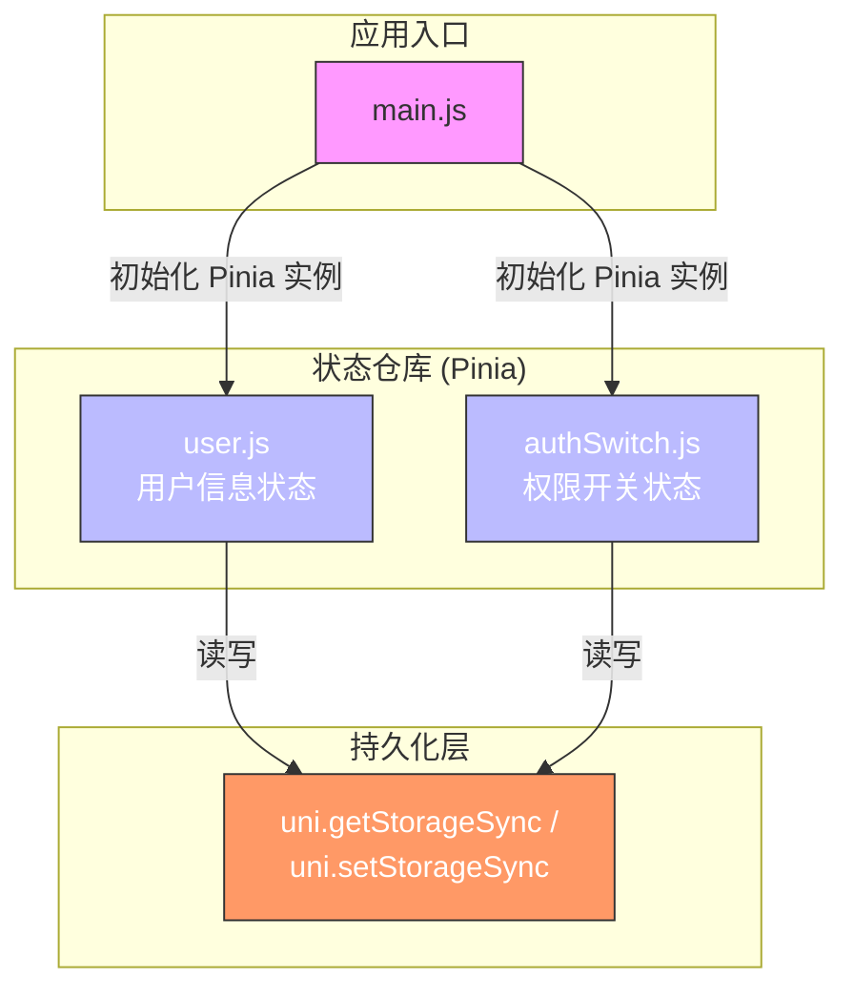
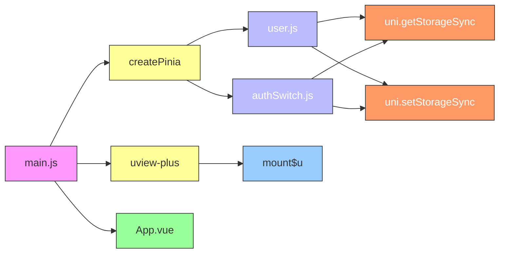

<cite>
**本文档中引用的文件**
- [main.js](file://main.js)
- [user.js](file://store/user.js)
- [authSwitch.js](file://store/authSwitch.js)
</cite>

## 目录
1. [状态管理机制](#状态管理机制)
2. [核心组件](#核心组件)
3. [架构概览](#架构概览)
4. [详细组件分析](#详细组件分析)
5. [依赖分析](#依赖分析)

## 状态管理机制

本项目采用Pinia作为Vue 3应用的状态管理库，通过模块化设计实现了用户信息与权限开关的集中式管理。系统利用自定义持久化插件将关键状态存储于uni-app提供的`uni.setStorageSync`中，确保了应用重启后用户登录态、点赞记录及权限配置的无缝恢复。整个状态管理层由`main.js`中的Pinia实例初始化，并通过`defineStore`在`store/`目录下定义独立的业务模块。

**Section sources**
- [main.js](file://main.js#L1-L70)
- [user.js](file://store/user.js#L1-L90)
- [authSwitch.js](file://store/authSwitch.js#L1-L53)

## 核心组件

核心状态管理组件包括`user.js`和`authSwitch.js`两个独立的Pinia Store。`user.js`负责维护用户的完整信息，如唯一标识（uid）、昵称、头像URL、手机号以及登录状态，并通过`likeRecords`数组追踪用户的点赞行为。`authSwitch.js`则专注于管理一个布尔类型的权限开关，用于控制敏感操作的访问权限。两者均通过`persist`选项启用了本地持久化，保证数据在页面刷新或应用关闭后依然有效。

**Section sources**
- [user.js](file://store/user.js#L1-L90)
- [authSwitch.js](file://store/authSwitch.js#L1-L53)

## 架构概览

**Diagram sources**
- [main.js](file://main.js#L1-L70)
- [user.js](file://store/user.js#L1-L90)
- [authSwitch.js](file://store/authSwitch.js#L1-L53)

## 详细组件分析

### 用户信息状态分析

#### 存储结构与更新方法
`user.js`模块使用`defineStore`创建了一个名为`userInfo`的Store。其核心数据结构是一个包含`uid`、`nickName`、`avatarUrl`等字段的`userInfo`响应式对象，以及一个独立的`likeRecords`数组用于记录点赞的文章ID。提供了`setUserInfo`、`updateUserAvatar`、`updateUserNickName`和`cleanUserInfo`等方法来安全地修改状态。每次更新不仅会改变内存中的状态，还会立即调用`uni.setStorageSync`同步到本地存储，确保数据一致性。

#### 本地持久化技术细节
该模块直接在`defineStore`的第三个参数中配置了`persist`选项，自定义了`storage`对象，将`getItem`和`setItem`映射到uni-app的同步存储API上。这使得`userInfo`和`likeRecords`的状态在应用重启后能够自动从`uni.getStorageSync`中恢复，无需手动初始化。

**Section sources**
- [user.js](file://store/user.js#L1-L90)

### 权限开关状态分析

#### 状态定义与验证控制
`authSwitch.js`模块定义了一个名为`auth`的Store，其核心是一个名为`authSwitch`的布尔值响应式引用。该状态代表了某种全局性的权限开关，可用于在执行敏感操作前进行身份验证检查。例如，在删除文章或修改设置前，可以查询`authSwitch.value`来决定是否允许操作继续。

#### 持久化实现
与`user.js`类似，`authSwitch.js`也通过`persist`选项实现了本地持久化。它在Store创建时尝试从`uni.getStorageSync('auth-state')`加载初始值，并通过`watch`监听器在状态变化时自动将其序列化并保存回`uni.setStorageSync('auth-state')`，从而保证了权限开关状态的长期记忆性。

**Section sources**
- [authSwitch.js](file://store/authSwitch.js#L1-L53)

## 依赖分析

**Diagram sources**
- [main.js](file://main.js#L1-L70)
- [user.js](file://store/user.js#L1-L90)
- [authSwitch.js](file://store/authSwitch.js#L1-L53)