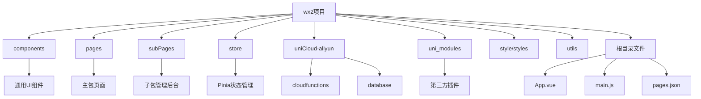
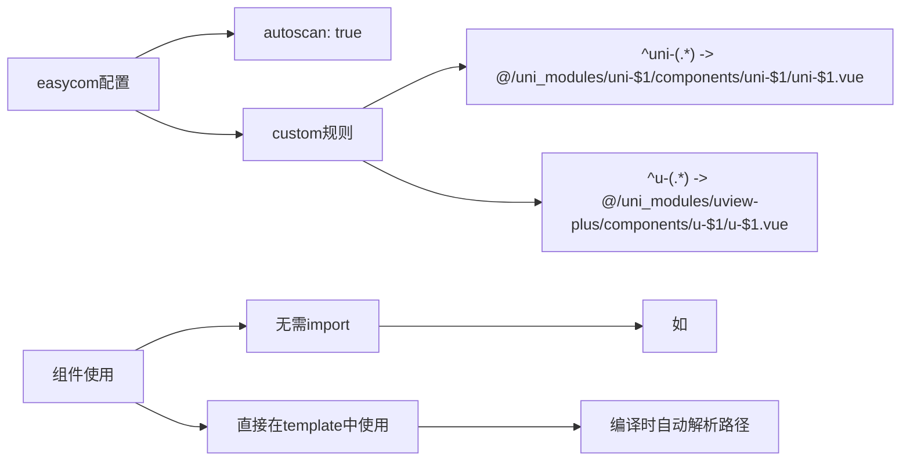
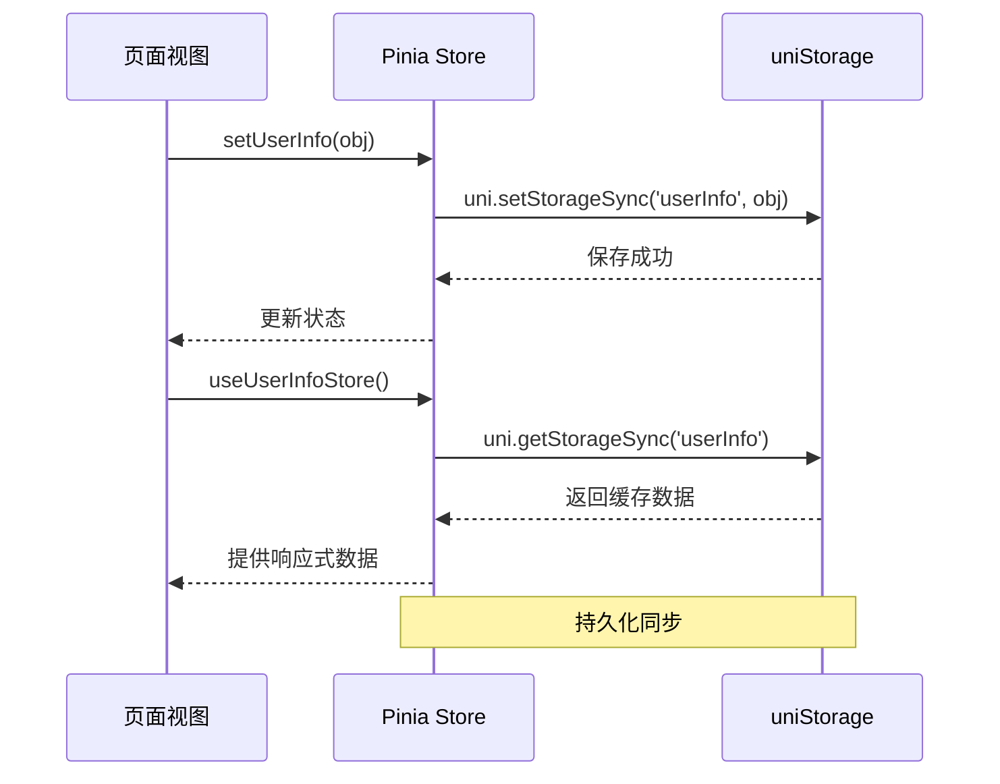

# 目录结构详解

<cite>
**本文档引用的文件**
- [articleItem.vue](file://components/articleItem/articleItem.vue)
- [index.vue](file://pages/index/index.vue)
- [adminManage.vue](file://subPages/adminManage/adminManage.vue)
- [user.js](file://store/user.js)
- [authSwitch.js](file://store/authSwitch.js)
- [user.schema.json](file://uniCloud-aliyun/database/user.schema.json)
- [sendOn/index.obj.js](file://uniCloud-aliyun/cloudfunctions/sendOn/index.obj.js)
- [userWx/index.obj.js](file://uniCloud-aliyun/cloudfunctions/userWx/index.obj.js)
- [App.vue](file://App.vue)
- [main.js](file://main.js)
- [pages.json](file://pages.json)
- [manifest.json](file://manifest.json)
</cite>

## 目录结构
1. [项目总体布局](#项目总体布局)
2. [核心目录职责划分](#核心目录职责划分)
3. [easycom机制与组件引用](#easycom机制与组件引用)
4. [子包拆分与性能优化](#子包拆分与性能优化)
5. [云函数模块化设计](#云函数模块化设计)
6. [状态管理实现](#状态管理实现)
7. [架构优势总结](#架构优势总结)

## 项目总体布局



**图示来源**
- [project_structure](file://)

## 核心目录职责划分

### components（通用UI组件）
该目录存放所有可复用的Vue组件，遵循单一职责原则。每个子目录包含一个同名`.vue`文件，如`articleItem/articleItem.vue`用于展示文章列表项，`comment-list/comment-list.vue`处理评论功能。这些组件通过props接收数据，通过emit触发事件，实现了高内聚低耦合的设计。

**Section sources**
- [articleItem.vue](file://components/articleItem/articleItem.vue)
- [articleDetail-choujia.vue](file://components/articleDetail-choujia/articleDetail-choujia.vue)

### pages（主包页面）
存放应用的核心页面，构成小程序的主体功能。包括首页`index/index.vue`、个人中心`my/my.vue`、登录页`login/login.vue`等。这些页面作为路由入口，在`pages.json`中注册，并可通过tabBar直接访问。主包页面加载速度快，确保用户首次打开时的良好体验。

**Section sources**
- [index.vue](file://pages/index/index.vue)
- [pages.json](file://pages.json)

### subPages（子包管理后台）
采用分包加载策略，将管理后台相关页面独立为子包。包含`adminManage/adminManage.vue`、`articleManage/articleManage.vue`等多个管理模块。这种拆分有效控制了主包大小，符合微信小程序2MB的限制要求，同时提升了非管理用户的加载速度。

**Section sources**
- [adminManage.vue](file://subPages/adminManage/adminManage.vue)
- [pages.json](file://pages.json)

### store（状态管理）
基于Pinia实现全局状态管理，替代传统的Vuex。`user.js`管理用户信息和登录状态，`authSwitch.js`存储权限开关配置。通过`persist`选项集成uniStorage，实现数据持久化。在`main.js`中初始化并挂载到应用实例，提供响应式的数据流管理。

**Section sources**
- [user.js](file://store/user.js)
- [authSwitch.js](file://store/authSwitch.js)
- [main.js](file://main.js)

### uniCloud-aliyun（云函数与数据库Schema）
#### cloudfunctions（云函数）
按业务模块组织云函数，如`articleWx`处理文章相关操作，`userWx`管理用户认证，`choujiangWx`实现抽奖逻辑。每个模块独立部署，便于维护和扩展。例如`sendOn/index.obj.js`提供系统开关控制，`getOpenid/index.js`处理微信登录。

#### database（数据库Schema）
定义了完整的数据模型约束，如`user.schema.json`规定了用户表结构，包含手机号正则校验`pattern: "^1[3-9]\\d{9}$"`和角色枚举`enum: ["user", "vip", "admin"]`。`articleList.schema.json`等文件确保数据一致性，支持JQL查询语法。

**Section sources**
- [user.schema.json](file://uniCloud-aliyun/database/user.schema.json)
- [sendOn/index.obj.js](file://uniCloud-aliyun/cloudfunctions/sendOn/index.obj.js)
- [userWx/index.obj.js](file://uniCloud-aliyun/cloudfunctions/userWx/index.obj.js)

### uni_modules（第三方插件）
集成uView Plus等第三方UI库，通过`@/uni_modules/uview-plus/components/u-$1/u-$1.vue`路径自动引入。`uni-icons`、`uni-badge`等组件丰富了界面表现力。在`App.vue`中通过`@import "@/uni_modules/uview-plus/index.scss"`统一引入样式，保证视觉一致性。

**Section sources**
- [uview-plus/index.js](file://uni_modules/uview-plus/index.js)
- [App.vue](file://App.vue)

## easycom机制与组件引用



**图示来源**
- [pages.json](file://pages.json)

通过`pages.json`中的easycom配置，实现了组件的自动化导入。设置`"autoscan": true`后，框架会自动扫描并注册`components`目录下的所有组件。自定义规则允许使用`u-`前缀调用uView组件，`uni-`前缀调用uni_modules组件，极大简化了开发流程，减少了样板代码。

**Section sources**
- [pages.json](file://pages.json)
- [App.vue](file://App.vue)

## 子包拆分与性能优化


**图示来源**
- [project_structure](file://)

在`pages.json`中通过`subPackages`字段定义子包，将`subPages`目录作为独立分包。当用户访问管理功能时才动态下载相应资源，避免一次性加载全部代码。这不仅满足了小程序主包不超过2MB的硬性要求，还显著提升了普通用户的启动速度，体现了良好的性能工程实践。

**Section sources**
- [pages.json](file://pages.json)
- [adminManage.vue](file://subPages/adminManage/adminManage.vue)

## 云函数模块化设计

```mermaid
classDiagram
class articleWx {
+getArticle(cate_id, page, size)
+del(articleId, userId)
+add(data)
}
class userWx {
+loginByPhoneWx(code, encryptedData, iv)
+updateUserProfile(uid, nickName, avatarUrl)
+getUsersByIds(userIds)
+getUserInfo(userId)
}
class sendOn {
+get()
+update(state, publishButton, floatButton, ...)
}
class choujiangWx {
+doLottery(commenters, userInfo)
+saveGridPositions(articleId, positions)
+getGridPositions(articleId)
+saveLotteryResult(lotteryData)
}
articleWx --> db : : "articleList"
userWx --> db : : "user"
sendOn --> db : : "sendOn"
choujiangWx --> db : : "lottery_grid_positions"
```

**图示来源**
- [userWx/index.obj.js](file://uniCloud-aliyun/cloudfunctions/userWx/index.obj.js)
- [sendOn/index.obj.js](file://uniCloud-aliyun/cloudfunctions/sendOn/index.obj.js)

云函数按业务领域垂直划分，每个模块对应特定的功能集合。`userWx`负责用户认证与资料管理，`articleWx`处理文章CRUD操作，`sendOn`控制系统级开关。这种设计遵循关注点分离原则，提高了代码的可维护性和可测试性。通过`uniCloud.importObject()`进行模块间调用，保持了松耦合的架构风格。

**Section sources**
- [userWx/index.obj.js](file://uniCloud-aliyun/cloudfunctions/userWx/index.obj.js)
- [sendOn/index.obj.js](file://uniCloud-aliyun/cloudfunctions/sendOn/index.obj.js)

## 状态管理实现



**图示来源**
- [user.js](file://store/user.js)
- [main.js](file://main.js)

采用Pinia作为状态管理方案，在`main.js`中创建pinia实例并配置持久化插件。`useUserInfoStore`定义了用户信息的状态容器，包含`userInfo`响应式对象和`setUserInfo`、`cleanUserInfo`等操作方法。通过重写storage的getItem和setItem，无缝对接uni-app的本地存储API，确保应用重启后状态不丢失。

**Section sources**
- [user.js](file://store/user.js)
- [main.js](file://main.js)

## 架构优势总结

该目录结构设计充分考虑了可维护性、可扩展性和团队协作需求：

1. **清晰的职责分离**：各目录功能明确，降低了模块间的耦合度。
2. **高效的开发体验**：easycom机制消除了繁琐的导入语句，提升编码效率。
3. **优秀的性能表现**：子包拆分优化了加载性能，改善了用户体验。
4. **规范的数据管理**：云数据库Schema定义了严格的约束规则，保障数据质量。
5. **现代化的技术栈**：Pinia+Vue3组合提供了更好的TypeScript支持和开发体验。

整体架构既遵循了uni-app的最佳实践，又结合项目实际进行了合理扩展，为后续的功能迭代和技术演进奠定了坚实基础。

**Section sources**
- [App.vue](file://App.vue)
- [manifest.json](file://manifest.json)
- [pages.json](file://pages.json)