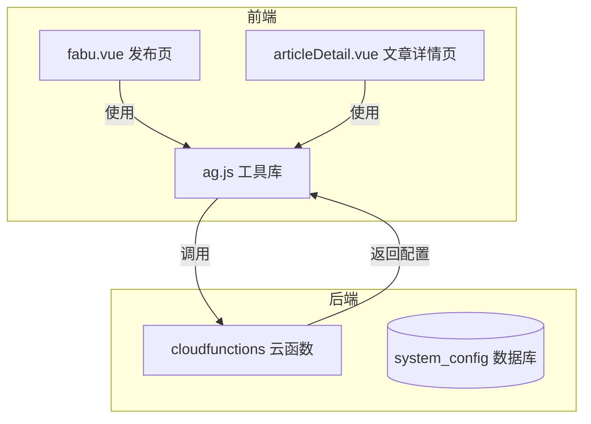
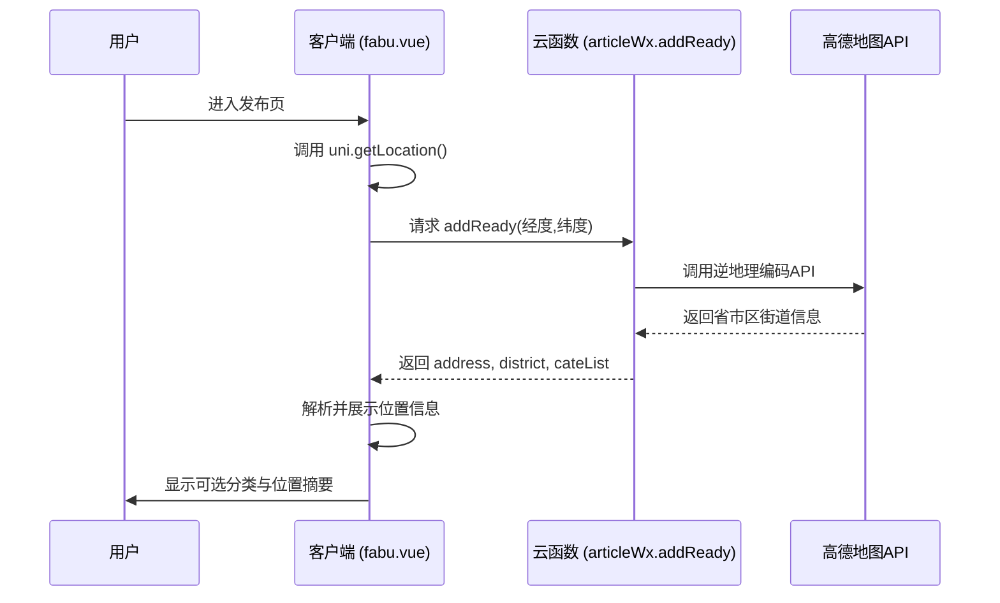

# 地理位置服务集成（高德地图）

<cite>
**本文档引用文件**  
- [ag.js](file://utils/ag.js)
- [fabu.vue](file://pages/fabu/fabu.vue)
- [articleDetail.vue](file://pages/article/articleDetail.vue)
</cite>

## 目录
1. [项目结构](#项目结构)  
2. [核心组件分析](#核心组件分析)  
3. [API调用与数据处理流程](#api调用与数据处理流程)  
4. [用户交互设计](#用户交互设计)  
5. [地理位置信息渲染](#地理位置信息渲染)  
6. [错误处理与性能优化](#错误处理与性能优化)  
7. [调试技巧与限流应对方案](#调试技巧与限流应对方案)

## 项目结构

本项目采用模块化架构，主要包含以下目录：

- `components/`：存放可复用的UI组件。
- `pages/`：页面级组件，如发布页、文章详情页等。
- `store/`：状态管理模块。
- `uniCloud-aliyun/`：云函数逻辑处理。
- `utils/`：工具类函数，包括高德地图相关封装。

其中，`utils/ag.js` 是地理编码和逆地理编码的核心工具文件；`pages/fabu/fabu.vue` 实现了位置选择器功能；`pages/article/articleDetail.vue` 负责展示地理位置信息。

**图示来源**  
- [ag.js](file://utils/ag.js)
- [fabu.vue](file://pages/fabu/fabu.vue)
- [articleDetail.vue](file://pages/article/articleDetail.vue)

**本节来源**  
- [ag.js](file://utils/ag.js)
- [fabu.vue](file://pages/fabu/fabu.vue)
- [articleDetail.vue](file://pages/article/articleDetail.vue)

## 核心组件分析

### ag.js 工具文件解析

`ag.js` 文件目前仅导出隐私协议和会员服务协议链接，并未实现高德地图API的直接调用。实际的地理编码与逆地理编码逻辑由云函数 `articleWx.addReady()` 在客户端通过 `uni.getLocation()` 获取经纬度后传递完成。

该设计将敏感API密钥保留在服务端，避免暴露于前端代码中，提升了安全性。

### fabu.vue 发布页位置选择器

`fabu.vue` 页面实现了完整的地理位置采集流程：

1. **自动定位**：通过 `uni.getLocation()` 获取用户当前坐标（GCJ-02 坐标系）。
2. **分类联动**：根据获取到的位置信息请求服务器返回对应区域的分类列表。
3. **手动搜索**：暂未在代码中体现，但可通过扩展输入框结合高德POI搜索接口实现。
4. **结果展示**：将地址简化显示，支持重新定位。

关键变量：
- `locationInfo`：存储地址与区域信息。
- `preciseLocationInfo`：保存详细的GPS数据（精度、海拔、速度等）。
- `getLocaAndCate()` 方法负责整合定位与分类逻辑。

### articleDetail.vue 地理位置渲染

文章详情页通过 `getArticleDetail()` 方法加载内容时，会从服务器获取与文章关联的 `address` 和 `district` 字段，并在模板中进行结构化展示。同时支持分享时携带地理位置标签，增强社交属性。

## API调用与数据处理流程

**图示来源**  
- [fabu.vue](file://pages/fabu/fabu.vue#L132-L301)
- [articleDetail.vue](file://pages/article/articleDetail.vue#L200-L250)

**本节来源**  
- [fabu.vue](file://pages/fabu/fabu.vue#L132-L301)
- [articleDetail.vue](file://pages/article/articleDetail.vue#L200-L250)

## 用户交互设计

### 自动定位机制

使用 `uni.getLocation()` 启用高精度模式（`isHighAccuracy: true`），并设置超时时间（`highAccuracyExpireTime: 10000`）。若失败则降级为默认坐标（北京天安门）。

### 手动搜索与结果展示

虽然当前代码未实现手动搜索功能，但可通过引入高德地图小程序SDK或调用其Web API 实现POI模糊搜索。建议添加一个搜索输入框，在用户输入时动态请求 `/v3/geocode/geo` 接口。

### 简化地址显示

通过 `getSimplifiedAddress()` 函数移除冗余前缀（如“中国”、“省”、“市”），并对过长地址截断处理，提升界面美观性。

## 地理位置信息渲染

在 `articleDetail.vue` 中，地理位置信息作为文章元数据的一部分被渲染：

- 使用 `processPhoneNumbers()` 处理文本中的手机号码，支持点击拨号。
- 支持朋友圈分享时携带第一张图片作为封面。
- 地址字段用于标识内容来源地，增强本地化社交属性。

## 错误处理与性能优化

### 错误处理机制

- 定位失败时提供默认坐标兜底。
- 云函数调用失败时提示“获取分类失败，请重试”。
- 图片上传过程中启用备用进度条以防平台不支持 `onProgressUpdate`。

### 缓存策略与性能优化

- **七牛云图标生成**：利用 `imageMogr2` 接口动态生成带背景色的分类图标，URL中加入时间戳防止缓存。
- **图片懒加载**：通过 `processCDNImage()` 移除压缩参数，避免长URL导致400错误。
- **全局超时控制**：设置 `IMAGE_LOAD_TIMEOUT = 15000ms`，确保即使资源加载缓慢也能正常浏览内容。

## 调试技巧与限流应对方案

### 调试技巧

1. **查看日志输出**：在 `console.log()` 中打印关键变量（如 `locationRes`, `res.address`）。
2. **模拟不同城市**：修改 `uni.getLocation()` 返回值测试多地区适配。
3. **检查网络请求**：使用开发者工具监控 `addReady` 云函数调用是否成功。

### 限流应对方案

- **服务端代理**：所有高德API请求均由云函数转发，便于统一管理QPS配额。
- **本地缓存 fallback**：当无法获取分类时尝试从本地存储恢复历史数据。
- **用户提示友好化**：对频繁请求给予明确提示而非静默失败。

**本节来源**  
- [fabu.vue](file://pages/fabu/fabu.vue#L132-L301)
- [config.js](file://uniCloud-aliyun/cloudfunctions/config/index.obj.js#L0-L53)
- [imageService/fabuWx/index.obj.js](file://uniCloud-aliyun/cloudfunctions/imageService/fabuWx/index.obj.js#L116-L155)