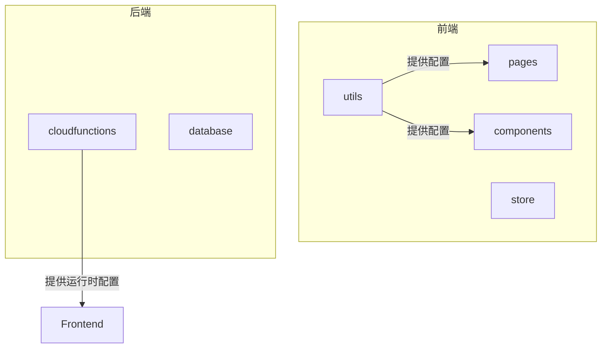
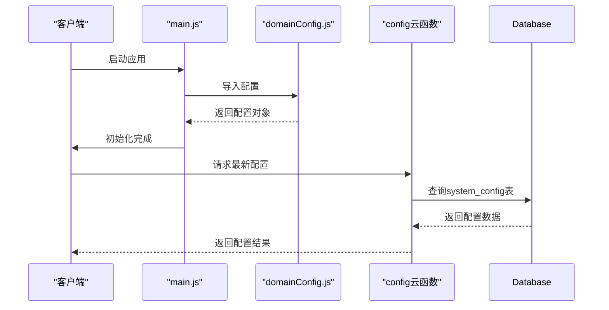
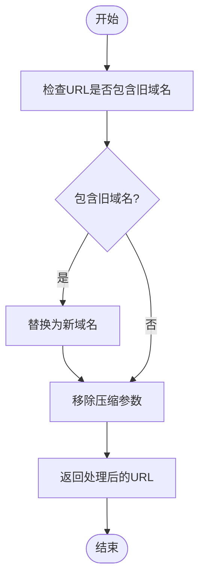
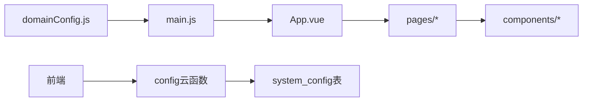

# 外部服务端点管理

<cite>
**本文档引用文件**  
- [domainConfig.js](file://utils/domainConfig.js)
- [main.js](file://main.js)
- [config/index.obj.js](file://uniCloud-aliyun/cloudfunctions/config/index.obj.js)
</cite>

## 目录
1. [引言](#引言)  
2. [项目结构分析](#项目结构分析)  
3. [核心组件解析](#核心组件解析)  
4. [架构概览](#架构概览)  
5. [详细组件分析](#详细组件分析)  
6. [依赖关系分析](#依赖关系分析)  
7. [性能考量](#性能考量)  
8. [故障排查指南](#故障排查指南)  
9. [结论](#结论)

## 引言
本项目通过 `domainConfig.js` 实现对第三方服务接口地址的统一管理，避免了硬编码带来的维护难题。该配置文件集中定义了七牛云上传域名、微信支付网关、高德地图API基础路径等外部依赖端点，并结合 `main.js` 的全局引入机制实现多环境动态切换策略。同时，通过 `config` 云函数对外暴露运行时可获取的最新服务地址，提升了系统的灵活性与安全性。

## 项目结构分析
项目采用模块化设计，主要分为前端页面（pages）、组件（components）、状态管理（store）、样式（style/styles）、云函数（uniCloud-aliyun/cloudfunctions）和工具类（utils）。其中 `utils/domainConfig.js` 是关键的配置中心，用于集中管理所有外部服务的域名和参数。



**图示来源**  
- [domainConfig.js](file://utils/domainConfig.js)
- [main.js](file://main.js)

## 核心组件解析
`domainConfig.js` 文件中定义了多个关键配置项：`domainMap` 用于修复旧域名错误，`correctDomain` 指定当前主域名，`defaultImages` 提供默认图片路径，`imageParams` 配置七牛云图片处理参数。这些配置通过导出函数如 `fixImageUrl`、`getDefaultImage` 等被其他模块调用，确保图片URL的一致性和可用性。

**章节来源**  
- [domainConfig.js](file://utils/domainConfig.js#L6-L31)

## 架构概览
系统采用前后端分离架构，前端通过 `main.js` 全局引入 `domainConfig.js`，在应用启动时加载配置。不同环境下可通过条件判断或环境变量切换配置。云函数 `config/index.obj.js` 提供 `getConfig` 接口，允许客户端在运行时动态获取最新的服务地址，支持热更新而无需重新发布应用。



**图示来源**  
- [main.js](file://main.js#L1-L70)
- [domainConfig.js](file://utils/domainConfig.js#L38-L75)
- [config/index.obj.js](file://uniCloud-aliyun/cloudfunctions/config/index.obj.js#L1-L109)

## 详细组件分析

### domainConfig.js 分析
该文件是整个项目外部服务端点的核心配置文件，包含以下功能：

#### 域名映射与修复


**图示来源**  
- [domainConfig.js](file://utils/domainConfig.js#L38-L75)

#### 默认图片与参数配置
提供了默认头像、视频缩略图等资源路径，并预设了七牛云的图片处理参数（如缩略图、压缩质量、WebP格式转换），但实际使用中已禁用压缩功能以提升加载速度。

**章节来源**  
- [domainConfig.js](file://utils/domainConfig.js#L6-L31)

### main.js 全局引入机制
`main.js` 在应用初始化阶段导入 `uviewPlus` 和 `pinia` 状态管理库，并通过 `createPersistedState` 插件实现用户信息的本地持久化存储。它还负责挂载 `domainConfig.js` 所提供的配置，使全局组件能够访问统一的服务端点。

**章节来源**  
- [main.js](file://main.js#L1-L70)

### config 云函数分析
位于 `uniCloud-aliyun/cloudfunctions/config/index.obj.js` 的云函数提供了 `getConfig` 和 `updateConfig` 两个接口，分别用于获取和更新系统配置。配置数据存储在 `system_config` 表中，支持按 `key` 查询特定配置项，例如评论区显示开关等。

```mermaid
classDiagram
class ConfigCloudFunction {
+async getConfig(key)
+async updateConfig(params)
}
class Database {
+collection('system_config')
+where({ key })
+get()
+update()
+add()
}
ConfigCloudFunction --> Database : "操作"
```

**图示来源**  
- [config/index.obj.js](file://uniCloud-aliyun/cloudfunctions/config/index.obj.js#L1-L109)

## 依赖关系分析
项目各模块之间存在清晰的依赖关系。前端页面和组件依赖 `utils/domainConfig.js` 获取服务端点；`main.js` 作为入口文件依赖 `domainConfig.js` 和状态管理模块；云函数 `config` 则独立于前端，直接与数据库交互，为前端提供运行时配置查询能力。



**图示来源**  
- [domainConfig.js](file://utils/domainConfig.js)
- [main.js](file://main.js)
- [config/index.obj.js](file://uniCloud-aliyun/cloudfunctions/config/index.obj.js)

## 性能考量
为避免长URL导致的400错误，系统在 `fixImageUrl` 函数中主动移除了所有图片压缩参数（如 `imageMogr2`）。此外，通过将常用配置缓存至本地并结合云函数按需拉取最新配置，减少了不必要的网络请求，提升了加载效率。图片懒加载机制也进一步优化了首屏渲染性能。

## 故障排查指南
当出现图片无法加载或域名错误时，应首先检查 `domainConfig.js` 中的 `domainMap` 是否正确映射了旧域名。若涉及运行时配置变更，则需确认 `config` 云函数是否正常返回预期值，并验证数据库 `system_config` 表中的记录是否准确。对于登录相关问题，可查看 `userStore` 是否成功同步了用户手机号等关键信息。

**章节来源**  
- [domainConfig.js](file://utils/domainConfig.js#L38-L75)
- [config/index.obj.js](file://uniCloud-aliyun/cloudfunctions/config/index.obj.js#L1-L109)

## 结论
通过 `domainConfig.js` 统一管理第三方服务接口地址，项目实现了高度解耦和易于维护的架构设计。结合 `main.js` 的全局引入机制和 `config` 云函数的运行时配置能力，系统能够在开发/生产环境中灵活切换服务端点，保障了业务连续性与安全性。建议未来进一步完善多环境配置模板和敏感信息脱敏方案，以适应更复杂的部署场景。