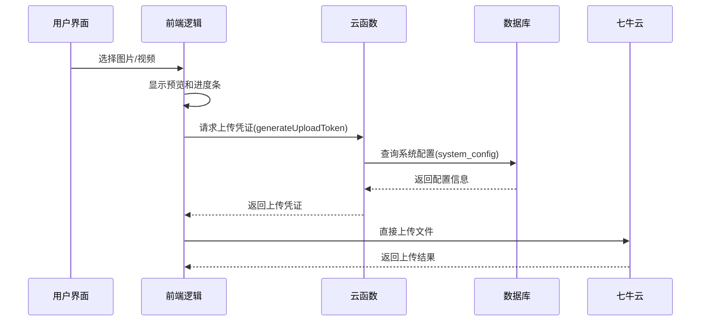
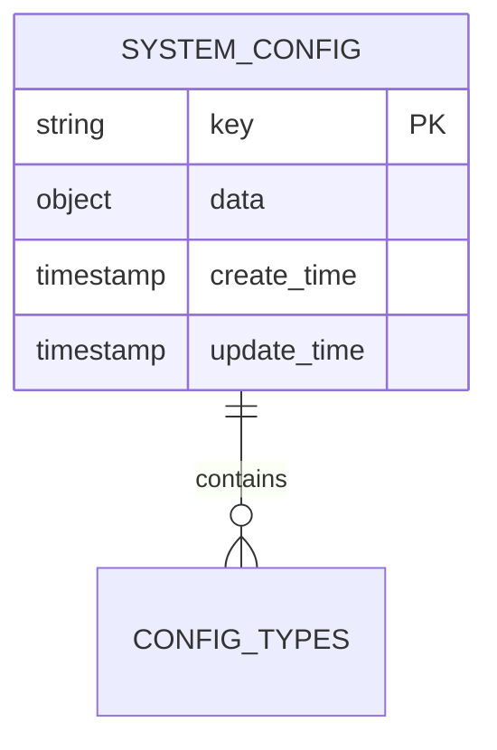
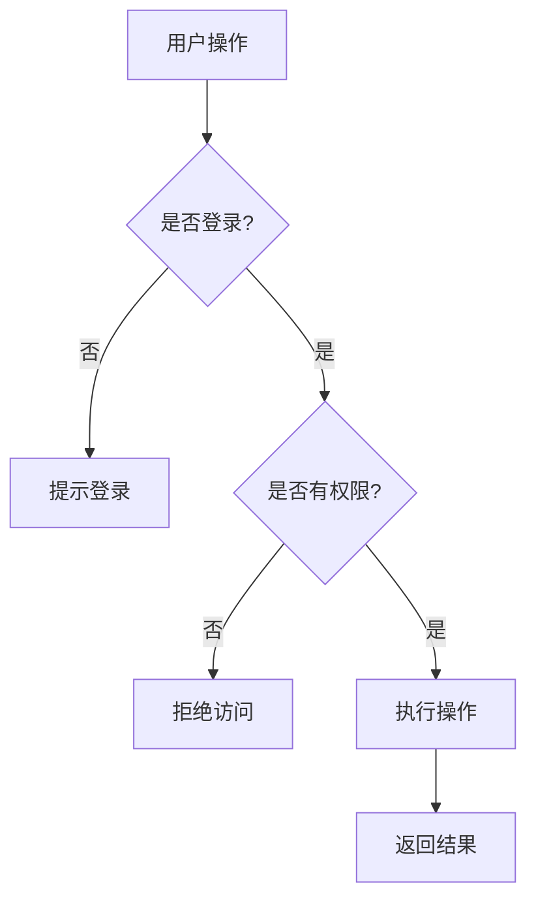
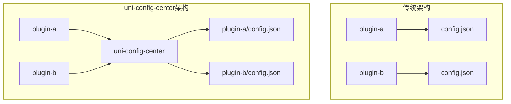
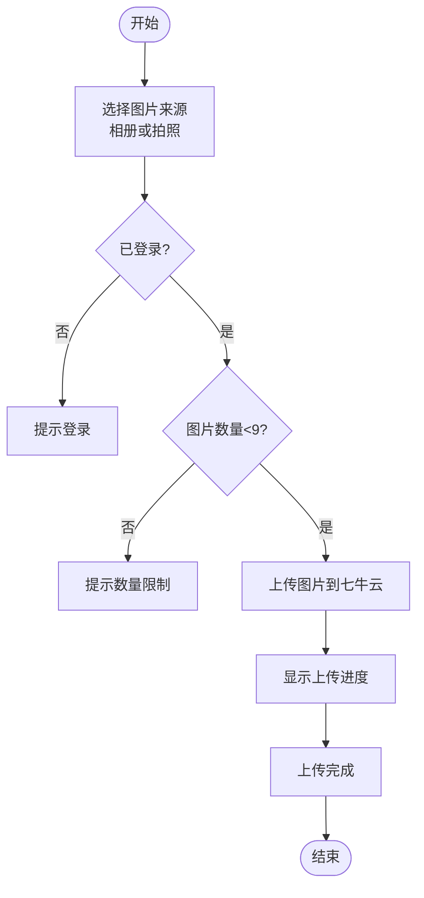
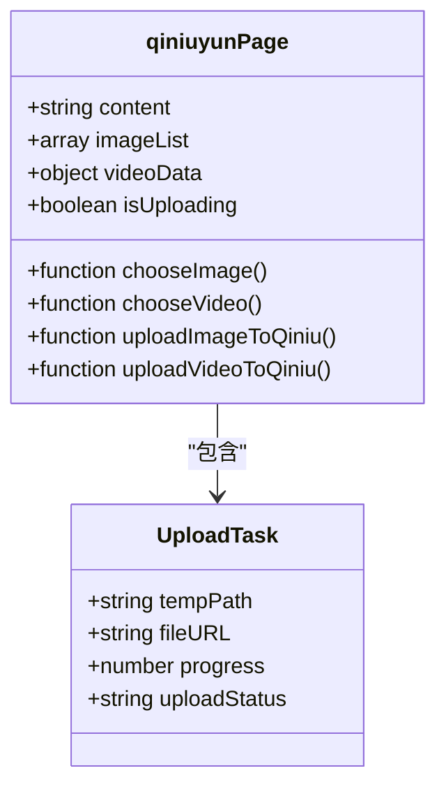

# 七牛云配置管理

<cite>
**Referenced Files in This Document **   
- [qiniuyun.vue](file://subPages/qiniuyun/qiniuyun.vue)
- [readme.md](file://uni_modules/uni-config-center/readme.md)
- [index.obj.js](file://uniCloud-aliyun/cloudfunctions/config/index.obj.js)
</cite>

## Table of Contents
1. [简介](#简介)
2. [核心功能实现](#核心功能实现)
3. [安全存储策略](#安全存储策略)
4. [权限访问控制](#权限访问控制)
5. [与uni-config-center集成](#与uni-config-center集成)
6. [UI交互流程](#ui交互流程)
7. [数据绑定与验证](#数据绑定与验证)

## 简介
本文档详细说明了七牛云配置页面 `qiniuyun.vue` 的实现机制，涵盖AK/SK密钥、存储桶名称、CDN加速域名和回调URL的前端管理界面设计。文档解释了如何通过该页面动态更新上传参数并持久化到云端配置中心，并提供了实际UI交互流程图示。

## 核心功能实现
七牛云配置页面实现了完整的文件上传管理功能，包括图片和视频的上传、进度显示、错误处理等核心功能。系统通过调用云函数获取上传凭证，确保上传过程的安全性和可靠性。

**Diagram sources **
- [qiniuyun.vue](file://subPages/qiniuyun/qiniuyun.vue#L0-L1961)
- [index.obj.js](file://uniCloud-aliyun/cloudfunctions/config/index.obj.js#L0-L110)

**Section sources**
- [qiniuyun.vue](file://subPages/qiniuyun/qiniuyun.vue#L0-L1961)

## 安全存储策略
系统采用多层次的安全存储策略来保护敏感配置信息。所有配置数据都存储在云端数据库中，而非客户端本地存储，有效防止了敏感信息泄露的风险。

### 配置数据存储结构

**Diagram sources **
- [index.obj.js](file://uniCloud-aliyun/cloudfunctions/config/index.obj.js#L0-L110)

**Section sources**
- [index.obj.js](file://uniCloud-aliyun/cloudfunctions/config/index.obj.js#L0-L110)

## 权限访问控制
系统实现了严格的权限访问控制机制，确保只有授权用户才能访问和修改配置信息。权限控制主要体现在以下几个方面：

1. **用户身份验证**：在执行任何操作前都会检查用户登录状态
2. **接口访问控制**：云函数对请求进行身份验证和权限校验
3. **数据隔离**：不同用户的数据相互隔离，防止越权访问

**Diagram sources **
- [qiniuyun.vue](file://subPages/qiniuyun/qiniuyun.vue#L0-L1961)

**Section sources**
- [qiniuyun.vue](file://subPages/qiniuyun/qiniuyun.vue#L0-L1961)

## 与uni-config-center集成
系统通过 `uni-config-center` 模块实现了配置文件的统一管理。这种架构设计将插件主体与配置信息分离，便于插件的更新和维护。

### uni-config-center优势

**Diagram sources **
- [readme.md](file://uni_modules/uni-config-center/readme.md#L0-L92)

**Section sources**
- [readme.md](file://uni_modules/uni-config-center/readme.md#L0-L92)

## UI交互流程
七牛云配置页面提供了直观友好的用户界面，支持图片和视频的混合上传，具有清晰的操作指引和实时反馈。

### 图片上传流程

**Diagram sources **
- [qiniuyun.vue](file://subPages/qiniuyun/qiniuyun.vue#L0-L1961)

**Section sources**
- [qiniuyun.vue](file://subPages/qiniuyun/qiniuyun.vue#L0-L1961)

## 数据绑定与验证
系统采用了响应式数据绑定机制，确保界面与数据状态始终保持同步。同时实现了完善的输入验证逻辑，保证数据的完整性和正确性。

### 数据绑定机制

**Diagram sources **
- [qiniuyun.vue](file://subPages/qiniuyun/qiniuyun.vue#L0-L1961)

**Section sources**
- [qiniuyun.vue](file://subPages/qiniuyun/qiniuyun.vue#L0-L1961)