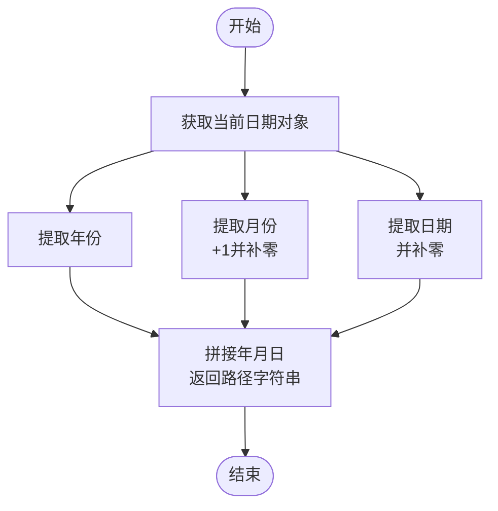
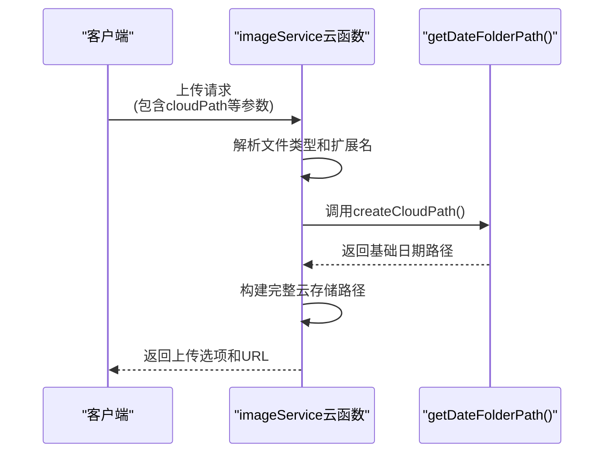
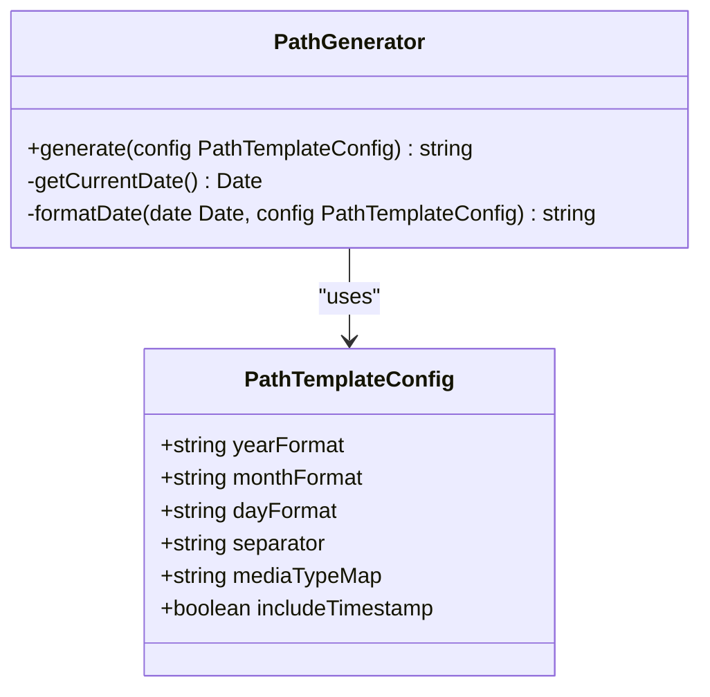

# 存储路径策略

<cite>
**Referenced Files in This Document**   
- [getDateFolderPath.js](file://utils/getDateFolderPath.js)
- [index.obj.js](file://uniCloud-aliyun/cloudfunctions/imageService/index.obj.js)
- [fabuWx/index.obj.js](file://uniCloud-aliyun/cloudfunctions/imageService/fabuWx/index.obj.js)
</cite>

## 目录
1. [引言](#引言)
2. [核心组件分析](#核心组件分析)
3. [路径生成逻辑详解](#路径生成逻辑详解)
4. [调用时机与参数传递](#调用时机与参数传递)
5. [路径命名规范的影响](#路径命名规范的影响)
6. [扩展方法](#扩展方法)

## 引言
本文档全面阐述基于日期分片的存储路径生成规则，重点分析`getDateFolderPath.js`工具函数如何根据当前时间生成形如'2023/12/05/'格式的目录路径。该策略确保媒体资源按日归档便于管理，并在`imageService`云函数中得到实际应用。文档还将讨论路径命名规范对SEO优化、缓存命中率及运维检索效率的影响，并提供自定义路径模板的扩展方法。

## 核心组件分析

### getDateFolderPath.js 工具函数
该工具函数位于`utils`目录下，负责生成基于当前日期的文件夹路径。其主要功能是获取当前年、月、日，并按照指定格式拼接成字符串。

**Section sources**
- [getDateFolderPath.js](file://utils/getDateFolderPath.js#L1-L7)

### imageService 云函数
`imageService`云函数是处理图像上传和管理的核心服务，它依赖于路径生成函数来组织存储结构。该服务包含多个子模块，其中`fabuWx`模块直接使用了路径生成逻辑。

**Section sources**
- [index.obj.js](file://uniCloud-aliyun/cloudfunctions/imageService/index.obj.js#L1-L194)
- [fabuWx/index.obj.js](file://uniCloud-aliyun/cloudfunctions/imageService/fabuWx/index.obj.js#L1-L595)

## 路径生成逻辑详解

**Diagram sources**
- [getDateFolderPath.js](file://utils/getDateFolderPath.js#L1-L7)

**Section sources**
- [getDateFolderPath.js](file://utils/getDateFolderPath.js#L1-L7)

`getDateFolderPath`函数通过以下步骤生成路径：
1. 创建一个新的`Date`对象以获取当前时间
2. 使用`getFullYear()`方法获取四位数年份
3. 使用`getMonth() + 1`获取月份（由于JavaScript中月份从0开始计数，因此需要加1），然后使用`padStart(2, '0')`确保月份为两位数
4. 使用`getDate()`获取日期，并同样使用`padStart(2, '0')`确保日期为两位数
5. 将年、月、日直接拼接成一个连续的数字字符串作为返回值

值得注意的是，尽管文档目标中提到期望生成'2023/12/05/'格式的路径，但实际代码实现返回的是无分隔符的纯数字格式（如'20231205'）。这表明可能存在需求与实现之间的差异或误解。

## 调用时机与参数传递

**Diagram sources**
- [fabuWx/index.obj.js](file://uniCloud-aliyun/cloudfunctions/imageService/fabuWx/index.obj.js#L261-L301)
- [getDateFolderPath.js](file://utils/getDateFolderPath.js#L1-L7)

**Section sources**
- [fabuWx/index.obj.js](file://uniCloud-aliyun/cloudfunctions/imageService/fabuWx/index.obj.js#L261-L301)

在`imageService`云函数的`fabuWx`模块中，路径生成函数被封装在`createCloudPath`函数内调用：

1. **调用时机**：当客户端发起文件上传请求时，在处理上传选项的过程中调用路径生成函数。
2. **参数传递**：虽然`getDateFolderPath`本身不接受参数（总是基于当前时间），但在更高层次的`createCloudPath(fileType, fileExt)`函数中接收文件类型和扩展名作为参数。
3. **集成方式**：`createCloudPath`函数内部调用日期相关逻辑生成基础路径，然后结合文件类型、时间戳、随机字符串和文件扩展名构建完整的云存储路径。

具体路径结构为：`${year}/${mediaType}/${year}${month}${day}/${timestamp}_${randomStr}.${fileExt}`，其中`mediaType`根据文件类型决定是'tupian'(图片)还是'shipin'(视频)。

## 路径命名规范的影响

### SEO优化
合理的路径命名有助于搜索引擎理解内容结构。当前实现虽然实现了按日归档的目的，但由于缺乏语义化信息（如使用中文"tupian"/"shipin"而非英文"images"/"videos"），可能会影响国际搜索引擎的解析效果。建议采用更具描述性的英文目录名以提高SEO友好度。

### 缓存命中率
基于日期的分片策略有利于CDN缓存管理：
- 每日独立目录减少了跨日访问冲突
- 静态资源按时间有序排列，便于缓存预热和清理
- 时间戳+随机字符串组合有效避免了文件名冲突，同时保证了唯一性

然而，完全移除连字符可能导致某些CDN系统无法正确识别日期边界，影响基于路径的缓存策略执行效率。

### 运维检索效率
按日期组织的层级结构显著提升了运维操作效率：
- 快速定位特定日期的媒体资源
- 简化批量管理和迁移操作
- 便于实施生命周期管理策略（如自动归档或删除过期内容）
- 在日志分析和问题排查时能快速关联时间维度

## 扩展方法

为了支持更灵活的路径模板定制，可以对现有实现进行如下扩展：

**Diagram sources**
- [getDateFolderPath.js](file://utils/getDateFolderPath.js#L1-L7)

**Section sources**
- [getDateFolderPath.js](file://utils/getDateFolderPath.js#L1-L7)

建议的扩展方案包括：
1. **引入配置对象**：允许通过配置项定义年月日格式、分隔符、是否包含时间戳等
2. **支持国际化**：提供多语言的媒体类型映射表
3. **可插拔格式化器**：允许开发者注册自定义的日期格式化函数
4. **环境感知**：根据不同部署环境（开发/测试/生产）自动调整路径策略
5. **向后兼容**：确保新版本能够读取旧格式路径下的资源

这种扩展不仅能满足当前需求，还能为未来的业务发展提供足够的灵活性和技术储备。