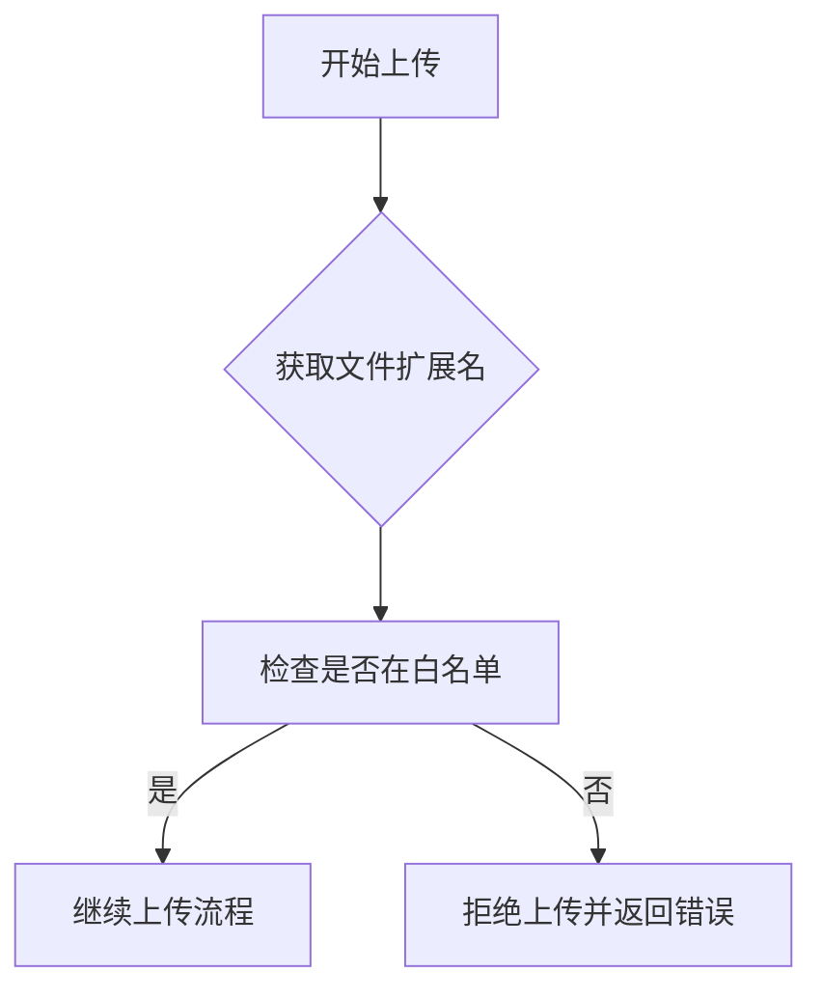
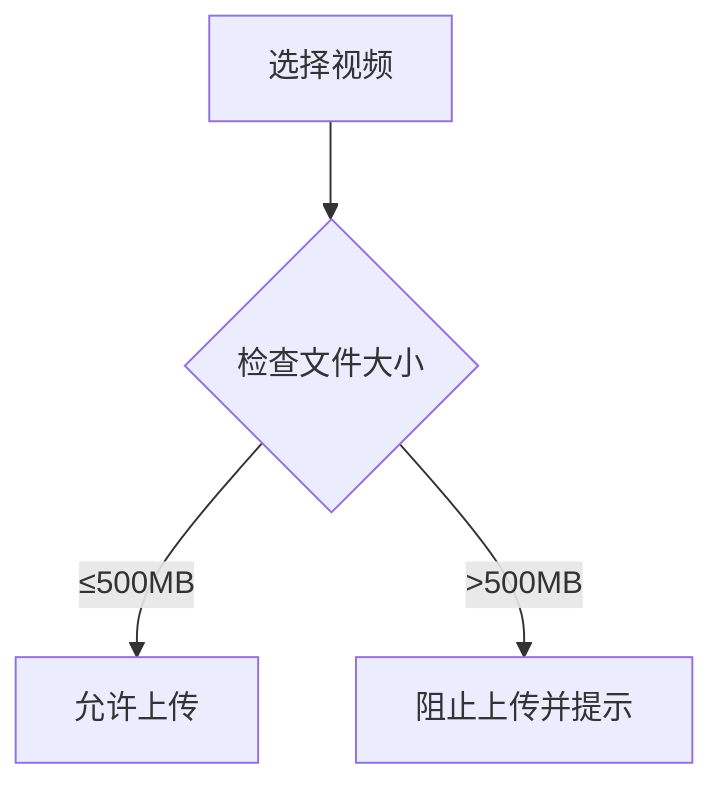
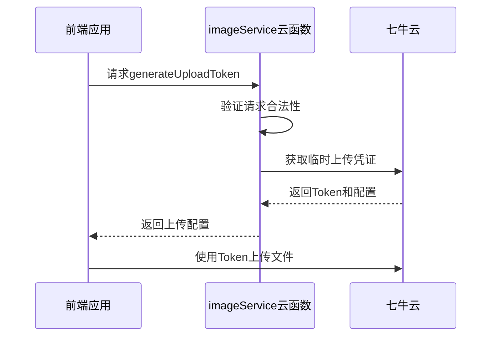
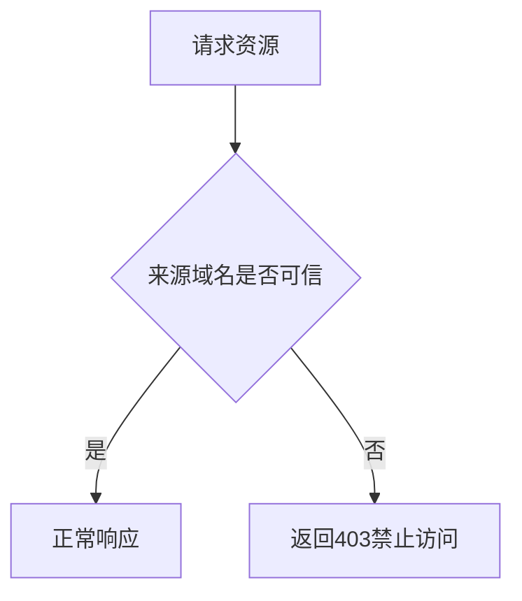
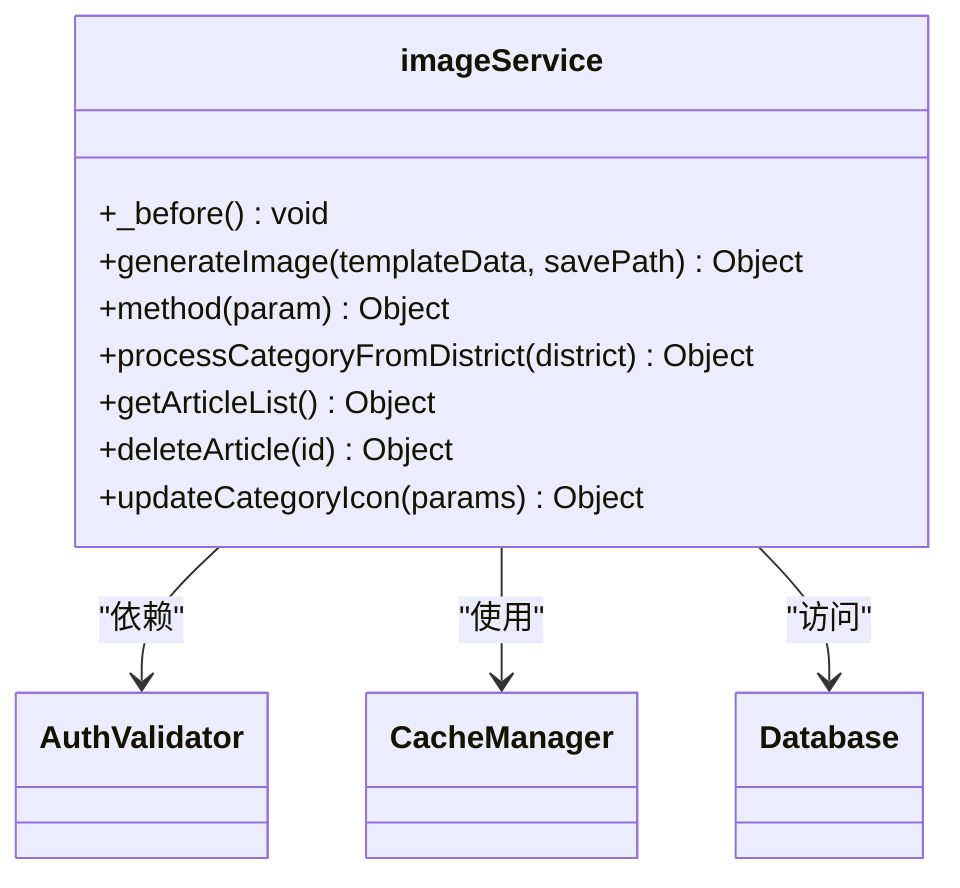
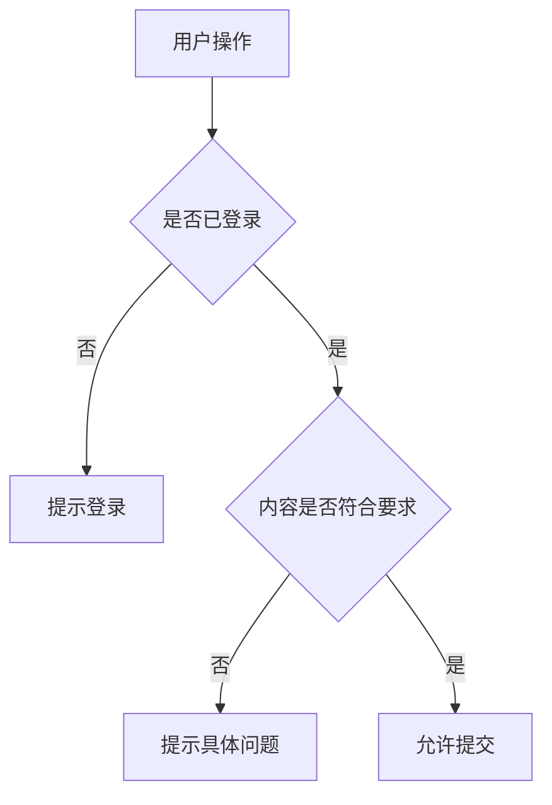
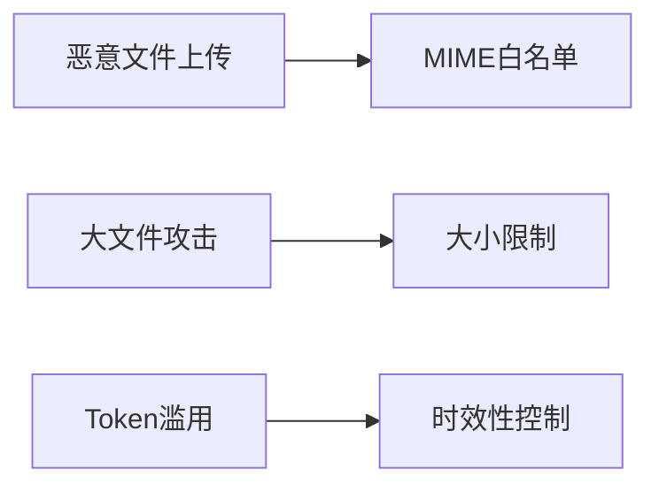
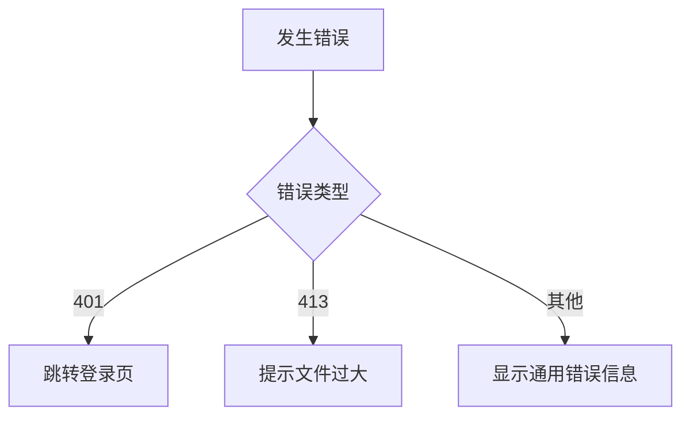

# 安全性控制措施

<cite>
**本文档引用的文件**
- [qiniuyun.vue](file://subPages/qiniuyun/qiniuyun.vue)
- [index.obj.js](file://uniCloud-aliyun/cloudfunctions/imageService/fabuWx/index.obj.js)
- [imageService/index.obj.js](file://uniCloud-aliyun/cloudfunctions/imageService/index.obj.js)
</cite>

## 目录
1. [简介](#简介)
2. [MIME类型白名单校验](#mime类型白名单校验)
3. [文件大小限制](#文件大小限制)
4. [上传Token有效期控制](#上传token有效期控制)
5. [防盗链Referer规则配置](#防盗链referer规则配置)
6. [imageService云函数请求鉴权](#imageservice云函数请求鉴权)
7. [前端预校验机制](#前端预校验机制)
8. [常见攻击场景及防御方案](#常见攻击场景及防御方案)
9. [错误码处理建议](#错误码处理建议)

## 简介
本系统通过七牛云集成实现全面的安全防护机制，涵盖文件上传、访问控制、数据验证等多个层面。系统采用前后端协同的方式，在保证用户体验的同时，确保系统的安全性。

**Section sources**
- [qiniuyun.vue](file://subPages/qiniuyun/qiniuyun.vue#L0-L1961)

## MIME类型白名单校验
系统实施严格的MIME类型白名单校验机制，仅允许特定类型的文件上传：

- **图片类型**：`jpg`, `jpeg`, `png`, `gif`, `webp`
- **视频类型**：`mp4`, `mov`, `m4v`

在服务端通过`getUploadFileOptions`方法对文件扩展名进行验证，若文件类型不在白名单内，则抛出"不支持的图片类型"或"不支持的视频类型"错误。

**Diagram sources**
- [index.obj.js](file://uniCloud-aliyun/cloudfunctions/imageService/fabuWx/index.obj.js#L261-L301)

**Section sources**
- [index.obj.js](file://uniCloud-aliyun/cloudfunctions/imageService/fabuWx/index.obj.js#L261-L301)

## 文件大小限制
系统对不同类型的文件实施差异化大小限制策略：

- **图片文件**：单张图片≤10MB（前端未明确限制，但服务端会拒绝超大文件）
- **视频文件**：单个视频≤500MB（前端直接限制）

前端在`chooseVideo`方法中通过`maxSize = 500 * 1024 * 1024`（500MB）对视频大小进行预校验，超出限制时提示用户"视频过大，请选择小于500MB的视频"。

**Diagram sources**
- [qiniuyun.vue](file://subPages/qiniuyun/qiniuyun.vue#L850-L855)

**Section sources**
- [qiniuyun.vue](file://subPages/qiniuyun/qiniuyun.vue#L850-L855)

## 上传Token有效期控制
系统通过动态生成的上传凭证（upload token）实现上传权限控制。在`uploadImageToQiniu`和`uploadVideoToQiniu`方法中，调用`qiniuCloud.generateUploadToken`接口获取临时上传凭证。

上传Token具有以下安全特性：
- 时效性：每次上传都需要重新获取新的Token
- 绑定性：Token与特定文件类型和扩展名绑定
- 一次性：每个Token只能用于一次上传操作

**Diagram sources**
- [qiniuyun.vue](file://subPages/qiniuyun/qiniuyun.vue#L731-L778)

**Section sources**
- [qiniuyun.vue](file://subPages/qiniuyun/qiniuyun.vue#L731-L778)

## 防盗链Referer规则配置
系统通过HTTPS协议和域名白名单机制防止资源被盗用：

- 强制使用HTTPS协议：在上传前检查`uploadDomain`，若为HTTP则自动转换为HTTPS
- 域名授权检查：当出现"上传域名未授权"错误时，系统会提示用户
- 安全域名：使用`https://aly22.jingle350.cn`作为可信域名

该机制有效防止其他网站直接引用系统中的媒体资源。

**Diagram sources**
- [qiniuyun.vue](file://subPages/qiniuyun/qiniuyun.vue#L755-L760)

**Section sources**
- [qiniuyun.vue](file://subPages/qiniuyun/qiniuyun.vue#L755-L760)

## imageService云函数请求鉴权
`imageService`云函数实现了多层请求鉴权机制：

1. **前置处理器**：通过`_before`方法实现通用预处理
2. **参数验证**：对所有输入参数进行严格校验
3. **业务逻辑鉴权**：在关键操作前验证用户身份和权限

云函数还实现了缓存机制，对重复请求进行优化，同时确保缓存数据的安全性和时效性（30分钟过期）。

**Diagram sources**
- [imageService/index.obj.js](file://uniCloud-aliyun/cloudfunctions/imageService/index.obj.js#L0-L193)

**Section sources**
- [imageService/index.obj.js](file://uniCloud-aliyun/cloudfunctions/imageService/index.obj.js#L0-L193)

## 前端预校验机制
前端实施多层次预校验以提升用户体验和系统安全性：

- **登录状态校验**：在`checkUserLogin`方法中验证用户登录状态，未登录用户无法上传
- **内容长度校验**：文字内容必须大于5个字符且不超过350字
- **数量限制**：图片最多上传9张
- **时间限制**：视频最长60秒

这些预校验在用户操作时即时反馈，避免无效请求到达服务器。

**Diagram sources**
- [qiniuyun.vue](file://subPages/qiniuyun/qiniuyun.vue#L1150-L1200)

**Section sources**
- [qiniuyun.vue](file://subPages/qiniuyun/qiniuyun.vue#L1150-L1200)

## 常见攻击场景及防御方案
### 恶意文件上传攻击
**攻击场景**：攻击者尝试上传可执行文件或脚本文件。

**防御方案**：
- 实施MIME类型白名单校验
- 服务端二次验证文件类型
- 使用随机文件名存储，防止路径遍历

### 大文件消耗资源攻击
**攻击场景**：攻击者上传超大文件消耗系统带宽和存储资源。

**防御方案**：
- 前端限制视频大小（500MB）
- 服务端设置合理的超时和大小限制
- 监控异常上传行为

### Token滥用攻击
**攻击场景**：攻击者截获上传Token并重复使用。

**防御方案**：
- Token短期有效
- Token与特定文件绑定
- 服务端验证Token使用次数

**Section sources**
- [index.obj.js](file://uniCloud-aliyun/cloudfunctions/imageService/fabuWx/index.obj.js#L261-L301)
- [qiniuyun.vue](file://subPages/qiniuyun/qiniuyun.vue#L850-L855)

## 错误码处理建议
系统定义了标准化的错误处理机制：

- **401未授权**：当用户未登录或Token失效时返回
  - 处理建议：引导用户重新登录，刷新Token
  
- **413负载过大**：当文件超过大小限制时返回
  - 处理建议：提示用户文件过大，建议压缩后重试

- **其他错误**：包括网络错误、服务端错误等
  - 处理建议：提供友好的错误提示，并记录日志供排查

前端通过Promise的reject机制捕获错误，并根据错误类型给出相应的用户提示。

**Diagram sources**
- [qiniuyun.vue](file://subPages/qiniuyun/qiniuyun.vue#L775-L814)

**Section sources**
- [qiniuyun.vue](file://subPages/qiniuyun/qiniuyun.vue#L775-L814)