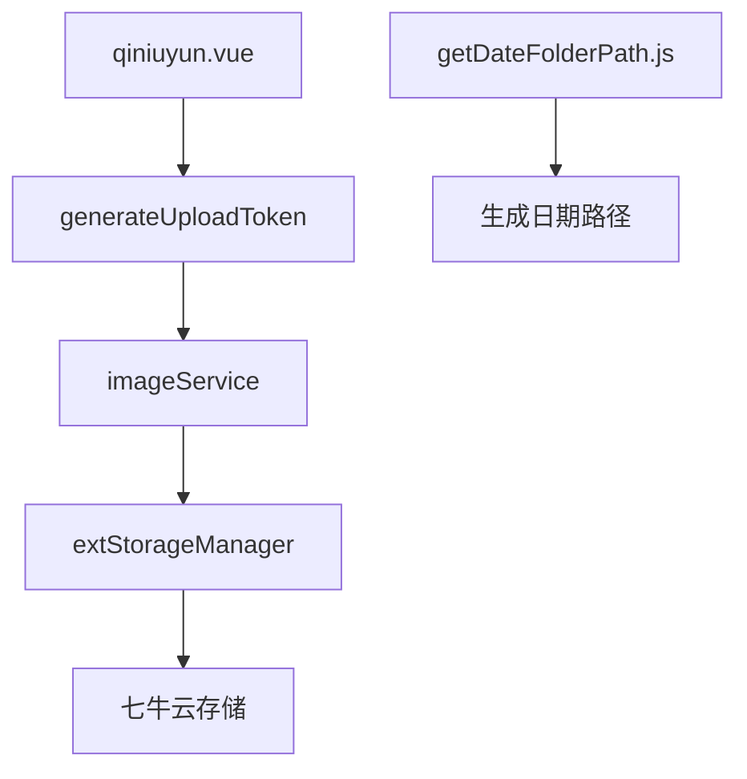
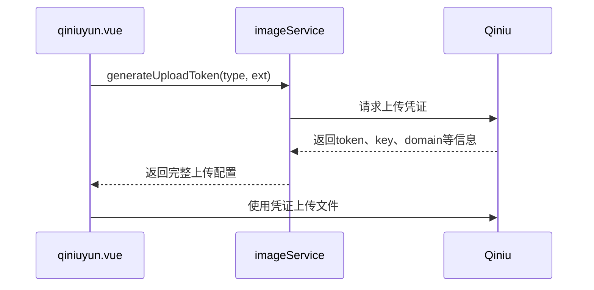
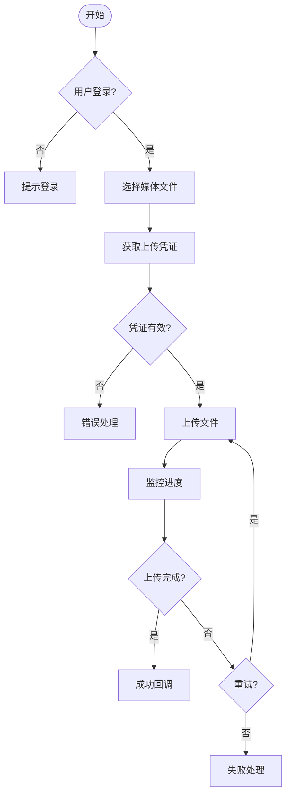
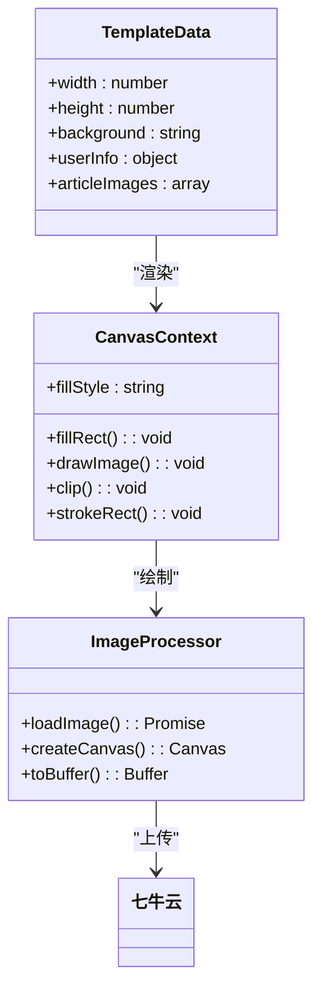

# 对象存储集成（七牛云）

<cite>
**本文档引用文件**
- [qiniuyun.vue](file://subPages/qiniuyun/qiniuyun.vue)
- [imageService/index.obj.js](file://uniCloud-aliyun/cloudfunctions/imageService/index.obj.js)
- [imageService/fabuWx/index.obj.js](file://uniCloud-aliyun/cloudfunctions/imageService/fabuWx/index.obj.js)
- [getDateFolderPath.js](file://utils/getDateFolderPath.js)
</cite>

## 目录
1. [项目结构](#项目结构)
2. [核心组件分析](#核心组件分析)
3. [上传凭证获取流程](#上传凭证获取流程)
4. [文件上传链路解析](#文件上传链路解析)
5. [存储路径规则](#存储路径规则)
6. [图片与视频上传机制](#图片与视频上传机制)
7. [安全控制措施](#安全控制措施)
8. [错误处理策略](#错误处理策略)

## 项目结构

本项目采用模块化设计，主要包含以下关键目录：

- `subPages/qiniuyun/`：七牛云对象存储配置页面
- `uniCloud-aliyun/cloudfunctions/imageService/`：图像处理云函数
- `utils/`：工具函数库
- `uni_modules/`：第三方组件模块



**图示来源**
- [qiniuyun.vue](file://subPages/qiniuyun/qiniuyun.vue)
- [imageService/index.obj.js](file://uniCloud-aliyun/cloudfunctions/imageService/index.obj.js)
- [getDateFolderPath.js](file://utils/getDateFolderPath.js)

## 核心组件分析

### qiniuyun.vue 页面功能
该页面实现了用户内容发布时的媒体文件上传功能，主要包括：
- 分类选择界面
- 文本输入区域
- 图片和视频上传管理
- 发布按钮交互

支持同时上传最多9张图片或1个视频，并提供实时进度显示。

**代码位置**
- [qiniuyun.vue](file://subPages/qiniuyun/qiniuyun.vue#L0-L799)

### imageService 云函数
作为后端服务，负责处理文件上传相关的业务逻辑：
- 生成上传凭证
- 验证文件类型和大小
- 创建存储路径
- 处理图片水印和格式转换

**代码位置**
- [imageService/index.obj.js](file://uniCloud-aliyun/cloudfunctions/imageService/index.obj.js#L0-L193)
- [imageService/fabuWx/index.obj.js](file://uniCloud-aliyun/cloudfunctions/imageService/fabuWx/index.obj.js#L0-L336)

## 上传凭证获取流程

系统通过调用云函数获取七牛云上传凭证，具体流程如下：



**图示来源**
- [qiniuyun.vue](file://subPages/qiniuyun/qiniuyun.vue#L731-L778)
- [imageService/fabuWx/index.obj.js](file://uniCloud-aliyun/cloudfunctions/imageService/fabuWx/index.obj.js#L261-L301)

## 文件上传链路解析

文件上传过程分为前端和后端两个部分协同工作：

### 前端处理流程
1. 用户选择图片或视频
2. 调用`generateUploadToken`获取上传凭证
3. 使用`uni.uploadFile`发起上传请求
4. 监听上传进度并更新UI
5. 处理上传成功或失败的结果

### 后端处理流程
1. 接收上传请求
2. 验证文件类型（图片：jpg/jpeg/png/gif/webp；视频：mp4/mov/m4v）
3. 生成唯一的存储路径
4. 执行文件安全检查
5. 返回上传配置信息



**图示来源**
- [qiniuyun.vue](file://subPages/qiniuyun/qiniuyun.vue#L731-L896)
- [imageService/fabuWx/index.obj.js](file://uniCloud-aliyun/cloudfunctions/imageService/fabuWx/index.obj.js#L261-L336)

## 存储路径规则

系统采用按日期分片的存储路径规则，确保资源有序管理。路径生成由`getDateFolderPath.js`工具函数实现。

### getDateFolderPath 实现
```javascript
export const getDateFolderPath = () => {
	const date = new Date()
	const year = date.getFullYear()
	const month = String(date.getMonth() + 1).padStart(2, '0')
	const day = String(date.getDate()).padStart(2, '0')
	return `${year}${month}${day}`
}
```

### 完整存储路径结构
路径遵循以下格式：
```
年份/媒体类型/年月日/时间戳_随机字符.扩展名
```

例如：
```
2025/tupian/20250115/1705280000123_abc123def.jpg
2025/shipin/20250115/1705280000456_xyz789uvw.mp4
```

其中：
- `tupian` 表示图片
- `shipin` 表示视频
- 时间戳保证唯一性
- 随机字符增加安全性

**代码位置**
- [getDateFolderPath.js](file://utils/getDateFolderPath.js#L0-L7)
- [imageService/fabuWx/index.obj.js](file://uniCloud-aliyun/cloudfunctions/imageService/fabuWx/index.obj.js#L156-L192)

## 图片与视频上传机制

### 图片上传特性
- 支持多图上传（最多9张）
- 自动压缩处理
- 生成缩略图：`?imageView2/1/w/200/h/200`
- 生成压缩图：`?imageView2/2/w/800`
- 添加自适应水印
- 支持WebP格式转换

### 视频上传特性
- 单视频上传限制
- 大小限制：500MB以内
- 时长限制：60秒以内
- 自动生成封面图：`?vframe/jpg/offset/0/w/640/h/360/rotate/auto`
- 支持多种视频格式（mp4、mov、m4v）

### 封面图处理
系统使用Canvas技术动态生成文章封面图，包含：
- 用户头像（圆形裁剪）
- 用户昵称
- 文章图片预览（最多3张）
- 品牌水印"遥望潜力股"



**图示来源**
- [imageService/index.obj.js](file://uniCloud-aliyun/cloudfunctions/imageService/index.obj.js#L0-L193)

### CDN加速与防盗链配置
- 使用HTTPS协议上传和访问
- 加速域名：`https://aly22.jingle0350.cn`
- 自动将HTTP域名转换为HTTPS
- 建议在七牛云控制台配置Referer防盗链
- 推荐启用URL鉴权功能增强安全性

## 安全控制措施

### 前端安全控制
- MIME类型验证
- 文件大小校验
- 登录状态检查
- 上传域名白名单
- HTTPS强制转换

### 后端安全控制
- 文件类型白名单验证
- 扩展名合法性检查
- 路径注入防护
- 上传凭证时效性
- 元数据记录

### 签名生成逻辑
前端通过调用云函数获取签名，避免密钥暴露：
1. 前端请求`generateUploadToken`
2. 云函数内部调用七牛SDK生成签名
3. 返回token、key、domain等必要信息
4. 前端使用这些信息直传文件

### 实际调用示例
```javascript
// 获取图片上传凭证
const uploadConfig = await qiniuCloud.generateUploadToken({
    type: 'image',
    ext: 'jpg'
});

// 执行上传
uni.uploadFile({
    url: uploadConfig.uploadDomain,
    filePath: tempPath,
    name: 'file',
    formData: {
        token: uploadConfig.token,
        key: uploadConfig.key
    }
});
```

**代码位置**
- [qiniuyun.vue](file://subPages/qiniuyun/qiniuyun.vue#L731-L896)

## 错误处理策略

### 常见错误码及处理
| 错误类型 | 错误码/信息 | 处理方案 |
|---------|-----------|--------|
| 未登录 | userInfo为空 | 弹出登录提示 |
| 文件过大 | size > maxSize | 提示"视频过大，请选择小于500MB的视频" |
| 不支持的类型 | 不在allowedTypes中 | 抛出"不支持的文件类型"异常 |
| 上传失败 | statusCode ≠ 200 | 显示状态码并提示重试 |
| 域名未授权 | url not in domain list | 显示模态框提示 |

### 重试机制
- 图片上传采用错峰上传策略（每张间隔200ms）
- 视频上传支持异步上传，不影响其他操作
- 上传任务自带3次重试逻辑
- 进度条实时反馈上传状态

### 用户体验优化
- 轻量级loading提示
- 上传中可继续编辑内容
- 失败后保留已选文件
- 清晰的错误消息展示

**代码位置**
- [qiniuyun.vue](file://subPages/qiniuyun/qiniuyun.vue#L731-L896)