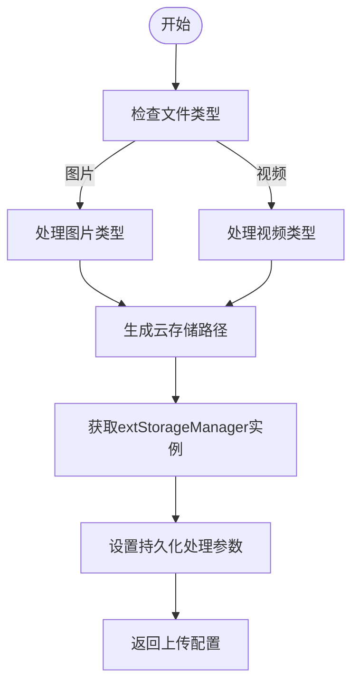
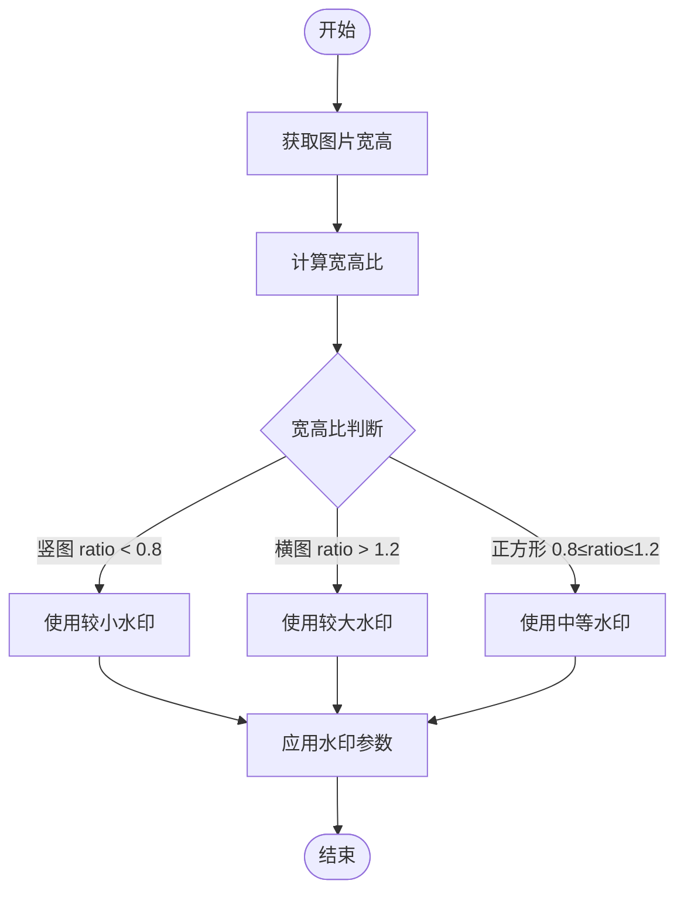
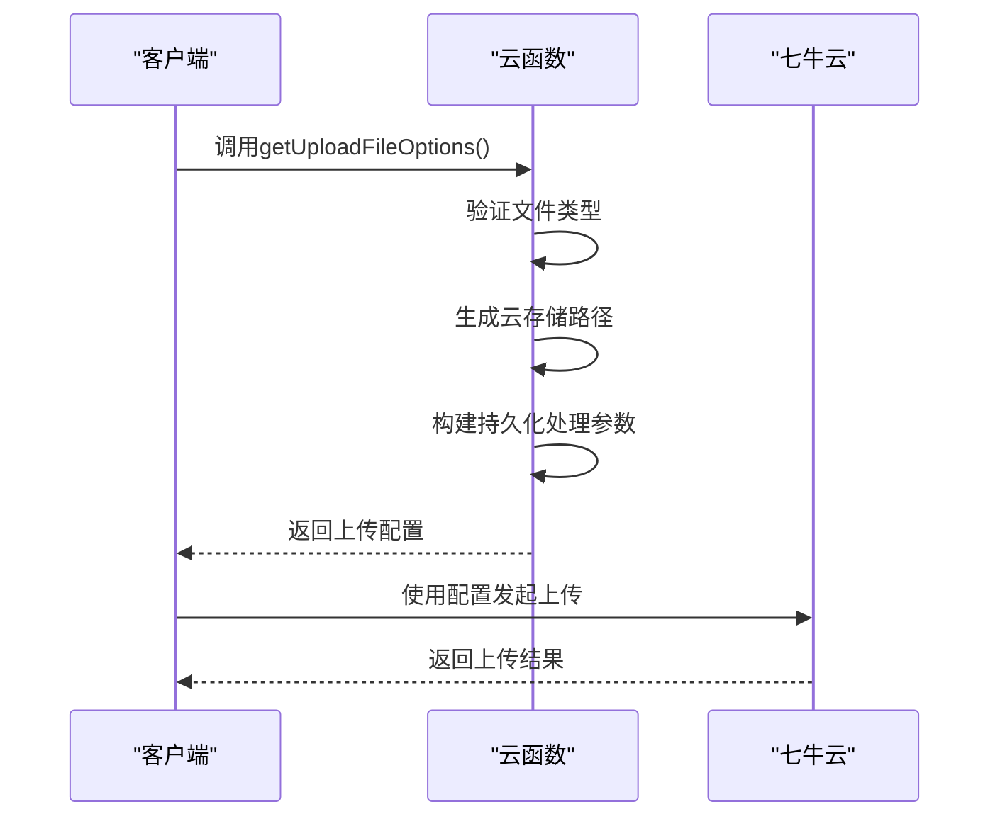
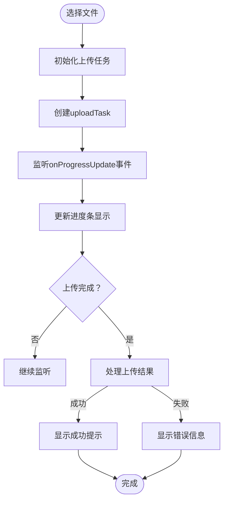
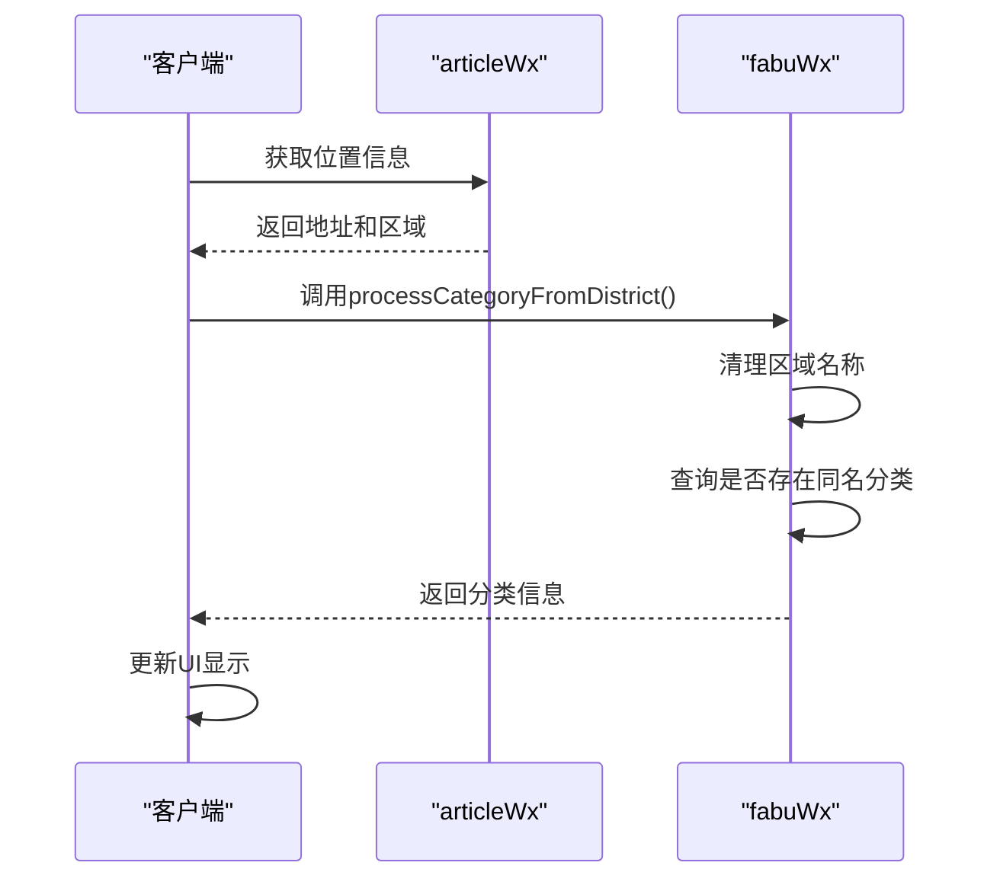
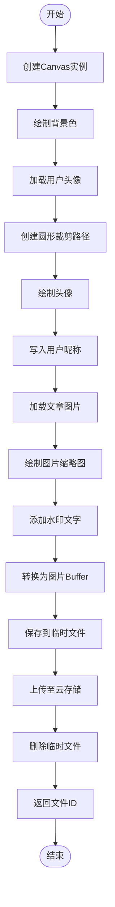
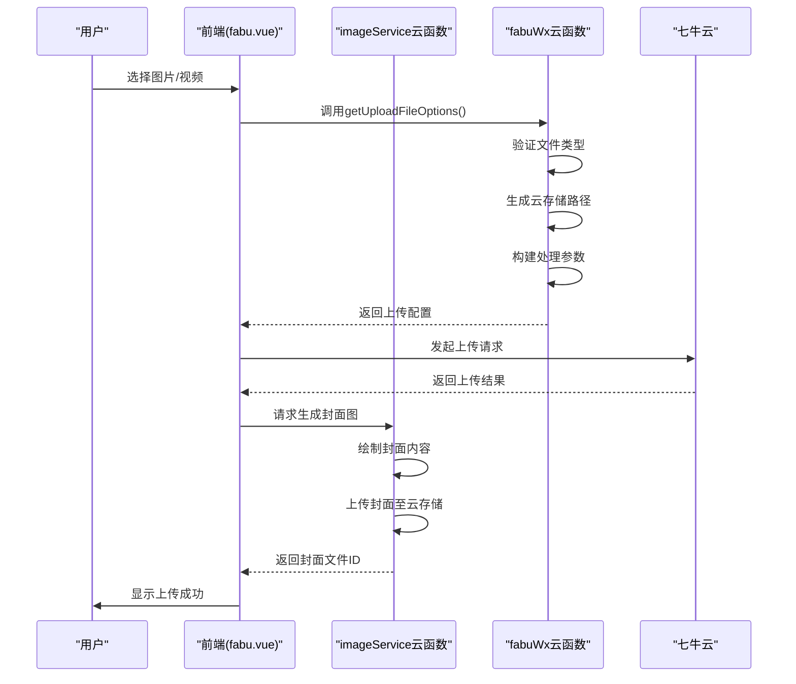
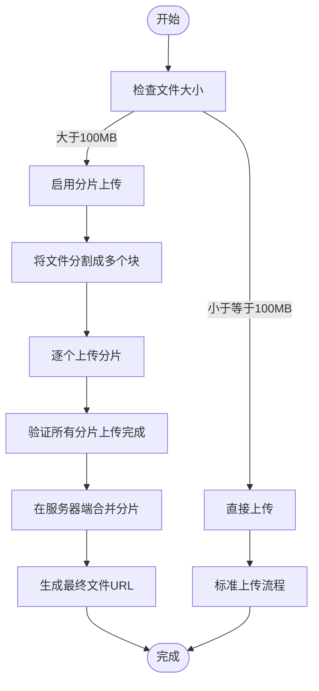
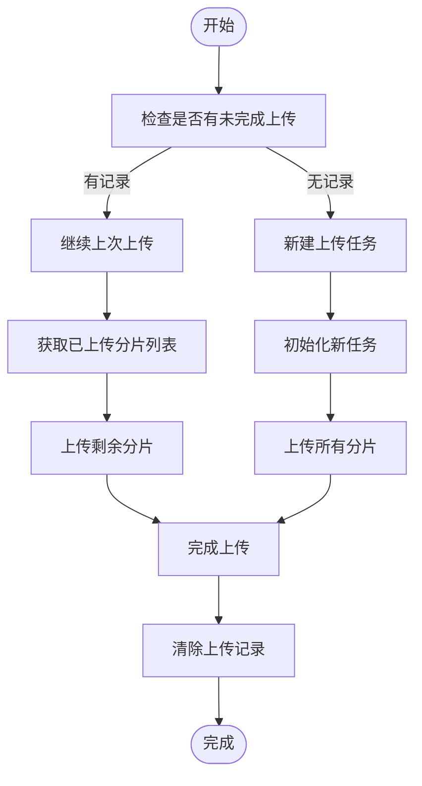
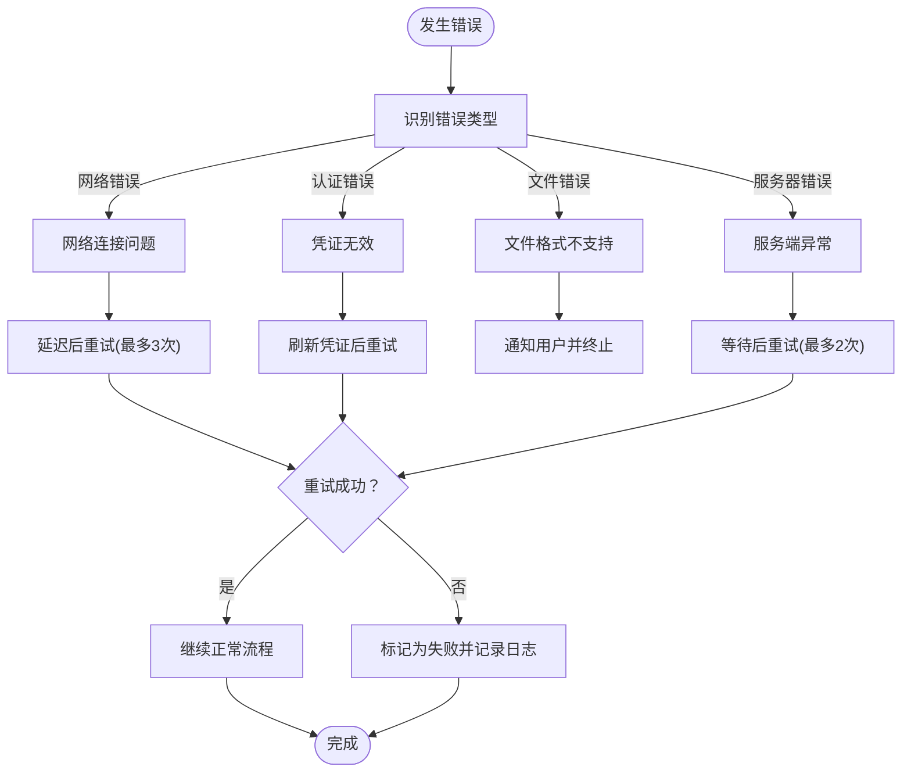

# 文件上传流程

<cite>
**本文档引用文件**  
- [fabu.vue](file://pages/fabu/fabu.vue)
- [imageService/index.obj.js](file://uniCloud-aliyun/cloudfunctions/imageService/index.obj.js)
- [imageService/fabuWx/index.obj.js](file://uniCloud-aliyun/cloudfunctions/imageService/fabuWx/index.obj.js)
- [fabuWx/index.obj.js](file://uniCloud-aliyun/cloudfunctions/fabuWx/index.obj.js)
- [qiniuyun.vue](file://subPages/qiniuyun/qiniuyun.vue)
</cite>

## 目录
1. [简介](#简介)
2. [核心组件分析](#核心组件分析)
3. [上传凭证生成机制](#上传凭证生成机制)
4. [前端直传流程](#前端直传流程)
5. [图文/视频发布协作流程](#图文视频发布协作流程)
6. [序列图：全链路上传时序](#序列图全链路上传时序)
7. [高级特性实现建议](#高级特性实现建议)
8. [异常处理与重试机制](#异常处理与重试机制)

## 简介
本文深入解析从客户端发起至七牛云完成上传的全链路流程。重点描述`imageService`云函数如何生成上传token与签名，`fabuWx`云函数在图文/视频发布时调用上传服务的协作关系。说明前端直传模式下的凭证获取、表单构建、进度监听及成功回调处理机制。结合序列图展示各环节时序关系，并提供异常中断重试、大文件分片上传等高级特性的实现建议。

## 核心组件分析

### imageService 云函数
负责生成封面图片和处理图像相关操作的核心服务。通过Canvas API动态绘制用户头像、昵称和文章图片，生成高质量封面图并上传至云存储。

**Section sources**
- [imageService/index.obj.js](file://uniCloud-aliyun/cloudfunctions/imageService/index.obj.js#L1-L194)

### fabuWx 云函数
处理图文/视频发布的主逻辑，包括分类管理、位置信息处理、媒体文件上传配置生成等功能。协调前端与云存储之间的交互流程。

**Section sources**
- [fabuWx/index.obj.js](file://uniCloud-aliyun/cloudfunctions/fabuWx/index.obj.js#L1-L710)

### 前端发布页面 (fabu.vue)
实现用户界面交互，包含内容输入、媒体选择、分类选择、位置获取等完整发布功能模块。

**Section sources**
- [fabu.vue](file://pages/fabu/fabu.vue#L1-L3113)

## 上传凭证生成机制

### 图片上传配置生成
`getUploadFileOptions`方法根据文件类型生成相应的上传配置参数：

**Diagram sources**
- [fabuWx/index.obj.js](file://uniCloud-aliyun/cloudfunctions/fabuWx/index.obj.js#L100-L200)

### 水印参数动态调整
根据图片形状自动调整水印大小和位置：

**Diagram sources**
- [fabuWx/index.obj.js](file://uniCloud-aliyun/cloudfunctions/fabuWx/index.obj.js#L50-L100)

## 前端直传流程

### 凭证获取与表单构建
前端通过调用云函数获取上传所需的安全凭证和配置信息：

**Diagram sources**
- [fabu.vue](file://pages/fabu/fabu.vue#L500-L600)
- [fabuWx/index.obj.js](file://uniCloud-aliyun/cloudfunctions/fabuWx/index.obj.js#L80-L150)

### 进度监听与状态更新
实现上传进度的实时监控和UI反馈：

**Diagram sources**
- [fabu.vue](file://pages/fabu/fabu.vue#L520-L550)

## 图文视频发布协作流程

### 分类与位置信息处理
系统根据用户位置自动创建或匹配相应分类：

**Diagram sources**
- [fabu.vue](file://pages/fabu/fabu.vue#L200-L300)
- [fabuWx/index.obj.js](file://uniCloud-aliyun/cloudfunctions/fabuWx/index.obj.js#L300-L400)

### 封面图生成流程
利用Canvas技术动态生成文章封面：

**Diagram sources**
- [imageService/index.obj.js](file://uniCloud-aliyun/cloudfunctions/imageService/index.obj.js#L20-L190)

## 序列图全链路上传时序

**Diagram sources**
- [fabu.vue](file://pages/fabu/fabu.vue#L1-L3113)
- [imageService/index.obj.js](file://uniCloud-aliyun/cloudfunctions/imageService/index.obj.js#L1-L194)
- [fabuWx/index.obj.js](file://uniCloud-aliyun/cloudfunctions/fabuWx/index.obj.js#L1-L710)

## 高级特性实现建议

### 大文件分片上传
对于超过100MB的视频文件，建议采用分片上传策略：

### 断点续传机制
实现上传中断后的恢复功能：

## 异常处理与重试机制

### 错误类型与处理策略
建立完善的错误分类和应对方案：

**Section sources**
- [fabu.vue](file://pages/fabu/fabu.vue#L520-L580)
- [fabuWx/index.obj.js](file://uniCloud-aliyun/cloudfunctions/fabuWx/index.obj.js#L600-L700)