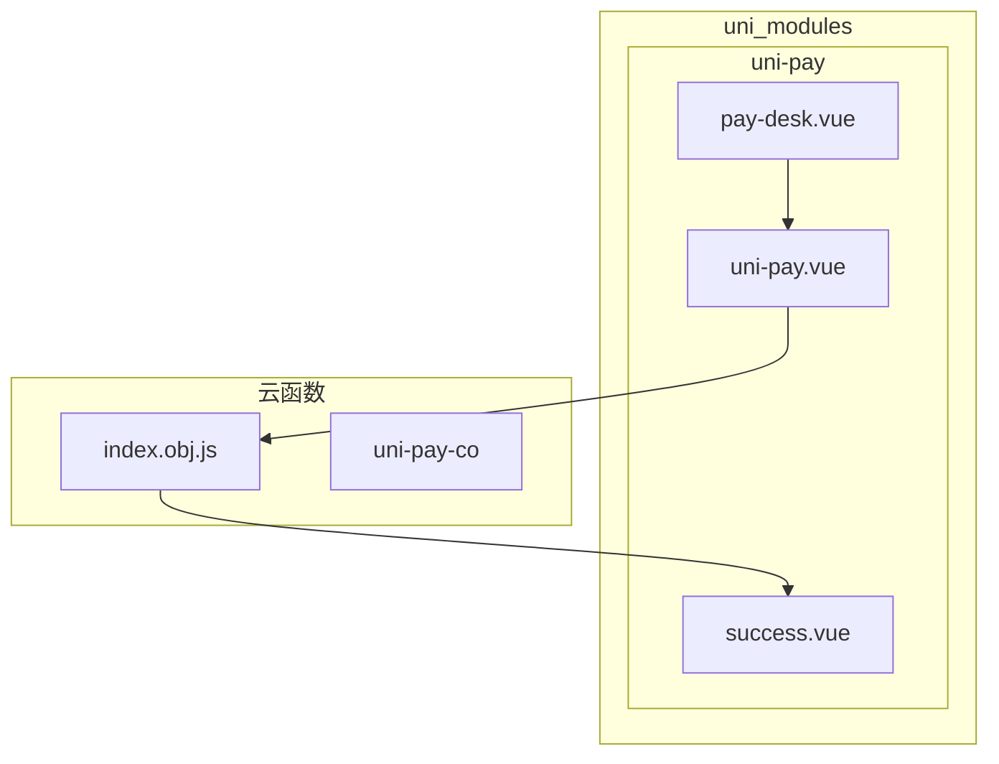
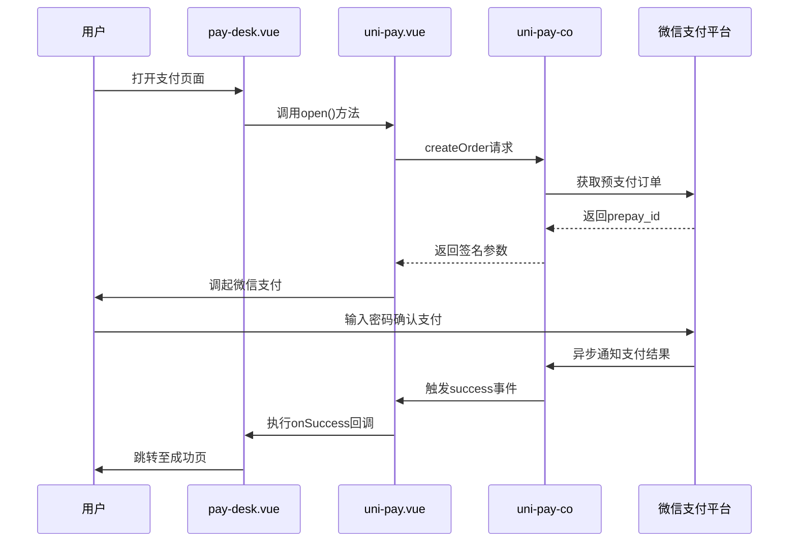
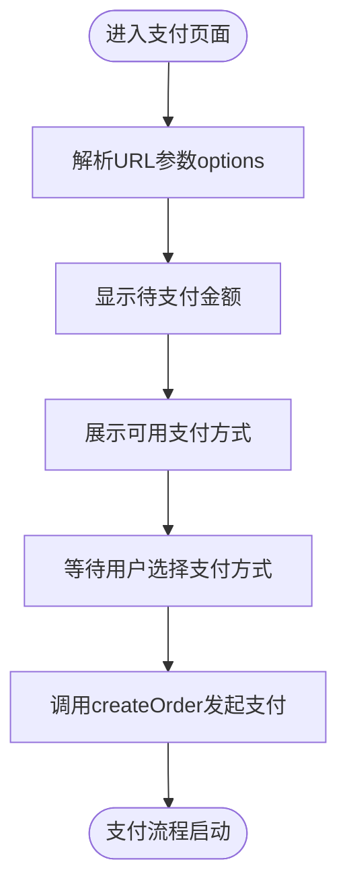
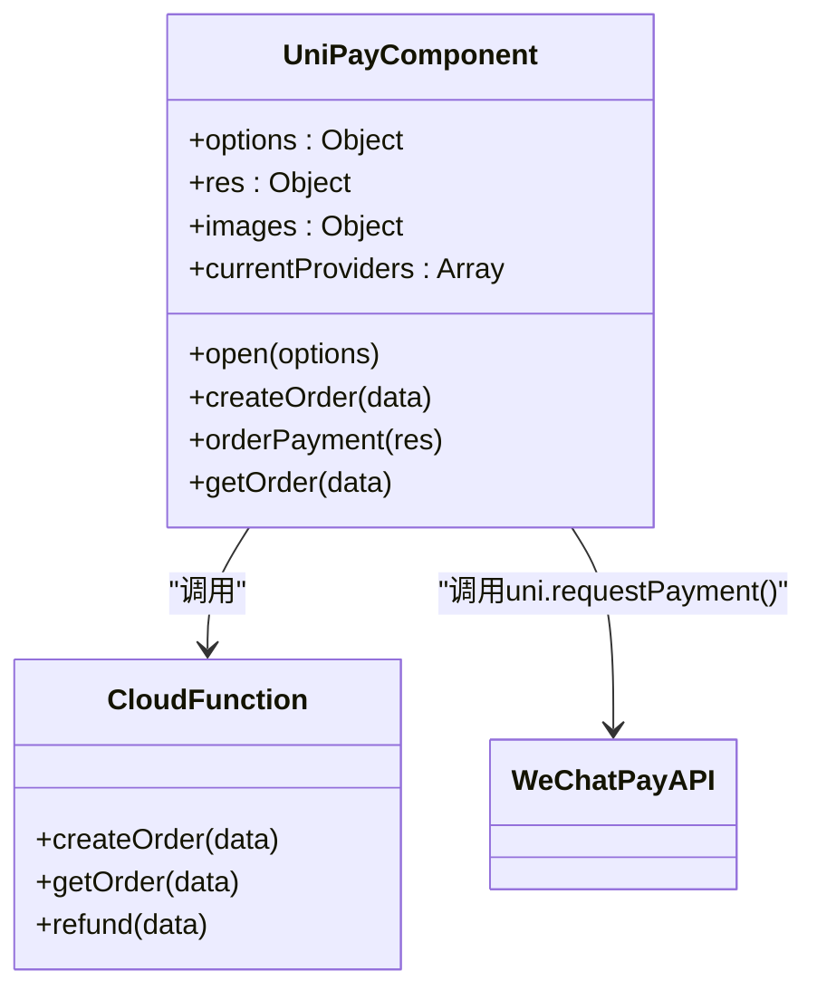
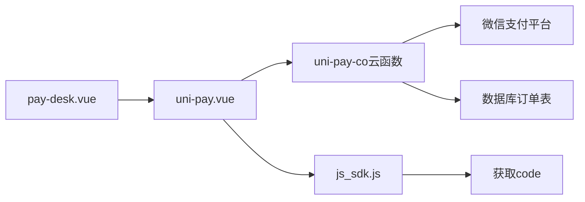

# 前端支付集成

<cite>
**本文档引用文件**  
- [pay-desk.vue](file://uni_modules/uni-pay/pages/pay-desk/pay-desk.vue)
- [uni-pay.vue](file://uni_modules/uni-pay/components/uni-pay/uni-pay.vue)
- [success.vue](file://uni_modules/uni-pay/pages/success/success.vue)
- [js_sdk.js](file://uni_modules/uni-pay/js_sdk/js_sdk.js)
- [index.obj.js](file://uniCloud-aliyun/cloudfunctions/wxpay/index.obj.js)
</cite>

## 目录
1. [简介](#简介)
2. [项目结构](#项目结构)
3. [核心组件](#核心组件)
4. [架构概述](#架构概述)
5. [详细组件分析](#详细组件分析)
6. [依赖分析](#依赖分析)
7. [性能考虑](#性能考虑)
8. [故障排除指南](#故障排除指南)
9. [结论](#结论)

## 简介
本指南旨在为前端开发者提供完整的微信支付功能集成方案，基于 `pay-desk.vue` 页面展示从用户选择支付方式到最终完成支付的全流程。文档将深入解析如何通过 `uni.requestPayment()` API 发起支付请求，并阐述支付成功、取消、失败三种状态的回调处理逻辑与后续导航策略。

## 项目结构
项目采用模块化设计，支付相关功能集中于 `uni_modules/uni-pay` 模块中，包含收银台页面、支付组件和成功页等关键部分。

**Diagram sources**
- [pay-desk.vue](file://uni_modules/uni-pay/pages/pay-desk/pay-desk.vue)
- [uni-pay.vue](file://uni_modules/uni-pay/components/uni-pay/uni-pay.vue)
- [success.vue](file://uni_modules/uni-pay/pages/success/success.vue)
- [index.obj.js](file://uniCloud-aliyun/cloudfunctions/wxpay/index.obj.js)

**Section sources**
- [pay-desk.vue](file://uni_modules/uni-pay/pages/pay-desk/pay-desk.vue)
- [uni-pay.vue](file://uni_modules/uni-pay/components/uni-pay/uni-pay.vue)

## 核心组件
`pay-desk.vue` 是自定义收银台页面的核心入口，负责接收订单参数并调用 `uni-pay` 组件发起支付流程。该页面通过 `onLoad` 钩子解析传入的支付选项，并在用户点击支付方式后触发 `createOrder` 方法。

**Section sources**
- [pay-desk.vue](file://uni_modules/uni-pay/pages/pay-desk/pay-desk.vue#L40-L64)

## 架构概述
系统采用前后端分离架构，前端通过 `uni-pay` 组件封装支付逻辑，后端通过云对象 `uni-pay-co` 处理订单创建与支付结果验证。支付请求由前端发起，经云端生成签名参数后返回给客户端调用原生支付接口。

**Diagram sources**
- [pay-desk.vue](file://uni_modules/uni-pay/pages/pay-desk/pay-desk.vue#L55-L64)
- [uni-pay.vue](file://uni_modules/uni-pay/components/uni-pay/uni-pay.vue#L280-L350)
- [index.obj.js](file://uniCloud-aliyun/cloudfunctions/wxpay/index.obj.js#L89-L117)

## 详细组件分析

### 支付台页面分析
`pay-desk.vue` 页面实现了移动端收银台界面，包含金额显示、支付方式选择等UI交互元素。页面通过 `insideData` 接收来自 `uni-pay` 组件的初始化数据，并动态渲染可用的支付渠道。

#### UI交互设计

**Diagram sources**
- [pay-desk.vue](file://uni_modules/uni-pay/pages/pay-desk/pay-desk.vue#L28-L64)

**Section sources**
- [pay-desk.vue](file://uni_modules/uni-pay/pages/pay-desk/pay-desk.vue#L1-L115)

### 支付组件分析
`uni-pay.vue` 组件是整个支付流程的核心控制器，封装了与云端通信及调用原生支付API的复杂逻辑。

#### 支付调起流程

**Diagram sources**
- [uni-pay.vue](file://uni_modules/uni-pay/components/uni-pay/uni-pay.vue#L280-L350)

**Section sources**
- [uni-pay.vue](file://uni_modules/uni-pay/components/uni-pay/uni-pay.vue#L1-L942)

## 依赖分析
系统依赖多个关键模块协同工作以完成支付流程：

**Diagram sources**
- [pay-desk.vue](file://uni_modules/uni-pay/pages/pay-desk/pay-desk.vue)
- [uni-pay.vue](file://uni_modules/uni-pay/components/uni-pay/uni-pay.vue)
- [js_sdk.js](file://uni_modules/uni-pay/js_sdk/js_sdk.js)
- [index.obj.js](file://uniCloud-aliyun/cloudfunctions/wxpay/index.obj.js)

**Section sources**
- [pay-desk.vue](file://uni_modules/uni-pay/pages/pay-desk/pay-desk.vue)
- [uni-pay.vue](file://uni_modules/uni-pay/components/uni-pay/uni-pay.vue)
- [js_sdk.js](file://uni_modules/uni-pay/js_sdk/js_sdk.js)

## 性能考虑
为确保支付流程顺畅，建议：
- 在用户进入支付页面前预先加载必要资源
- 对网络请求进行错误重试机制
- 使用本地缓存减少重复获取openid的次数
- 控制图片资源大小以加快页面渲染速度

## 故障排除指南
针对常见集成问题提供以下解决方案：

| 问题类型 | 可能原因 | 解决方案 |
|--------|--------|--------|
| 参数缺失错误 | 必填字段未传递 | 检查total_fee、out_trade_no等必填项 |
| 签名无效 | 密钥配置错误 | 核实商户密钥与证书配置 |
| 用户拒绝授权 | 用户取消登录 | 提示用户重新授权并检查scope权限 |
| 支付无响应 | 网络异常或超时 | 添加超时处理并提示用户重试 |

**Section sources**
- [uni-pay.vue](file://uni_modules/uni-pay/components/uni-pay/uni-pay.vue#L300-L350)
- [index.obj.js](file://uniCloud-aliyun/cloudfunctions/wxpay/index.obj.js#L89-L117)

## 结论
通过合理使用 `uni-pay` 组件及其配套页面，开发者可以快速实现安全可靠的微信支付功能。建议严格按照文档指引完成各环节配置，并充分测试各种边界情况以保障用户体验。