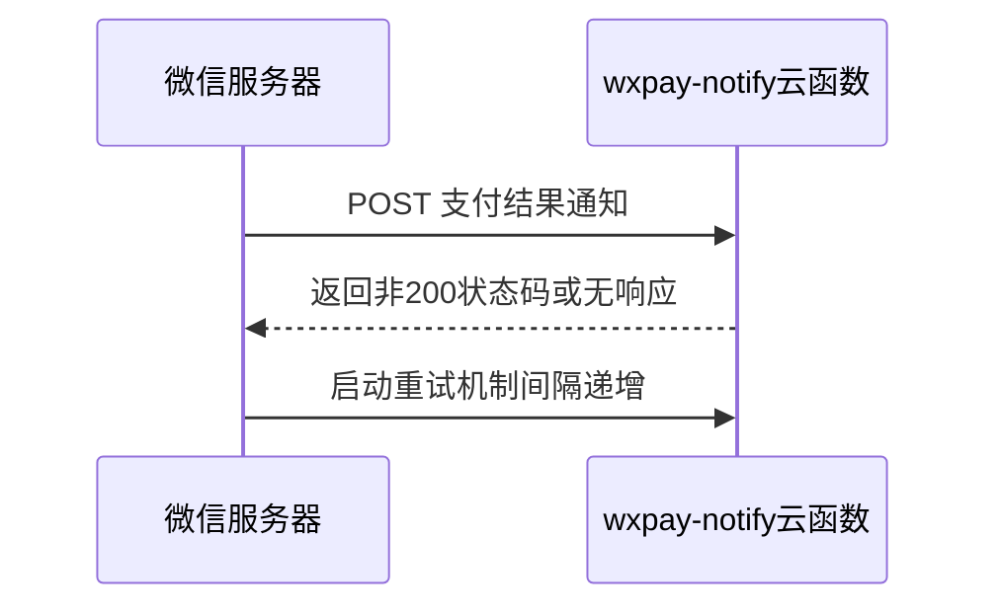
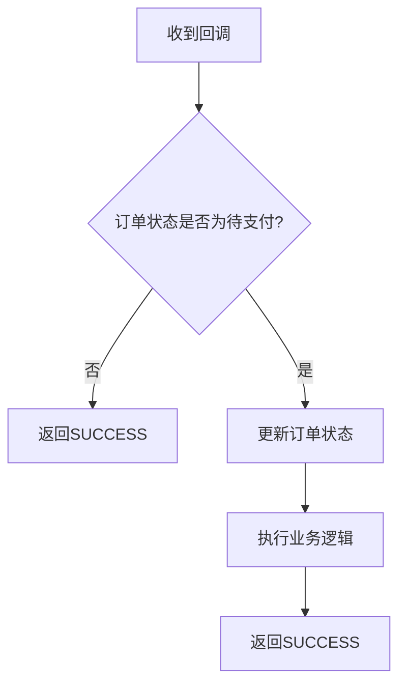

# 回调失败重试与日志审计

<cite>
**本文档引用文件**  
- [index.js](file://uniCloud-aliyun/cloudfunctions/wxpay-notify/index.js)
- [config.js](file://uniCloud-aliyun/cloudfunctions/wxpay/config.js)
- [pay.js](file://uni_modules/uni-pay/uniCloud/cloudfunctions/uni-pay-co/service/pay.js)
- [【重要】请先看这里.md](file://uni_modules/uni-pay/uniCloud/cloudfunctions/uni-pay-co/notify/【重要】请先看这里.md)
</cite>

## 目录
1. [微信支付回调重试机制](#微信支付回调重试机制)  
2. [日志记录最佳实践](#日志记录最佳实践)  
3. [云开发控制台日志查看与告警设置](#云开发控制台日志查看与告警设置)  
4. [结构化日志输出建议](#结构化日志输出建议)  
5. [返回FAIL触发重试的时机](#返回fail触发重试的时机)  
6. [避免消息积压的处理策略](#避免消息积压的处理策略)

## 微信支付回调重试机制

微信支付系统在向商户服务器发送支付结果通知时，若未收到HTTP 200响应，会启动自动重试机制。根据官方规则，微信服务器将在一定时间间隔内多次重发通知，通常持续数小时，确保最终成功送达。

在本项目中，支付回调由 `wxpay-notify` 云函数处理。当该函数执行异常或未正确返回预期格式的XML响应时，微信将判定为接收失败并触发重试。



**Diagram sources**  
- [index.js](file://uniCloud-aliyun/cloudfunctions/wxpay-notify/index.js#L0-L31)

**Section sources**  
- [index.js](file://uniCloud-aliyun/cloudfunctions/wxpay-notify/index.js#L0-L31)

## 日志记录最佳实践

为便于排查回调问题，强烈建议开发者在 `index.js` 中添加详细的请求日志记录。应记录以下关键信息：

- **原始请求体（body）**：用于核对微信推送的原始数据。
- **签名头信息**：用于验证请求来源合法性。
- **处理结果状态**：包括订单更新、业务逻辑执行情况等。

推荐在 `wxpay-notify/index.js` 的主函数入口处添加如下日志代码：

```javascript
console.log('收到微信支付回调', {
  rawBody: event.body,
  headers: event.headers,
  context: context
});
```

通过完整记录输入输出，可快速定位是网络传输、签名验证还是业务逻辑导致的问题。

**Section sources**  
- [index.js](file://uniCloud-aliyun/cloudfunctions/wxpay-notify/index.js#L0-L31)

## 云开发控制台日志查看与告警设置

开发者可通过阿里云UniCloud控制台查看 `wxpay-notify` 函数的执行日志：

1. 登录[阿里云UniCloud控制台](https://unicloud.dcloud.net.cn/)
2. 进入对应服务空间
3. 在“云函数”列表中找到 `wxpay-notify`
4. 点击“日志”标签页，查看每次调用的详细执行记录

建议设置告警规则以及时发现异常：
- **监控指标**：函数执行失败次数
- **触发条件**：5分钟内失败≥1次
- **通知方式**：短信、邮件、钉钉机器人

这样可在第一时间获知回调异常，避免因未及时处理导致用户投诉。

**Section sources**  
- [index.js](file://uniCloud-aliyun/cloudfunctions/wxpay-notify/index.js#L0-L31)

## 结构化日志输出建议

为便于追踪重复通知和交易状态，推荐使用结构化日志格式输出关键字段，例如：

```javascript
console.log(JSON.stringify({
  eventType: 'payment_callback',
  transactionId: body.transaction_id,
  outTradeNo: body.out_trade_no,
  resultCode: body.result_code,
  status: 'processing_started',
  timestamp: Date.now()
}));
```

结构化日志的优势包括：
- 可被日志系统自动解析并建立索引
- 支持按交易单号快速检索所有相关记录
- 便于分析重复通知频率与处理耗时

**Section sources**  
- [index.js](file://uniCloud-aliyun/cloudfunctions/wxpay-notify/index.js#L0-L31)

## 返回FAIL触发重试的时机

在以下情况下，应主动返回 `FAIL` 响应以触发微信重试机制：

- **签名验证失败**：无法确认请求来自微信官方服务器
- **数据格式错误**：`body` 解析异常或关键字段缺失
- **数据库临时故障**：无法连接或写入订单状态

示例代码：

```javascript
return {
  mpserverlessComposedResponse: true,
  statusCode: 500,
  body: `<xml><return_code><![CDATA[FAIL]]></return_code><return_msg><![CDATA[Signature failed]]></return_msg></xml>`
}
```

注意：仅当确实无法处理本次请求时才应返回 `FAIL`，否则可能导致不必要的重试压力。

**Section sources**  
- [index.js](file://uniCloud-aliyun/cloudfunctions/wxpay-notify/index.js#L0-L31)

## 避免消息积压的处理策略

为防止因程序错误导致大量未处理的回调堆积，应采取以下措施：

1. **幂等性设计**：在处理前检查订单是否已更新，避免重复发货或扣款
2. **异步解耦**：将耗时操作（如发送通知、积分发放）放入消息队列异步处理
3. **快速失败**：尽早验证并返回结果，减少函数执行时间
4. **异常捕获**：使用 `try-catch` 包裹核心逻辑，确保错误不会中断整个流程

参考 `uni-pay-co` 模块的设计，其通过 `updateAndReturn` 方法保证只有首次成功的通知才会执行用户回调，有效防止了重复处理。



**Diagram sources**  
- [pay.js](file://uni_modules/uni-pay/uniCloud/cloudfunctions/uni-pay-co/service/pay.js#L84-L154)

**Section sources**  
- [pay.js](file://uni_modules/uni-pay/uniCloud/cloudfunctions/uni-pay-co/service/pay.js#L84-L154)
- [【重要】请先看这里.md](file://uni_modules/uni-pay/uniCloud/cloudfunctions/uni-pay-co/notify/【重要】请先看这里.md#L0-L52)