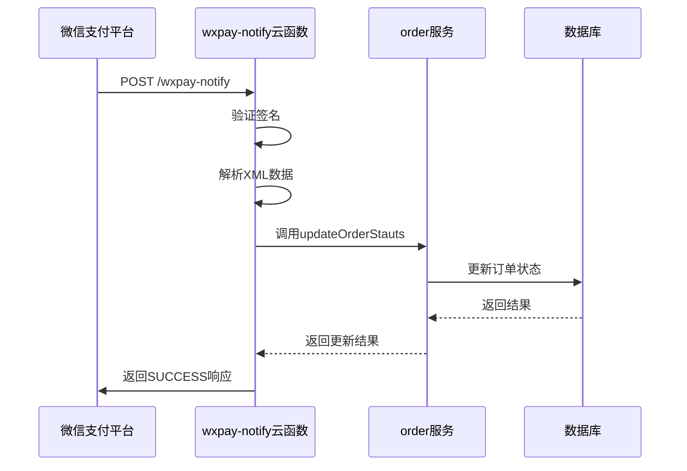
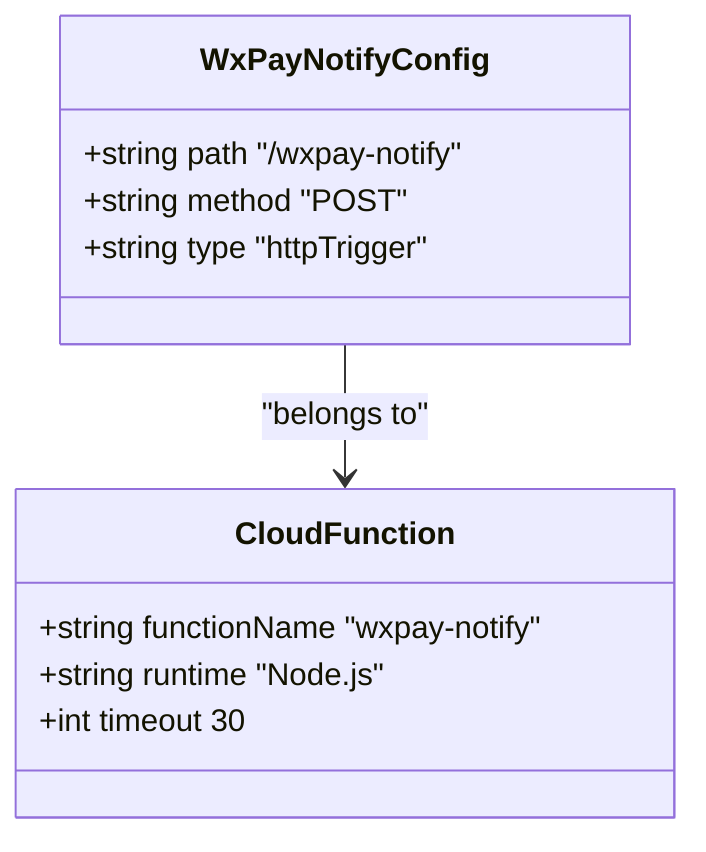
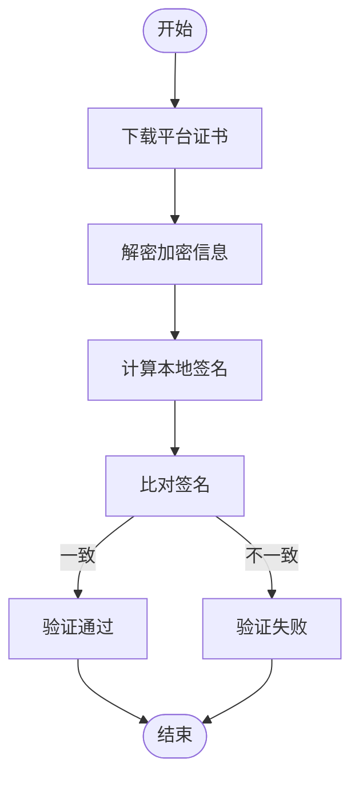
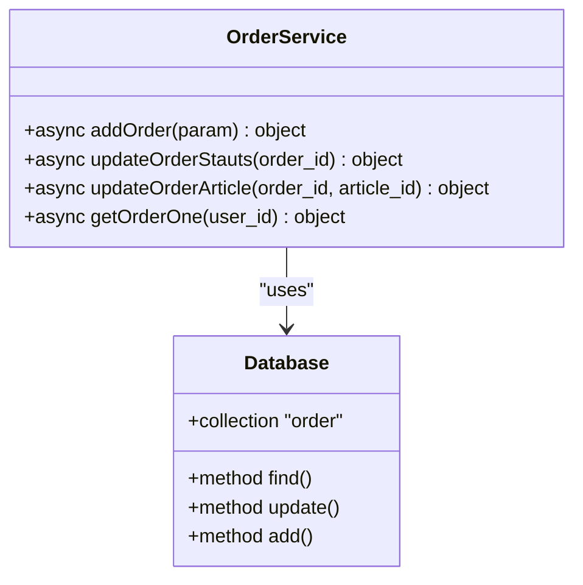
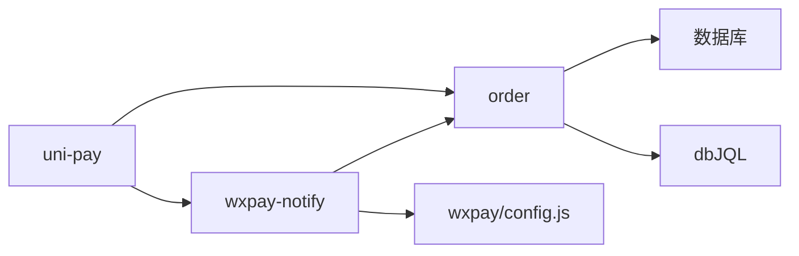

# 支付回调处理

<cite>
**本文档引用的文件**
- [index.js](file://uniCloud-aliyun/cloudfunctions/wxpay-notify/index.js)
- [config.json](file://uniCloud-aliyun/cloudfunctions/wxpay-notify/config.json)
- [order/index.obj.js](file://uniCloud-aliyun/cloudfunctions/order/index.obj.js)
- [wxpay/config.js](file://uniCloud-aliyun/cloudfunctions/wxpay/config.js)
- [uni-pay-co/service/pay.js](file://uni_modules/uni-pay/uniCloud/cloudfunctions/uni-pay-co/service/pay.js)
</cite>

## 目录
1. [项目结构](#项目结构)
2. [核心组件](#核心组件)
3. [架构概述](#架构概述)
4. [详细组件分析](#详细组件分析)
5. [依赖分析](#依赖分析)

## 项目结构

本项目采用云开发架构，支付结果通知服务位于 `uniCloud-aliyun/cloudfunctions/wxpay-notify` 目录下。该服务作为微信支付异步通知的接收端点，通过云函数处理支付结果并更新业务状态。

```mermaid
graph TB
A[微信支付平台] --> |HTTP POST| B[wxf7ee79349bd957b8]
B --> C[/wxpay-notify]
C --> D{验证签名}
D --> |成功| E[解析交易数据]
E --> F[更新订单状态]
F --> G[返回ACK确认]
D --> |失败| H[记录错误日志]
```

**图表来源**
- [config.json](file://uniCloud-aliyun/cloudfunctions/wxpay-notify/config.json#L1-L6)
- [index.js](file://uniCloud-aliyun/cloudfunctions/wxpay-notify/index.js#L1-L32)

**章节来源**
- [config.json](file://uniCloud-aliyun/cloudfunctions/wxpay-notify/config.json#L1-L6)
- [index.js](file://uniCloud-aliyun/cloudfunctions/wxpay-notify/index.js#L1-L32)

## 核心组件

支付回调处理系统由多个核心组件构成：通知接收端点、签名校验模块、订单状态更新服务以及重试机制。其中，`wxpay-notify/index.js` 是主要的入口文件，负责接收微信支付平台发送的异步通知消息，并进行初步处理。

在接收到通知后，系统需要验证消息的真实性，这包括平台证书下载、加密文本解密和签名比对等安全步骤。随后，从通知消息中提取 transaction_id、trade_state 等关键交易信息，用于后续的业务逻辑处理。

为确保数据一致性，订单状态更新采用了事务性操作与幂等性控制机制，防止因重复通知导致的重复发货或账户充值问题。整个流程设计遵循最终一致性原则，通过日志审计和失败重试机制保障支付结果的准确处理。

**章节来源**
- [index.js](file://uniCloud-aliyun/cloudfunctions/wxpay-notify/index.js#L1-L32)
- [order/index.obj.js](file://uniCloud-aliyun/cloudfunctions/order/index.obj.js#L1-L69)

## 架构概述

系统采用分层架构设计，前端应用通过 uni-pay 组件发起支付请求，支付结果由微信支付平台通过 HTTP POST 回调方式通知到指定的云函数端点。该端点配置在 `config.json` 文件中，路径为 `/wxpay-notify`，仅接受 POST 请求方法。



**图表来源**
- [config.json](file://uniCloud-aliyun/cloudfunctions/wxpay-notify/config.json#L1-L6)
- [index.js](file://uniCloud-aliyun/cloudfunctions/wxpay-notify/index.js#L1-L32)
- [order/index.obj.js](file://uniCloud-aliyun/cloudfunctions/order/index.obj.js#L1-L69)

## 详细组件分析

### 回调端点配置分析

支付结果通知服务的HTTP POST回调端点通过 `config.json` 文件进行配置。该配置文件定义了触发器类型为httpTrigger，指定了访问路径为 `/wxpay-notify`，且只允许POST方法访问。这种配置确保了只有来自微信支付平台的合法通知才能被正确路由到处理函数。



**图表来源**
- [config.json](file://uniCloud-aliyun/cloudfunctions/wxpay-notify/config.json#L1-L6)

**章节来源**
- [config.json](file://uniCloud-aliyun/cloudfunctions/wxpay-notify/config.json#L1-L6)

### 签名校验流程分析

虽然当前实现中签名校验部分标记为TODO，但根据行业标准和最佳实践，完整的签名校验流程应包含以下步骤：首先从微信支付平台获取最新的平台证书；然后使用证书中的公钥对通知中的加密信息进行解密；最后将解密后的数据按照特定算法重新计算签名，并与通知中的签名字段进行比对。



**章节来源**
- [index.js](file://uniCloud-aliyun/cloudfunctions/wxpay-notify/index.js#L1-L32)

### 订单状态更新机制分析

订单状态更新是支付回调处理的核心业务逻辑之一。系统通过调用 `order` 云函数的 `updateOrderStauts` 方法来更新订单状态。此操作具有幂等性特征，即多次执行相同的操作不会产生不同的结果，从而避免了重复发货或账户重复充值的风险。



**图表来源**
- [order/index.obj.js](file://uniCloud-aliyun/cloudfunctions/order/index.obj.js#L1-L69)

**章节来源**
- [order/index.obj.js](file://uniCloud-aliyun/cloudfunctions/order/index.obj.js#L1-L69)

## 依赖分析

系统各组件之间存在明确的依赖关系。`wxpay-notify` 云函数依赖于 `order` 云函数提供的订单管理接口，而 `order` 服务又依赖于底层的数据库服务。此外，支付配置信息分散在多个位置，如 `wxpay/config.js` 中定义了 notifyUrl、appid、mch_id 等关键参数。



**图表来源**
- [wxpay/config.js](file://uniCloud-aliyun/cloudfunctions/wxpay/config.js#L1-L9)
- [order/index.obj.js](file://uniCloud-aliyun/cloudfunctions/order/index.obj.js#L1-L69)
- [index.js](file://uniCloud-aliyun/cloudfunctions/wxpay-notify/index.js#L1-L32)

**章节来源**
- [wxpay/config.js](file://uniCloud-aliyun/cloudfunctions/wxpay/config.js#L1-L9)
- [order/index.obj.js](file://uniCloud-aliyun/cloudfunctions/order/index.obj.js#L1-L69)
- [index.js](file://uniCloud-aliyun/cloudfunctions/wxpay-notify/index.js#L1-L32)