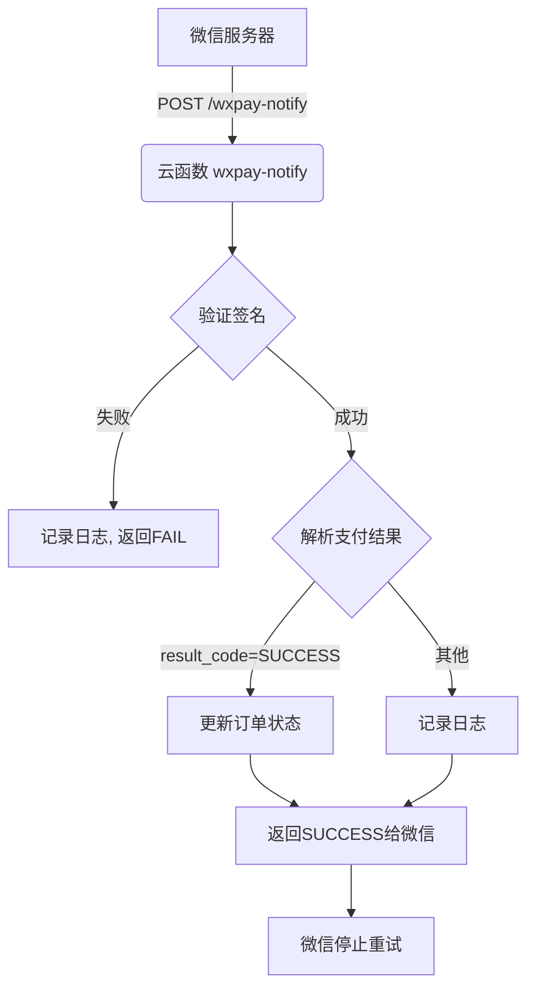

# 支付回调安全验证

<cite>
**本文档引用的文件**   
- [index.js](file://uniCloud-aliyun/cloudfunctions/wxpay-notify/index.js)
- [config.json](file://uniCloud-aliyun/cloudfunctions/wxpay-notify/config.json)
- [config.js](file://uniCloud-aliyun/cloudfunctions/wxpay/config.js)
</cite>

## 目录
1. [引言](#引言)
2. [事件处理流程概述](#事件处理流程概述)
3. [证书获取与公钥管理](#证书获取与公钥管理)
4. [加密头信息解析](#加密头信息解析)
5. [签名串构造与比对](#签名串构造与比对)
6. [SHA256 with RSA签名校验实现](#sha256-with-rsa签名校验实现)
7. [防止重放攻击：时间戳与nonce_str校验](#防止重放攻击时间戳与nonce_str校验)
8. [云函数访问权限配置指导](#云函数访问权限配置指导)
9. [总结](#总结)

## 引言
微信支付异步通知是商户系统接收支付结果的核心机制。为确保数据来源的真实性和完整性，必须对每一条回调消息进行严格的安全验证。本文档基于`index.js`中的事件处理流程，详细说明如何通过平台证书公钥验证回调签名的有效性。涵盖从证书获取、加密头信息解析、签名串构造到最终比对的完整过程，并提供使用`crypto`模块进行SHA256 with RSA签名校验的具体实现示例。同时，强调了防止重放攻击的时间戳与`nonce_str`校验策略，并指导开发者正确配置云函数访问权限以避免中间人篡改风险。

## 事件处理流程概述
当用户完成支付后，微信服务器会向商户预先配置的异步通知URL（在本项目中为`/wxpay-notify`）发送POST请求。该请求由部署在uniCloud上的云函数`wxpay-notify`处理。入口文件`index.js`定义了主执行逻辑，其核心步骤包括：
1.  接收并解析HTTP请求体。
2.  验证回调消息的数字签名，确认消息未被篡改且确实来自微信。
3.  解析支付结果，若支付成功则更新本地订单状态。
4.  向微信服务器返回标准响应，告知处理结果。



**Diagram sources**
- [index.js](file://uniCloud-aliyun/cloudfunctions/wxpay-notify/index.js#L0-L31)
- [config.json](file://uniCloud-aliyun/cloudfunctions/wxpay-notify/config.json#L0-L5)

## 证书获取与公钥管理
为了验证微信的签名，商户必须持有微信支付平台的公钥。在uni-app生态中，通常通过以下方式获取和管理：

1.  **自动获取**：成熟的支付插件（如`uni-pay`）会在后台自动轮询并下载最新的微信支付平台证书。这些证书包含了用于验证签名的公钥。
2.  **手动配置**：开发者也可以将公钥直接存储在云函数的配置文件或数据库中。在本项目的`wxpay`模块中，`config.js`文件包含了商户自身的私密信息（如`mch_id`, `partner_key`），但不包含平台公钥，这表明公钥的获取和管理是由更高层的框架（如`uni-pay`）负责的。

平台证书具有有效期，因此依赖于能够自动更新证书的支付插件是最佳实践，可以避免因证书过期导致的验证失败。

**Section sources**
- [config.js](file://uniCloud-aliyun/cloudfunctions/wxpay/config.js#L0-L8)

## 加密头信息解析
微信支付V3版本的回调通知采用了更高级的安全机制。除了常规的HTTP请求外，关键的支付信息被封装在一个加密的消息体中，并通过特定的HTTP头传递解密所需的元数据。主要的加密头信息包括：

*   `Wechatpay-Serial`: 微信支付平台证书的序列号，用于标识本次签名所使用的具体证书。
*   `Wechatpay-Signature`: 使用平台私钥对消息体生成的数字签名，采用Base64编码。
*   `Wechatpay-Timestamp`: 发起请求时的Unix时间戳，用于防止重放攻击。
*   `Wechatpay-Nonce`: 随机字符串，用于防止重放攻击。

在`index.js`的处理流程中，第一步就是从`event`对象中提取这些头部信息，为后续的签名验证做准备。

**Section sources**
- [index.js](file://uniCloud-aliyun/cloudfunctions/wxpay-notify/index.js#L0-L31)

## 签名串构造与比对
签名验证的核心在于“一致性”。商户需要按照与微信服务器完全相同的规则，重新构造一个待签名的字符串，然后使用已知的平台公钥对该字符串进行验签。

1.  **构造签名串**：根据微信官方文档，签名串的构造格式为：`[HTTP Method]\n[URL Path]\n[Query String]\n[HTTP Body]\n`。其中每一项都必须精确匹配，包括换行符`\n`。例如，对于一个POST请求，其签名串可能如下：
    ```
    POST\n/v3/pay/transactions/notify\n\n{"resource":{...}}\n
    ```
2.  **获取公钥**：根据`Wechatpay-Serial`头信息，找到对应的平台证书，并从中提取出公钥。
3.  **执行验签**：使用`crypto`模块的`verify`方法，传入公钥、哈希算法（SHA256）、原始签名串和收到的`Wechatpay-Signature`，判断两者是否匹配。

如果构造的签名串与微信服务器一致，且公钥验签通过，则证明消息是真实且完整的。

**Section sources**
- [index.js](file://uniCloud-aliyun/cloudfunctions/wxpay-notify/index.js#L0-L31)

## SHA256 with RSA签名校验实现
Node.js的`crypto`模块提供了强大的加密功能。以下是基于`index.js`上下文，实现SHA256 with RSA签名校验的关键代码示例：

```javascript
const crypto = require('crypto');

// 假设已从请求头中获取到以下值
const method = 'POST';
const path = '/wxpay-notify';
const queryString = ''; // 如果有查询参数
const body = event.body; // 请求体
const signatureFromWx = 'base64EncodedSignature'; // Wechatpay-Signature 头部的值
const publicKeyPem = '-----BEGIN PUBLIC KEY-----...'; // 从平台证书中获取的公钥

// 1. 构造签名串
const message = `${method}\n${path}\n${queryString}\n${body}\n`;

// 2. 创建验证器
const verifier = crypto.createVerify('RSA-SHA256');
verifier.update(message);

// 3. 执行验签
const isValid = verifier.verify(publicKeyPem, signatureFromWx, 'base64');

if (isValid) {
    console.log('签名验证通过');
    // 继续处理业务逻辑
} else {
    console.log('签名验证失败');
    // 拒绝请求
}
```
此代码片段展示了如何利用`crypto.createVerify`和`.verify()`方法完成整个验签过程。

**Section sources**
- [index.js](file://uniCloud-aliyun/cloudfunctions/wxpay-notify/index.js#L1-L1)

## 防止重放攻击：时间戳与nonce_str校验
即使签名验证通过，仍需防范“重放攻击”，即攻击者截获一次有效的请求并重复发送。为此，必须结合时间戳和随机数进行校验。

1.  **时间戳校验**：比较`Wechatpay-Timestamp`与当前服务器时间。如果时间差超过一定阈值（如5分钟），则认为该请求是过期的，应予以拒绝。
2.  **`nonce_str`校验**：将每次收到的`Wechatpay-Nonce`值存储在缓存（如Redis）或数据库中。在处理新请求前，先检查该`nonce_str`是否已存在。如果存在，说明这是一个重复请求，应直接丢弃。

这两个策略共同作用，确保了每条通知的唯一性和时效性。

**Section sources**
- [index.js](file://uniCloud-aliyun/cloudfunctions/wxpay-notify/index.js#L0-L31)

## 云函数访问权限配置指导
云函数`wxpay-notify`作为支付回调的入口，其访问权限配置至关重要。错误的配置可能导致两种风险：
1.  **过于开放**：允许任何人调用，容易遭受恶意攻击或滥用。
2.  **过于封闭**：阻止了微信服务器的合法调用，导致无法接收到支付通知。

正确的做法是：
*   **不要设置登录鉴权**：云函数的触发路径（如`/wxpay-notify`）不应要求用户登录态，因为微信服务器是以匿名身份发起请求的。
*   **依赖网络层防护**：依靠uniCloud平台本身的安全机制来保障基础安全，而将核心的信任建立在数字签名验证上。只要签名验证通过，即可信任该请求来源于微信。

简而言之，应将云函数配置为“公开可访问”，并将安全重心放在应用层的签名和重放攻击校验上。

**Section sources**
- [config.json](file://uniCloud-aliyun/cloudfunctions/wxpay-notify/config.json#L0-L5)

## 总结
微信支付异步通知的安全验证是一个多环节的综合过程。开发者不能仅依赖简单的密码或token，而必须实施一套完整的安全方案。本方案以`crypto`模块为基础，通过平台证书公钥验证回调签名，从根本上保证了消息的真实性。同时，结合时间戳和`nonce_str`的校验，有效抵御了重放攻击。最后，合理的云函数权限配置确保了服务的可用性与安全性之间的平衡。遵循以上实践，可以构建一个可靠、安全的支付结果处理系统。