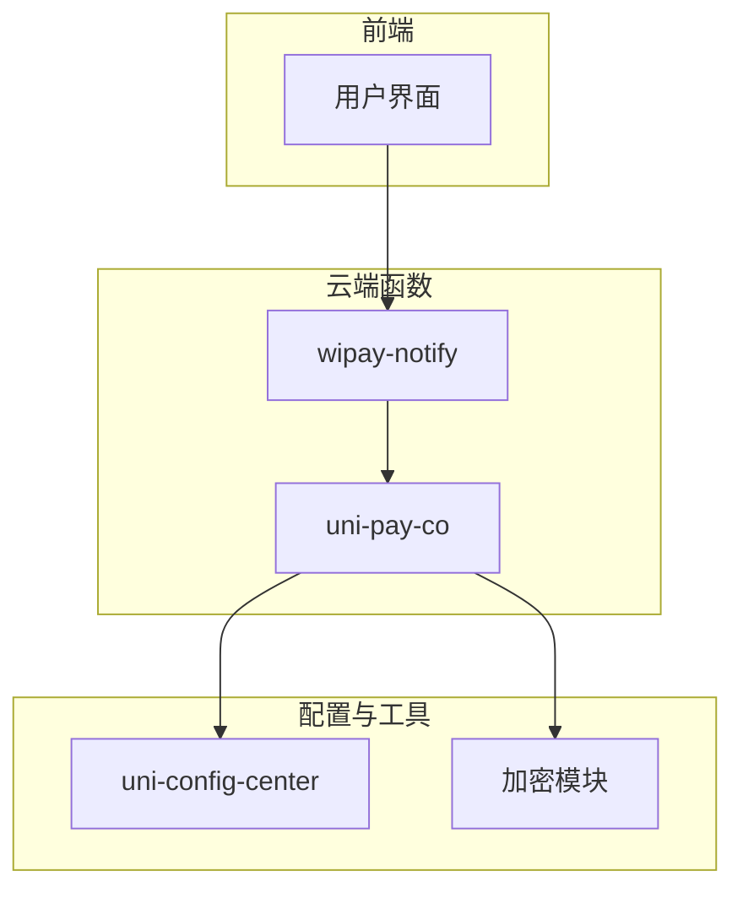
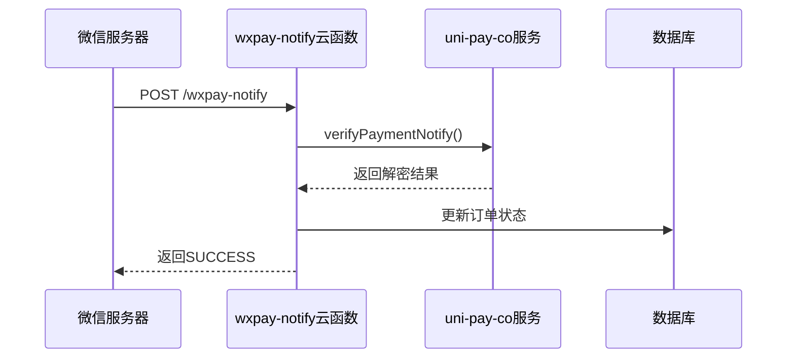
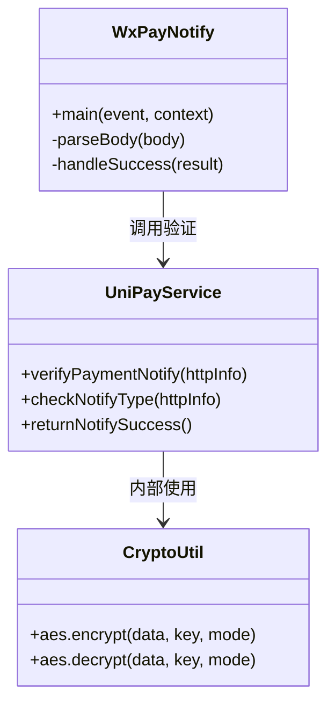
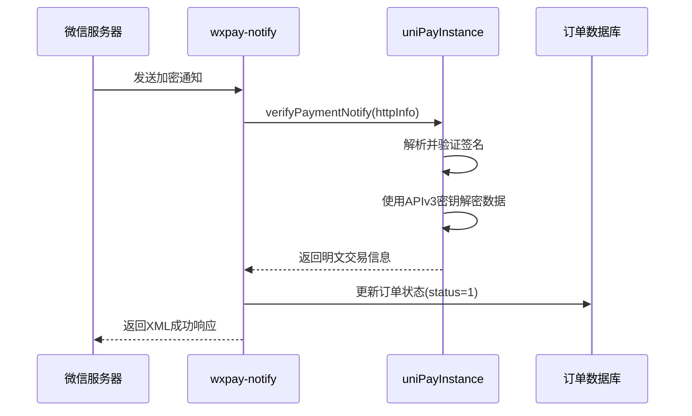
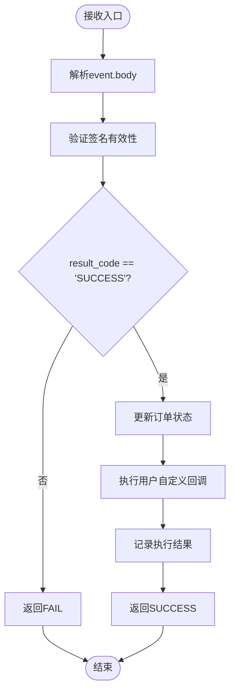
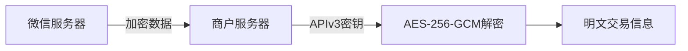
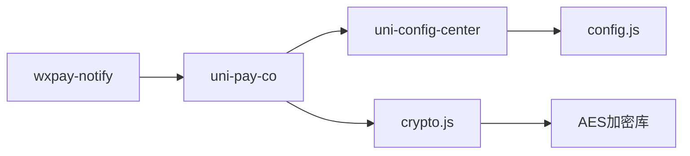

# 支付结果数据解密

<cite>
**本文档引用文件**  
- [index.js](file://uniCloud-aliyun/cloudfunctions/wxpay-notify/index.js)
- [config.json](file://uniCloud-aliyun/cloudfunctions/wxpay-notify/config.json)
- [crypto.js](file://uni_modules/uni-pay/uniCloud/cloudfunctions/uni-pay-co/libs/crypto.js)
- [config.js](file://uni_modules/uni-config-center/uniCloud/cloudfunctions/common/uni-config-center/uni-pay/config.js)
- [pay.js](file://uni_modules/uni-pay/uniCloud/cloudfunctions/uni-pay-co/service/pay.js)
</cite>

## 目录
1. [简介](#简介)
2. [项目结构](#项目结构)
3. [核心组件](#核心组件)
4. [架构概述](#架构概述)
5. [详细组件分析](#详细组件分析)
6. [依赖分析](#依赖分析)
7. [性能考虑](#性能考虑)
8. [故障排除指南](#故障排除指南)
9. [结论](#结论)

## 简介
本文档深入解析微信支付V3 API回调中加密数据的解密流程，重点针对`event.body`中包含的`encrypted_data`字段，使用AES-256-GCM算法结合商户APIv3密钥进行内容解密。说明初始化向量（IV）、附加认证数据（AAD）的生成规则，并展示从密文提取`transaction_id`、`trade_state`、`out_trade_no`等关键交易参数的实现逻辑。同时提供错误处理建议，如解密失败或JSON解析异常的捕获与响应。

## 项目结构
本项目为基于uni-app和uniCloud的全栈应用，支付通知处理逻辑位于云函数目录下。核心支付相关功能集中在`uniCloud-aliyun/cloudfunctions`目录中，其中`wxpay-notify`为微信支付异步通知入口，`uni-pay`插件提供了完整的支付服务封装。

**图示来源**
- [config.json](file://uniCloud-aliyun/cloudfunctions/wxpay-notify/config.json#L1-L6)
- [index.js](file://uniCloud-aliyun/cloudfunctions/wxpay-notify/index.js#L1-L32)

**章节来源**
- [config.json](file://uniCloud-aliyun/cloudfunctions/wxpay-notify/config.json#L1-L6)
- [index.js](file://uniCloud-aliyun/cloudfunctions/wxpay-notify/index.js#L1-L32)

## 核心组件
核心组件包括微信支付通知接收函数`wxpay-notify/index.js`、统一支付服务`uni-pay-co/service/pay.js`以及加密解密工具`libs/crypto.js`。这些组件协同完成支付结果的接收、验证、解密及业务逻辑处理。

**章节来源**
- [index.js](file://uniCloud-aliyun/cloudfunctions/wxpay-notify/index.js#L1-L32)
- [pay.js](file://uni_modules/uni-pay/uniCloud/cloudfunctions/uni-pay-co/service/pay.js#L0-L799)
- [crypto.js](file://uni_modules/uni-pay/uniCloud/cloudfunctions/uni-pay-co/libs/crypto.js#L0-L158)

## 架构概述
系统采用分层架构设计，前端发起支付请求后由微信服务器回调至指定云函数接口。该接口负责接收加密数据，调用统一支付服务进行签名验证与内容解密，最终更新订单状态并返回确认响应。

**图示来源**
- [index.js](file://uniCloud-aliyun/cloudfunctions/wxpay-notify/index.js#L1-L32)
- [pay.js](file://uni_modules/uni-pay/uniCloud/cloudfunctions/uni-pay-co/service/pay.js#L0-L799)

## 详细组件分析

### 解密流程分析
`wxpay-notify`云函数作为支付结果通知的入口，接收来自微信服务器的加密数据体，并通过`uni-pay-co`提供的服务进行解密处理。

#### 对象导向组件：

**图示来源**
- [index.js](file://uniCloud-aliyun/cloudfunctions/wxpay-notify/index.js#L1-L32)
- [pay.js](file://uni_modules/uni-pay/uniCloud/cloudfunctions/uni-pay-co/service/pay.js#L0-L799)
- [crypto.js](file://uni_modules/uni-pay/uniCloud/cloudfunctions/uni-pay-co/libs/crypto.js#L0-L158)

#### API/服务组件：

**图示来源**
- [index.js](file://uniCloud-aliyun/cloudfunctions/wxpay-notify/index.js#L1-L32)
- [pay.js](file://uni_modules/uni-pay/uniCloud/cloudfunctions/uni-pay-co/service/pay.js#L0-L799)

#### 复杂逻辑组件：

**图示来源**
- [index.js](file://uniCloud-aliyun/cloudfunctions/wxpay-notify/index.js#L1-L32)
- [pay.js](file://uni_modules/uni-pay/uniCloud/cloudfunctions/uni-pay-co/service/pay.js#L0-L799)

**章节来源**
- [index.js](file://uniCloud-aliyun/cloudfunctions/wxpay-notify/index.js#L1-L32)
- [pay.js](file://uni_modules/uni-pay/uniCloud/cloudfunctions/uni-pay-co/service/pay.js#L0-L799)

### 概念概述
微信支付V3 API采用AES-256-GCM算法对敏感信息进行加密传输，确保数据在公网传输过程中的安全性。商户需使用平台分配的APIv3密钥对接收到的数据进行解密，以获取真实的交易结果。

## 依赖分析
系统依赖关系清晰，`wxpay-notify`云函数直接依赖`uni-pay-co`支付服务，后者又依赖配置中心和加密工具模块。所有敏感操作均通过标准化接口完成，降低耦合度。

**图示来源**
- [index.js](file://uniCloud-aliyun/cloudfunctions/wxpay-notify/index.js#L1-L32)
- [pay.js](file://uni_modules/uni-pay/uniCloud/cloudfunctions/uni-pay-co/service/pay.js#L0-L799)
- [crypto.js](file://uni_modules/uni-pay/uniCloud/cloudfunctions/uni-pay-co/libs/crypto.js#L0-L158)

**章节来源**
- [index.js](file://uniCloud-aliyun/cloudfunctions/wxpay-notify/index.js#L1-L32)
- [pay.js](file://uni_modules/uni-pay/uniCloud/cloudfunctions/uni-pay-co/service/pay.js#L0-L799)
- [crypto.js](file://uni_modules/uni-pay/uniCloud/cloudfunctions/uni-pay-co/libs/crypto.js#L0-L158)

## 性能考虑
由于支付通知具有高实时性要求，系统应保证在毫秒级内完成解密与响应。避免在通知处理中执行耗时数据库操作或远程调用，建议将复杂业务逻辑异步化处理。

## 故障排除指南
当出现解密失败或JSON解析异常时，应首先检查APIv3密钥是否正确配置，其次确认加密模式是否匹配（AES-256-GCM）。日志中应记录原始加密数据以便调试。

**章节来源**
- [index.js](file://uniCloud-aliyun/cloudfunctions/wxpay-notify/index.js#L1-L32)
- [crypto.js](file://uni_modules/uni-pay/uniCloud/cloudfunctions/uni-pay-co/libs/crypto.js#L0-L158)

## 结论
本文档全面解析了微信支付V3回调数据的解密机制，展示了从接收到解密再到业务处理的完整链路。通过合理利用`uni-pay`插件提供的标准化接口，开发者可高效安全地实现支付结果处理逻辑，保障交易数据的一致性与完整性。