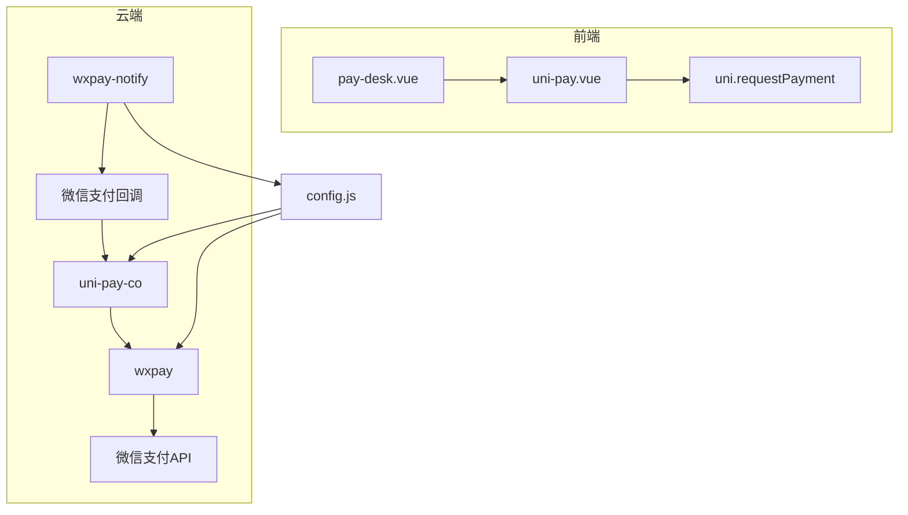
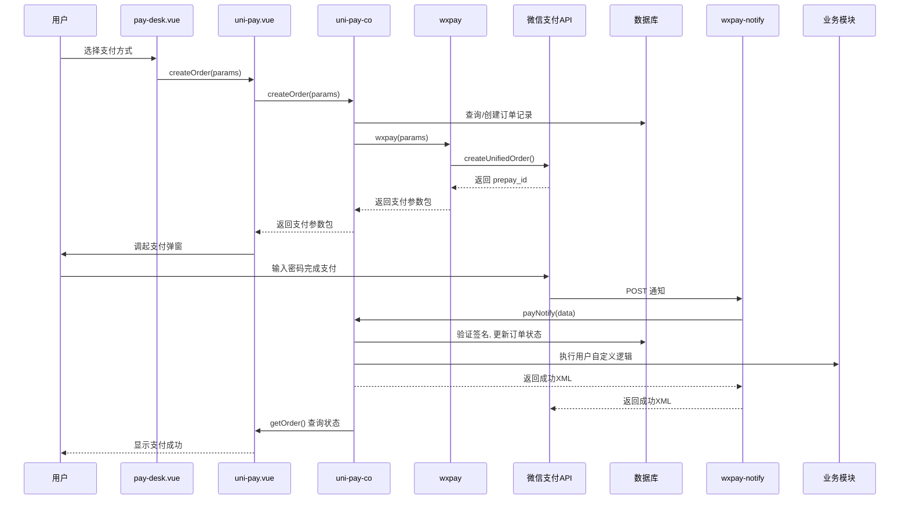
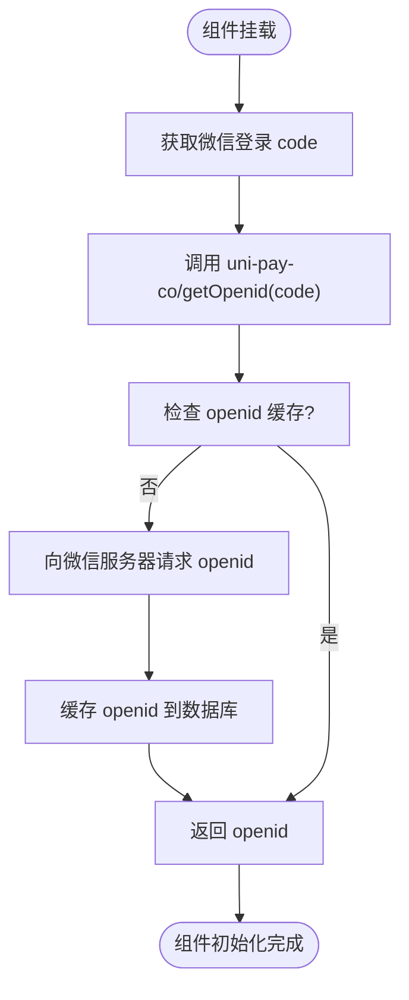
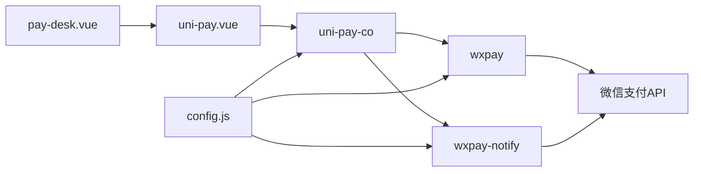

# 支付网关集成（微信支付）

<cite>
**本文档引用文件**
- [config.js](file://uniCloud-aliyun/cloudfunctions/wxpay/config.js)
- [index.obj.js](file://uniCloud-aliyun/cloudfunctions/wxpay/index.obj.js)
- [index.js](file://uniCloud-aliyun/cloudfunctions/wxpay-notify/index.js)
- [pay-desk.vue](file://uni_modules/uni-pay/pages/pay-desk/pay-desk.vue)
- [uni-pay.vue](file://uni_modules/uni-pay/components/uni-pay/uni-pay.vue)
- [config.js](file://uni_modules/uni-config-center/uniCloud/cloudfunctions/common/uni-config-center/uni-pay/config.js)
- [index.obj.js](file://uni_modules/uni-pay/uniCloud/cloudfunctions/uni-pay-co/index.obj.js)
- [pay.js](file://uni_modules/uni-pay/uniCloud/cloudfunctions/uni-pay-co/service/pay.js)
</cite>

## 目录
1. [引言](#引言)
2. [项目结构](#项目结构)
3. [核心组件](#核心组件)
4. [架构概述](#架构概述)
5. [详细组件分析](#详细组件分析)
6. [依赖分析](#依赖分析)
7. [性能考量](#性能考量)
8. [故障排除指南](#故障排除指南)
9. [结论](#结论)

## 引言
本文档全面阐述了基于 uni-app 框架的微信支付系统对接方案。文档围绕 `wxpay` 云函数和 `uni-pay` 组件库，详细说明了从商户配置、统一下单、回调处理到前端调用的完整支付流程。重点分析了 `wxpay/config.js` 中的核心参数配置、`wxpay/index.obj.js` 的下单接口封装逻辑、`wxpay-notify/index.js` 的安全验证机制，并结合 `pay-desk` 支付台页面展示了完整的交互流程。同时，文档还介绍了如何通过 `uni-pay-co` 服务实现交易闭环，以及沙箱测试、常见问题排查和合规性要求。

## 项目结构
本项目的支付功能主要由两部分构成：部署在云端的云函数和集成在前端的 UI 组件库。
- **云函数 (uniCloud-aliyun/cloudfunctions)**:
  - `wxpay`: 负责与微信支付官方 API 进行直接通信，包含核心的下单和查询逻辑。
  - `wxpay-notify`: 专门用于接收和处理来自微信服务器的异步通知。
  - `uni-pay-co`: `uni-pay` 组件库的后端服务，提供统一的支付接口，协调订单状态和业务逻辑。
- **UI 组件库 (uni_modules/uni-pay)**:
  - `components/uni-pay/uni-pay.vue`: 核心支付组件，负责与 `uni-pay-co` 交互并调起原生支付。
  - `pages/pay-desk/pay-desk.vue`: 可自定义的收银台页面，为用户提供支付方式选择界面。
- **配置中心 (uni_modules/uni-config-center)**:
  - `common/uni-config-center/uni-pay/config.js`: 存放所有支付相关的敏感配置信息，是整个支付系统的“中枢神经”。

**图表来源**
- [pay-desk.vue](file://uni_modules/uni-pay/pages/pay-desk/pay-desk.vue)
- [uni-pay.vue](file://uni_modules/uni-pay/components/uni-pay/uni-pay.vue)
- [index.obj.js](file://uniCloud-aliyun/cloudfunctions/wxpay/index.obj.js)
- [index.obj.js](file://uni_modules/uni-pay/uniCloud/cloudfunctions/uni-pay-co/index.obj.js)
- [index.js](file://uniCloud-aliyun/cloudfunctions/wxpay-notify/index.js)
- [config.js](file://uni_modules/uni-config-center/uniCloud/cloudfunctions/common/uni-config-center/uni-pay/config.js)

**章节来源**
- [pay-desk.vue](file://uni_modules/uni-pay/pages/pay-desk/pay-desk.vue)
- [uni-pay.vue](file://uni_modules/uni-pay/components/uni-pay/uni-pay.vue)
- [index.obj.js](file://uniCloud-aliyun/cloudfunctions/wxpay/index.obj.js)
- [index.obj.js](file://uni_modules/uni-pay/uniCloud/cloudfunctions/uni-pay-co/index.obj.js)
- [index.js](file://uniCloud-aliyun/cloudfunctions/wxpay-notify/index.js)
- [config.js](file://uni_modules/uni-config-center/uniCloud/cloudfunctions/common/uni-config-center/uni-pay/config.js)

## 核心组件
本节将深入分析支付系统中的几个关键组件及其相互关系。

### 微信支付配置 (`wxpay/config.js`)
该文件定义了与微信支付平台进行通信所必需的核心凭证。
- **`appid`**: 小程序的唯一标识符，用于指定本次支付请求属于哪个小程序。
- **`mch_id`**: 商户号，是微信支付分配给开发者的唯一身份ID。
- **`partner_key`**: API密钥，是用于生成和校验签名的关键密钥，必须严格保密。
- **`notifyUrl`**: 回调通知地址，微信支付在用户完成支付后，会向此URL发送POST请求以通知支付结果。

**章节来源**
- [config.js](file://uniCloud-aliyun/cloudfunctions/wxpay/config.js)

### 统一下单接口封装 (`wxpay/index.obj.js`)
此云对象封装了微信支付的“统一下单”API，是发起支付的核心逻辑。
- **参数验证**: 方法首先对传入的 `openid`（用户标识）、`out_trade_no`（商户订单号）和 `total_fee`（订单金额，单位为分）进行严格校验。
- **订单创建**: 使用 `wx-pay` SDK 创建预支付订单，其中 `body` 字段固定为"会员充值"，`trade_type` 设置为 `JSAPI` 表示公众号或小程序支付。
- **支付参数构建**: 成功获取 `prepay_id` 后，按照微信支付规范重新构建前端所需的支付参数包，包括 `appId`, `timeStamp`, `nonceStr`, `package` 和 `signType`。
- **签名生成**: 最关键的一步是使用 `partner_key` 对上述参数进行MD5签名，生成 `paySign`，确保请求的完整性和安全性。最终返回一个包含所有必要字段的对象，供前端调用 `uni.requestPayment`。

**章节来源**
- [index.obj.js](file://uniCloud-aliyun/cloudfunctions/wxpay/index.obj.js)

### 回调通知服务 (`wxpay-notify/index.js`)
该云函数作为 Webhook 端点，接收并处理来自微信支付服务器的异步通知。
- **安全校验**: 当前代码中已预留 `TODO` 注释，明确指出需要在此处实现签名校验。这是防止伪造通知攻击的最重要环节，应使用 `partner_key` 对回调数据重新计算签名并与 `sign` 字段比对。
- **幂等性处理**: 在更新订单状态前，应检查该笔订单是否已被成功处理过，避免因网络重试导致的重复扣款或发货。
- **订单状态更新**: 当 `result_code` 为 `SUCCESS` 时，表示支付成功，此时应执行核心业务逻辑，如更新数据库中的订单状态、增加用户余额或发放商品。
- **响应微信**: 处理完成后，必须立即返回特定格式的成功XML响应 `<xml><return_code><![CDATA[SUCCESS]]></return_code><return_msg><![CDATA[OK]]></return_msg></xml>`，否则微信服务器会认为通知失败并在一段时间内持续重发。

**章节来源**
- [index.js](file://uniCloud-aliyun/cloudfunctions/wxpay-notify/index.js)

### 前端支付台 (`pay-desk/pay-desk.vue`)
这是一个可复用的收银台页面模板，为用户提供直观的支付入口。
- **UI 结构**: 页面包含待支付金额显示和支付方式列表（如微信支付、支付宝）。
- **事件绑定**: 用户点击支付方式后，触发 `createOrder` 方法。
- **调用支付组件**: `createOrder` 方法通过 `this.$refs.uniPay.createOrder(options)` 将支付参数传递给底层的 `uni-pay` 组件，从而启动支付流程。

**章节来源**
- [pay-desk.vue](file://uni_modules/uni-pay/pages/pay-desk/pay-desk.vue)

### 交易闭环服务 (`uni-pay-co`)
`uni-pay-co` 是连接前端和各个支付渠道（如 `wxpay`）的中间层服务，实现了交易的闭环管理。
- **统一接口**: 提供 `createOrder`, `getOrder`, `payNotify` 等标准化接口，屏蔽了不同支付渠道的差异。
- **订单持久化**: 在 `createOrder` 时，会将订单信息（如 `out_trade_no`, `total_fee`, `status`）存储到 `uni-pay-orders` 数据库集合中，便于后续查询和对账。
- **回调协调**: `payNotify` 接口接收到微信的异步通知后，会先验证签名，然后更新订单状态，并加载用户自定义的业务逻辑模块（如 `require('../notify/recharge')`）来执行具体的业务操作（如充值），最后才向微信返回成功响应，确保了业务逻辑和支付状态的一致性。

**章节来源**
- [index.obj.js](file://uni_modules/uni-pay/uniCloud/cloudfunctions/uni-pay-co/index.obj.js)
- [pay.js](file://uni_modules/uni-pay/uniCloud/cloudfunctions/uni-pay-co/service/pay.js)

## 架构概述
整个支付系统采用前后端分离和微服务化的架构设计。

**图表来源**
- [pay-desk.vue](file://uni_modules/uni-pay/pages/pay-desk/pay-desk.vue)
- [uni-pay.vue](file://uni_modules/uni-pay/components/uni-pay/uni-pay.vue)
- [index.obj.js](file://uni_modules/uni-pay/uniCloud/cloudfunctions/uni-pay-co/index.obj.js)
- [index.obj.js](file://uniCloud-aliyun/cloudfunctions/wxpay/index.obj.js)
- [index.js](file://uniCloud-aliyun/cloudfunctions/wxpay-notify/index.js)
- [pay.js](file://uni_modules/uni-pay/uniCloud/cloudfunctions/uni-pay-co/service/pay.js)

## 详细组件分析

### `uni-pay` 组件内部逻辑
`uni-pay.vue` 组件是前端支付流程的控制中心。

#### 初始化与 OpenID 获取
组件在 `mounted` 钩子中自动执行：
1.  **获取 Code**: 调用 `jsSdk.getWeixinCode()` 获取微信登录凭证 `code`。
2.  **换取 OpenID**: 将 `code` 发送给 `uni-pay-co` 的 `getOpenid` 接口。
3.  **缓存 OpenID**: `uni-pay-co` 内部调用 `libs.wxpay.getOpenid` 并向微信服务器请求，最终获得用户的 `openid` 并缓存，供后续下单使用。

**图表来源**
- [uni-pay.vue](file://uni_modules/uni-pay/components/uni-pay/uni-pay.vue)
- [index.obj.js](file://uni_modules/uni-pay/uniCloud/cloudfunctions/uni-pay-co/index.obj.js)
- [pay.js](file://uni_modules/uni-pay/uniCloud/cloudfunctions/uni-pay-co/service/pay.js)

#### 下单与支付流程
当用户确认支付时，流程如下：
1.  **参数组装**: `createOrder` 方法将 `provider`, `total_fee`, `openid` 等参数组装成 `createOrderData`。
2.  **调用云函数**: 通过 `uniPayCo.createOrder(createOrderData)` 发起远程调用。
3.  **接收响应**: 若成功，`uni-pay-co` 会返回一个包含 `order` 对象（内含 `timeStamp`, `nonceStr`, `package`, `paySign` 等）的响应。
4.  **调起支付**: 组件根据运行环境（H5、App、小程序）调用 `uni.requestPayment` 或注入 `WeixinJSBridge` 来拉起支付界面。

**章节来源**
- [uni-pay.vue](file://uni_modules/uni-pay/components/uni-pay/uni-pay.vue)
- [index.obj.js](file://uni_modules/uni-pay/uniCloud/cloudfunctions/uni-pay-co/index.obj.js)

### 安全与合规性
#### 配置文件分离
敏感信息（如 `partner_key`）被集中存放在 `uni-config-center` 的 `config.js` 文件中，而不是分散在各个云函数里。这不仅提高了安全性，也方便了多环境（开发、生产）的配置管理。

#### 证书管理
`wxpay` 云函数通过 `fs.readFileSync(__dirname + '/apiclient_cert.p12')` 读取商户证书文件。该 `.p12` 文件应通过 `uniCloud` 控制台上传至云函数根目录，避免将证书硬编码在代码中。

#### 签名验证
无论是 `wxpay` 发起请求时的签名，还是 `wxpay-notify` 接收通知时的验签，都必须使用正确的 `partner_key`。任何一方的签名错误都会导致交易失败。

**章节来源**
- [config.js](file://uni_modules/uni-config-center/uniCloud/cloudfunctions/common/uni-config-center/uni-pay/config.js)
- [index.obj.js](file://uniCloud-aliyun/cloudfunctions/wxpay/index.obj.js)
- [index.js](file://uniCloud-aliyun/cloudfunctions/wxpay-notify/index.js)

## 依赖分析
系统各组件间存在清晰的依赖关系。

**图表来源**
- [pay-desk.vue](file://uni_modules/uni-pay/pages/pay-desk/pay-desk.vue)
- [uni-pay.vue](file://uni_modules/uni-pay/components/uni-pay/uni-pay.vue)
- [index.obj.js](file://uni_modules/uni-pay/uniCloud/cloudfunctions/uni-pay-co/index.obj.js)
- [index.obj.js](file://uniCloud-aliyun/cloudfunctions/wxpay/index.obj.js)
- [index.js](file://uniCloud-aliyun/cloudfunctions/wxpay-notify/index.js)
- [config.js](file://uni_modules/uni-config-center/uniCloud/cloudfunctions/common/uni-config-center/uni-pay/config.js)

**章节来源**
- [pay-desk.vue](file://uni_modules/uni-pay/pages/pay-desk/pay-desk.vue)
- [uni-pay.vue](file://uni_modules/uni-pay/components/uni-pay/uni-pay.vue)
- [index.obj.js](file://uni_modules/uni-pay/uniCloud/cloudfunctions/uni-pay-co/index.obj.js)
- [index.obj.js](file://uniCloud-aliyun/cloudfunctions/wxpay/index.obj.js)
- [index.js](file://uniCloud-aliyun/cloudfunctions/wxpay-notify/index.js)
- [config.js](file://uni_modules/uni-config-center/uniCloud/cloudfunctions/common/uni-config-center/uni-pay/config.js)

## 性能考量
- **云函数冷启动**: `wxpay` 和 `wxpay-notify` 作为独立的云函数，在首次调用时可能存在冷启动延迟。建议保持函数实例常驻以优化性能。
- **数据库查询**: `uni-pay-co` 在处理通知时会进行多次数据库查询（查找订单、更新状态）。确保 `out_trade_no` 字段有索引，以保证查询效率。
- **网络开销**: 支付流程涉及多次跨服务调用（前端->云函数->微信API），整体耗时受网络状况影响较大。

## 故障排除指南
### 常见支付失败原因
- **签名错误 (INVALID_SIGNATURE)**: 检查 `partner_key` 是否正确，且未包含空格或换行符。确保参与签名的字段和顺序完全符合微信文档要求。
- **订单号重复**: 确保每次调用 `createOrder` 时生成的 `out_trade_no` 全局唯一。
- **金额为0或负数**: 检查 `total_fee` 参数是否为正整数（单位：分）。
- **缺少 OpenID**: 确认 `openid` 已成功获取并正确传递。
- **证书问题**: 检查 `.p12` 证书文件是否已正确上传，且密码正确。
- **回调地址不可达**: 确保 `notifyUrl` 可以被公网访问，且服务器能正常处理POST请求。

### 沙箱环境测试方法
1.  在 `uni-config-center` 的 `config.js` 中，将 `wxpay.mp.sandbox` 设置为 `true`。
2.  使用微信支付提供的沙箱 `partner_key` 替换正式密钥。
3.  发起支付，使用沙箱专用的测试账号完成支付流程。
4.  观察日志，确认 `uni-pay-co` 能正确接收并处理来自沙箱环境的模拟通知。

## 结论
本文档详细解析了基于 `uni-pay` 组件库和自定义云函数的微信支付集成方案。该方案通过清晰的职责划分（前端展示、中间层协调、后端通信）和严格的安全部署（配置分离、签名验证），构建了一个稳定、安全、易于维护的支付系统。开发者应重点关注 `uni-pay-co` 的订单状态管理和 `wxpay-notify` 的幂等性处理，以确保线上交易的准确无误。遵循本文档的指导，可以高效地完成支付功能的开发与上线。