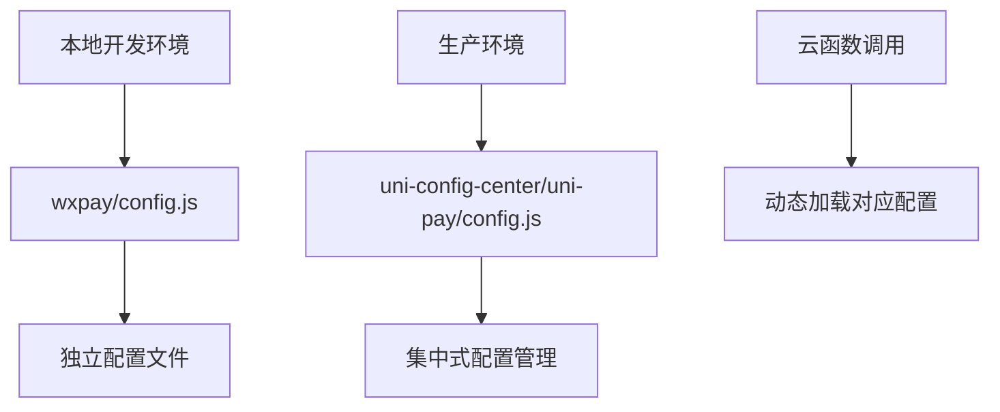
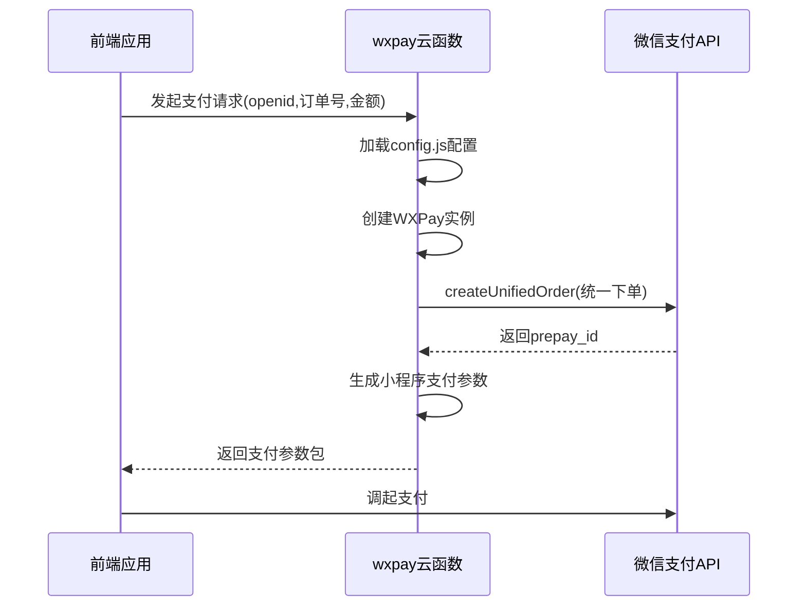
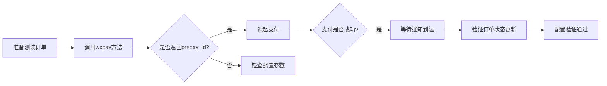

# 支付配置管理

<cite>
**Referenced Files in This Document **   
- [config.js](file://uniCloud-aliyun/cloudfunctions/wxpay/config.js)
- [index.obj.js](file://uniCloud-aliyun/cloudfunctions/wxpay/index.obj.js)
- [config.js](file://uni_modules/uni-config-center/uniCloud/cloudfunctions/common/uni-config-center/uni-pay/config.js)
- [index.js](file://uniCloud-aliyun/cloudfunctions/wxpay-notify/index.js)
</cite>

## 目录
1. [微信支付核心配置参数解析](#微信支付核心配置参数解析)
2. [多环境配置与安全存储实践](#多环境配置与安全存储实践)
3. [配置项与微信支付API的映射关系](#配置项与微信支付api的映射关系)
4. [常见配置错误排查指南](#常见配置错误排查指南)
5. [配置有效性验证方法](#配置有效性验证方法)

## 微信支付核心配置参数解析

本项目中的微信支付配置主要通过 `wxpay/config.js` 文件进行定义，该文件包含了商户接入微信支付所必需的核心参数。这些参数直接对应于微信支付官方API的认证和通信要求。

### 商户号（mch_id）
商户号是微信支付为每个注册商户分配的唯一标识符，在 `config.js` 文件中通过 `mch_id` 字段进行配置。此ID用于在所有支付请求中标识发起交易的商户身份，确保资金能够正确结算到对应的商户账户。

### API密钥（partner_key）
API密钥即V2版本的API Key，通过 `partner_key` 字段配置。该密钥用于生成支付请求的签名，确保通信的安全性。密钥必须严格保密，不应硬编码在前端代码中，而应仅存在于服务端配置文件或环境变量中。

### 小程序APPID
小程序APPID通过 `appid` 字段配置，标识了支付行为所属的小程序应用。该ID必须与商户号在微信支付平台完成绑定，否则将无法完成支付流程。

### 证书路径与通知地址
虽然当前配置文件未显式包含证书路径，但代码实现中通过 `fs.readFileSync(__dirname + '/apiclient_cert.p12')` 动态读取了位于相同目录下的 `apiclient_cert.p12` 证书文件。该证书用于V2接口的双向SSL认证。同时，`notifyUrl` 配置了支付结果异步通知的接收地址，微信服务器会在此URL上报支付结果。

**Section sources**
- [config.js](file://uniCloud-aliyun/cloudfunctions/wxpay/config.js#L1-L8)

## 多环境配置与安全存储实践

### 配置分离策略
项目采用了多层级的配置体系。除了 `wxpay` 模块自身的 `config.js` 外，还存在统一的配置中心 `uni-config-center`，其路径为 `uni_modules/uni-config-center/uniCloud/cloudfunctions/common/uni-config-center/uni-pay/config.js`。这种设计允许在不同模块间共享支付配置，便于集中管理和维护。

**Diagram sources **
- [config.js](file://uniCloud-aliyun/cloudfunctions/wxpay/config.js#L1-L8)
- [config.js](file://uni_modules/uni-config-center/uniCloud/cloudfunctions/common/uni-config-center/uni-pay/config.js#L1-L20)

### 敏感信息保护
当前配置将API密钥以明文形式存储在 `config.js` 文件中，这存在一定的安全风险。最佳实践应是：
1. 使用环境变量替代硬编码密钥
2. 在部署时通过CI/CD管道注入敏感信息
3. 利用云服务商提供的密钥管理服务（如KMS）

尽管如此，由于配置文件位于云函数内部，不被前端直接访问，一定程度上降低了泄露风险。

**Section sources**
- [config.js](file://uniCloud-aliyun/cloudfunctions/wxpay/config.js#L5)
- [config.js](file://uni_modules/uni-config-center/uniCloud/cloudfunctions/common/uni-config-center/uni-pay/config.js#L14)

## 配置项与微信支付API的映射关系

### APIv3密钥使用场景
当前配置主要针对微信支付V2 API，使用 `partner_key` 进行MD5签名。对于更安全的V3 API，应使用APIv3密钥进行AES加密和证书签名。在 `uni-config-center` 的配置中已预留了 `notifyKey` 字段，可能用于V3接口的通知解密。

### 签名算法要求
支付请求的签名采用MD5算法，这是由 `signType: 'MD5'` 明确指定的。签名过程需将参与签名的参数按字典序排序后拼接，并附加API密钥进行MD5哈希计算。这一过程在 `index.obj.js` 中的 `payRes.sign(signParams)` 调用中完成。

**Diagram sources **
- [config.js](file://uniCloud-aliyun/cloudfunctions/wxpay/config.js#L1-L8)
- [index.obj.js](file://uniCloud-aliyun/cloudfunctions/wxpay/index.obj.js#L26-L79)

### 核心配置映射表
| 配置项 | 对应API字段 | 用途说明 |
|--------|------------|---------|
| appid | appid | 小程序应用标识 |
| mch_id | mch_id | 商户号标识 |
| partner_key | key | V2 API签名密钥 |
| notifyUrl | notify_url | 支付结果回调地址 |
| pfx证书 | apiclient_cert.p12 | V2接口双向认证 |

**Section sources**
- [config.js](file://uniCloud-aliyun/cloudfunctions/wxpay/config.js#L3-L5)
- [index.obj.js](file://uniCloud-aliyun/cloudfunctions/wxpay/index.obj.js#L28-L31)

## 常见配置错误排查指南

### 密钥格式不匹配
当 `partner_key` 长度不符合32位要求，或包含非法字符时，会导致签名验证失败。应确保密钥为连续的32位字符串，不含空格或换行。

### 域名未授权
`notifyUrl` 所指向的域名必须在微信支付商户平台的"支付授权目录"中完成配置。若域名未授权，微信服务器将拒绝发送支付通知，导致无法自动更新订单状态。

### 证书问题
`apiclient_cert.p12` 证书文件必须与当前商户号匹配。若证书过期、密码错误或与商户号不匹配，将导致 `fs.readFileSync` 后的证书无法通过微信API的验证。

### 缺失必要参数
根据 `index.obj.js` 中的参数验证逻辑，缺少 `openid`、`out_trade_no` 或 `total_fee` 任一参数都将抛出"缺少必需的支付参数"错误。特别是 `total_fee` 必须为正数，单位为分。

**Section sources**
- [config.js](file://uniCloud-aliyun/cloudfunctions/wxpay/config.js#L5)
- [index.obj.js](file://uniCloud-aliyun/cloudfunctions/wxpay/index.obj.js#L14-L22)

## 配置有效性验证方法

### 通过订单查询接口验证
系统提供了 `getWxOrder` 方法用于查询订单状态，可作为配置有效性的验证手段。通过传入已知订单号调用此接口，若能成功返回订单信息，则表明商户号、API密钥等配置正确无误。

### 支付通知模拟测试
`wxpay-notify/index.js` 实现了支付结果通知的接收处理。可通过构造模拟的XML通知数据来测试该接口是否能正常接收和处理。成功的响应应返回 `<return_code><![CDATA[SUCCESS]]></return_code>`。

**Diagram sources **
- [index.obj.js](file://uniCloud-aliyun/cloudfunctions/wxpay/index.obj.js#L82-L116)
- [index.js](file://uniCloud-aliyun/cloudfunctions/wxpay-notify/index.js#L1-L31)

**Section sources**
- [index.obj.js](file://uniCloud-aliyun/cloudfunctions/wxpay/index.obj.js#L82-L116)
- [index.js](file://uniCloud-aliyun/cloudfunctions/wxpay-notify/index.js#L1-L31)