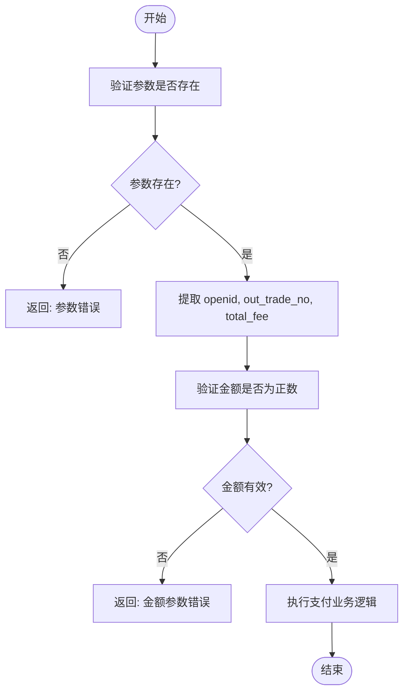
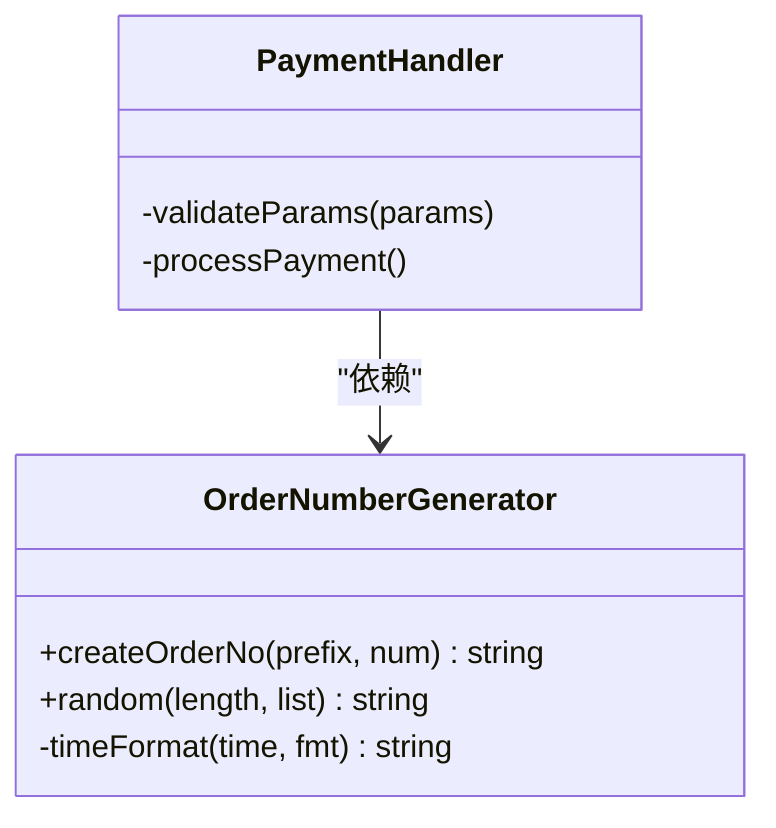
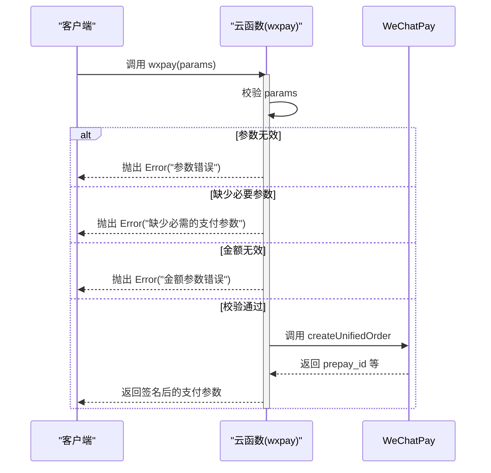

# 下单参数处理

<cite>
**本文档引用的文件**
- [index.obj.js](file://uniCloud-aliyun/cloudfunctions/wxpay/index.obj.js)
- [config.js](file://uniCloud-aliyun/cloudfunctions/wxpay/config.js)
- [randomOrder.js](file://utils/randomOrder.js)
</cite>

## 目录
1. [统一下单接口参数校验与预处理](#统一下单接口参数校验与预处理)
2. [金额单位转换策略](#金额单位转换策略)
3. [订单号生成算法](#订单号生成算法)
4. [支付身份绑定机制](#支付身份绑定机制)
5. [错误捕获与异常响应](#错误捕获与异常响应)

## 统一下单接口参数校验与预处理

`wxpay` 方法是微信支付的核心入口，负责接收前端传入的支付参数并进行统一处理。该方法首先对输入参数进行严格校验，确保所有必需字段都存在且类型正确。

在参数验证阶段，系统检查 `params` 是否为对象类型，并提取 `openid`、`out_trade_no` 和 `total_fee` 三个核心参数。若任一参数缺失或为空值，则抛出“缺少必需的支付参数”错误。此验证流程确保了后续业务逻辑执行的基础数据完整性。

**图表来源**
- [index.obj.js](file://uniCloud-aliyun/cloudfunctions/wxpay/index.obj.js#L10-L20)

**本节来源**
- [index.obj.js](file://uniCloud-aliyun/cloudfunctions/wxpay/index.obj.js#L10-L25)

## 金额单位转换策略

微信支付API要求交易金额以“分”为单位进行传输，而前端通常使用“元”作为用户友好的显示单位。因此，在调用支付接口前必须将金额从“元”精确转换为“分”。

在当前实现中，`total_fee` 参数直接作为数值传入，其值应已由调用方完成从“元”到“分”的乘以100的转换。例如，1元需表示为100，0.01元（即1分）需表示为1。系统通过 `typeof total_fee !== 'number' || total_fee <= 0` 的校验确保传入的是一个大于零的有效数字，从而保证了金额的合法性。

这种设计将单位转换的责任前置到客户端或上层服务，简化了云函数内部逻辑，同时避免了浮点数运算可能带来的精度丢失问题。开发者在集成时必须确保传入的 `total_fee` 已经是整数形式的“分”单位金额。

**本节来源**
- [index.obj.js](file://uniCloud-aliyun/cloudfunctions/wxpay/index.obj.js#L18-L20)

## 订单号生成算法

商户订单号 (`out_trade_no`) 是微信支付中用于唯一标识一笔交易的关键字段。在 `wxpay` 接口中，该参数由调用方提供，而非在云函数内部生成。

项目中提供了两种订单号生成方案：
1. **自定义简单方案**：位于 `utils/randomOrder.js` 文件中的 `out_trade_no` 函数，通过拼接固定前缀 `'20160203'` 和随机字符串生成。
2. **通用库方案**：`uni-pay-co` 模块中的 `common.createOrderNo` 方法，结合当前时间戳（精确到毫秒）和随机数生成高并发下重复概率极低的订单号。

虽然当前 `wxpay` 接口未直接使用上述任一函数生成订单号，但其设计允许外部系统根据业务需求选择合适的生成策略。推荐使用 `common.createOrderNo` 这类基于时间戳和随机数的组合算法，以确保全局唯一性和可追溯性。

**图表来源**
- [randomOrder.js](file://utils/randomOrder.js#L1-L3)
- [common.js](file://uni_modules/uni-pay/uniCloud/cloudfunctions/uni-pay-co/libs/common.js#L43-L57)

**本节来源**
- [randomOrder.js](file://utils/randomOrder.js#L1-L3)

## 支付身份绑定机制

用户的支付身份通过 `openid` 进行绑定。`openid` 是微信用户在某个公众号或小程序下的唯一标识符，确保了支付请求与特定用户账户的关联。

在 `wxpay` 接口中，`openid` 作为必填参数之一，由前端在用户授权登录后获取并传递给云函数。云函数将此 `openid` 直接用于调用微信支付的统一下单API，指定该笔支付归属于哪个用户。

此机制实现了支付身份的安全绑定，防止了未经授权的支付操作。`openid` 的获取通常发生在用户首次使用小程序时，通过调用微信登录接口完成，之后可在本地存储并在每次支付时复用。

**本节来源**
- [index.obj.js](file://uniCloud-aliyun/cloudfunctions/wxpay/index.obj.js#L16-L17)

## 错误捕获与异常响应

系统采用 JavaScript 的 `throw new Error()` 机制进行错误抛出，实现了清晰的异常处理流程。

当参数校验失败时，会抛出带有明确描述信息的 `Error` 对象：
- 若 `params` 无效，则抛出“参数错误”
- 若 `openid`、`out_trade_no` 或 `total_fee` 缺失，则抛出“缺少必需的支付参数”
- 若 `total_fee` 非正数，则抛出“金额参数错误”

这些错误会被云函数框架捕获，并自动转换为标准的HTTP错误响应返回给客户端。这种方式使得前端能够根据返回的错误消息进行相应的用户提示或重试逻辑，提升了系统的健壮性和用户体验。

**图表来源**
- [index.obj.js](file://uniCloud-aliyun/cloudfunctions/wxpay/index.obj.js#L12-L22)

**本节来源**
- [index.obj.js](file://uniCloud-aliyun/cloudfunctions/wxpay/index.obj.js#L12-L22)