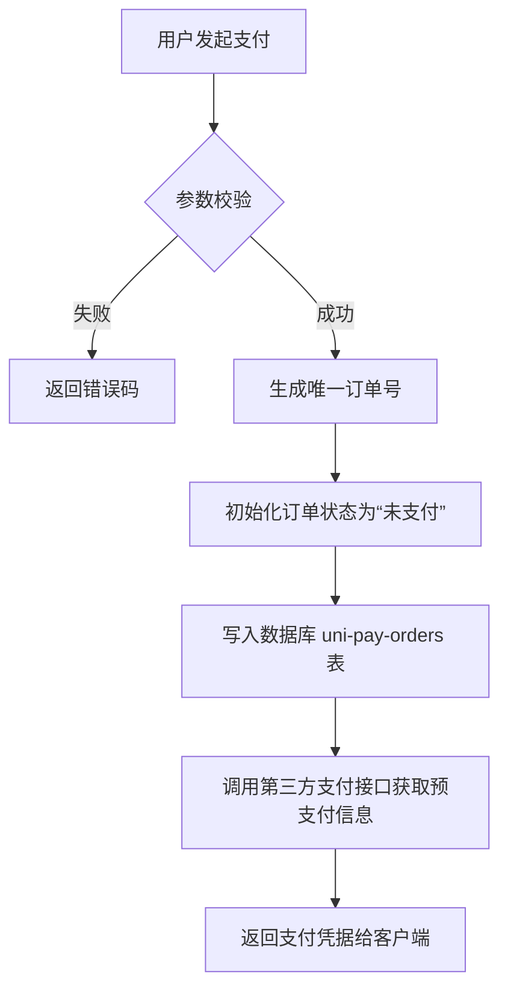
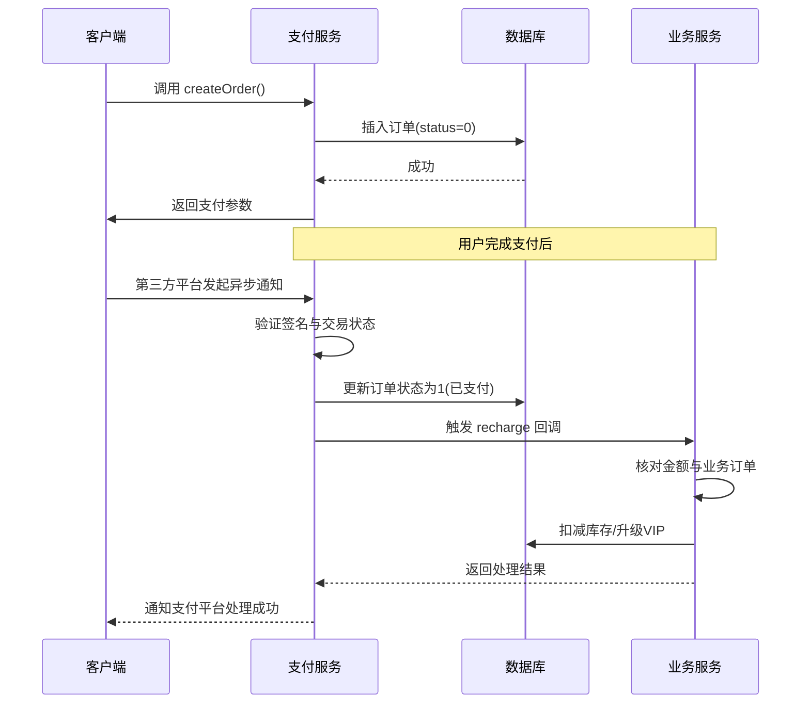
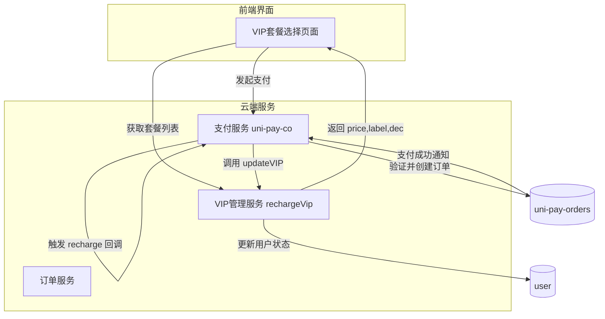

# 业务逻辑协同

<cite>
**本文档引用文件**  
- [pay.js](file://uni_modules/uni-pay/uniCloud/cloudfunctions/uni-pay-co/service/pay.js)
- [uniPayOrders.js](file://uni_modules/uni-pay/uniCloud/cloudfunctions/uni-pay-co/dao/uniPayOrders.js)
- [recharge.js](file://uni_modules/uni-pay/uniCloud/cloudfunctions/uni-pay-co/notify/recharge.js)
- [index.obj.js](file://uni_modules/uni-pay/uniCloud/cloudfunctions/uni-pay-co/index.obj.js)
- [vipRechargePro.schema.json](file://uniCloud-aliyun/database/vipRechargePro.schema.json)
- [order.schema.json](file://uniCloud-aliyun/database/order.schema.json)
- [rechargeVip/index.obj.js](file://uniCloud-aliyun/cloudfunctions/rechargeVip/index.obj.js)
</cite>

## 目录
1. [引言](#引言)
2. [统一下单流程中的业务前置操作](#统一下单流程中的业务前置操作)
3. [数据库订单状态初始化机制](#数据库订单状态初始化机制)
4. [库存扣减与服务权益锁定的原子性保障](#库存扣减与服务权益锁定的原子性保障)
5. [交易超时时间设定策略](#交易超时时间设定策略)
6. [支付服务与其他业务模块的协作关系](#支付服务与其他业务模块的协作关系)
7. [支付成功后的后续业务触发机制](#支付成功后的后续业务触发机制)
8. [结论](#结论)

## 引言
本文档旨在深入分析基于 `uni-pay-co` 框架实现的统一下单过程中涉及的关键业务前置操作。重点阐述在用户发起支付请求后，系统如何通过一系列协调机制确保数据一致性、防止重复支付，并为后续业务动作提供可靠触发条件。文档将结合代码结构与业务逻辑，解析支付服务与VIP套餐管理、商品库存等核心模块之间的协同工作模式。

## 统一下单流程中的业务前置操作
当用户选择商品或服务并确认支付时，前端调用 `createOrder` 接口启动统一下单流程。该过程不仅生成第三方支付所需的订单信息，还同步执行多项关键的业务前置操作，包括：订单记录创建、初始状态设置、支付参数校验及异步回调地址拼接。这些操作均在单一事务上下文中完成，以保证操作的原子性和数据的一致性。

**图示来源**  
- [pay.js](file://uni_modules/uni-pay/uniCloud/cloudfunctions/uni-pay-co/service/pay.js#L200-L400)

**本节来源**  
- [pay.js](file://uni_modules/uni-pay/uniCloud/cloudfunctions/uni-pay-co/service/pay.js#L200-L400)

## 数据库订单状态初始化机制
在订单创建阶段，系统会立即向 `uni-pay-orders` 集合中插入一条新记录，其核心字段包含商户订单号（`out_trade_no`）、业务订单号（`order_no`）、支付金额（`total_fee`）以及最重要的支付状态（`status`）。根据 `uniPayOrders.js` 的实现逻辑，所有新建订单的初始状态被固定设置为 `0`，代表“未支付”。

此状态值是整个支付生命周期管理的基础，后续无论是支付成功通知、退款还是订单关闭，都将基于当前状态进行判断和变更。例如，在处理支付异步通知时，系统首先检查订单是否已存在且状态仍为 `0`，以此避免因网络重试导致的重复通知引发的状态错乱。

**本节来源**  
- [uniPayOrders.js](file://uni_modules/uni-pay/uniCloud/cloudfunctions/uni-pay-co/dao/uniPayOrders.js#L50-L60)
- [pay.js](file://uni_modules/uni-pay/uniCloud/cloudfunctions/uni-pay-co/service/pay.js#L350-L370)

## 库存扣减与服务权益锁定的原子性保障
虽然 `uni-pay-co` 本身不直接处理库存或服务权益，但它通过设计良好的扩展点来支持这类原子性操作。具体而言，在 `createOrder` 方法执行末尾，系统并未立即提交最终结果，而是先完成支付订单的持久化。真正的库存扣减或权益锁定应在支付成功的异步回调中完成。

`recharge.js` 文件作为支付成功后的自定义通知处理器模板，明确指出开发者应在其中加入业务逻辑验证，特别是对前端传递的 `total_fee` 进行二次核对。只有当金额与业务系统内订单一致时，才可安全地执行如更新用户VIP等级、扣除虚拟商品库存等敏感操作。这种延迟执行策略结合数据库事务，有效保障了操作的原子性与最终一致性。

**图示来源**  
- [recharge.js](file://uni_modules/uni-pay/uniCloud/cloudfunctions/uni-pay-co/notify/recharge.js#L10-L25)
- [pay.js](file://uni_modules/uni-pay/uniCloud/cloudfunctions/uni-pay-co/service/pay.js#L100-L150)

**本节来源**  
- [recharge.js](file://uni_modules/uni-pay/uniCloud/cloudfunctions/uni-pay-co/notify/recharge.js#L1-L30)
- [pay.js](file://uni_modules/uni-pay/uniCloud/cloudfunctions/uni-pay-co/service/pay.js#L100-L150)

## 交易超时时间设定策略
`uni-pay-co` 框架本身未显式暴露交易超时配置项，但其底层依赖的第三方支付SDK（如微信、支付宝）通常内置默认超时规则（如微信支付为2小时）。然而，为了更灵活地控制订单生命周期，框架提供了 `closeOrder` 接口用于主动关闭长时间未支付的订单。

此外，`uniPayOrders.js` 中定义了 `deleteExpPayOrders` 方法，可用于定期清理超过三天仍未支付的过期订单。尽管该方法当前被注释掉，但它揭示了一种通过定时任务自动管理订单生命周期的设计思路。实际项目中，可通过云函数定时触发此清理逻辑，或结合消息队列在订单创建时投递一个延迟任务，以实现精确到分钟级别的超时控制。

**本节来源**  
- [uniPayOrders.js](file://uni_modules/uni-pay/uniCloud/cloudfunctions/uni-pay-co/dao/uniPayOrders.js#L100-L108)
- [pay.js](file://uni_modules/uni-pay/uniCloud/cloudfunctions/uni-pay-co/service/pay.js#L600-L630)

## 支付服务与其他业务模块的协作关系
支付服务作为系统的中枢组件，与多个业务模块保持松耦合但高协同的关系。以VIP套餐管理为例，`rechargeVip/index.obj.js` 提供了获取所有充值套餐列表的接口，前端在展示VIP购买选项时会调用此接口。用户选择特定套餐后，其价格（`price` 字段）将作为 `total_fee` 参数传入 `createOrder`。

支付成功后，`recharge.js` 回调函数可根据 `type` 字段识别出这是一笔VIP充值订单，并依据 `order_no` 查询原始业务订单，进而调用相应的服务更新用户的VIP有效期。整个过程通过标准化的事件驱动模型连接，确保支付结果能准确无误地转化为具体的业务状态变更。

**图示来源**  
- [rechargeVip/index.obj.js](file://uniCloud-aliyun/cloudfunctions/rechargeVip/index.obj.js#L5-L10)
- [vipRechargePro.schema.json](file://uniCloud-aliyun/database/vipRechargePro.schema.json#L1-L32)
- [recharge.js](file://uni_modules/uni-pay/uniCloud/cloudfunctions/uni-pay-co/notify/recharge.js#L1-L30)

**本节来源**  
- [rechargeVip/index.obj.js](file://uniCloud-aliyun/cloudfunctions/rechargeVip/index.obj.js#L1-L13)
- [vipRechargePro.schema.json](file://uniCloud-aliyun/database/vipRechargePro.schema.json#L1-L32)
- [recharge.js](file://uni_modules/uni-pay/uniCloud/cloudfunctions/uni-pay-co/notify/recharge.js#L1-L30)

## 支付成功后的后续业务触发机制
支付成功的后续业务触发完全依赖于异步通知机制。一旦第三方支付平台确认收款，便会向预设的回调地址发送HTTP请求。`pay.js` 中的 `paymentNotify` 方法负责接收并验证此通知，验证通过后，系统会查找对应的支付订单，并仅在订单状态为 `0`（未支付）时执行以下关键步骤：

1. 将订单状态更新为 `1`（已支付），并记录交易ID与支付时间；
2. 动态加载与订单 `type` 对应的自定义通知处理器（如 `../notify/recharge`）；
3. 执行该处理器内的业务逻辑，如更新用户账户余额、发放虚拟物品或升级会员等级；
4. 将处理器执行结果（`user_order_success`）写回订单记录，供前端查询最终支付结果。

这一机制确保了即使在极端情况下（如网络中断），只要支付平台最终发出通知，系统就能恢复并完成全部业务流程，从而实现可靠的最终一致性。

**本节来源**  
- [pay.js](file://uni_modules/uni-pay/uniCloud/cloudfunctions/uni-pay-co/service/pay.js#L50-L150)
- [recharge.js](file://uni_modules/uni-pay/uniCloud/cloudfunctions/uni-pay-co/notify/recharge.js#L1-L30)

## 结论
通过对 `uni-pay-co` 支付服务的深入分析可见，其设计充分考虑了分布式环境下支付场景的复杂性。通过严格的初始状态设置、清晰的职责分离以及基于事件的异步回调机制，系统能够在保证数据一致性的同时，灵活对接各类业务需求。建议在实际开发中充分利用 `notify` 目录下的自定义回调能力，并结合定时任务与数据库索引优化，构建健壮、可扩展的支付业务体系。