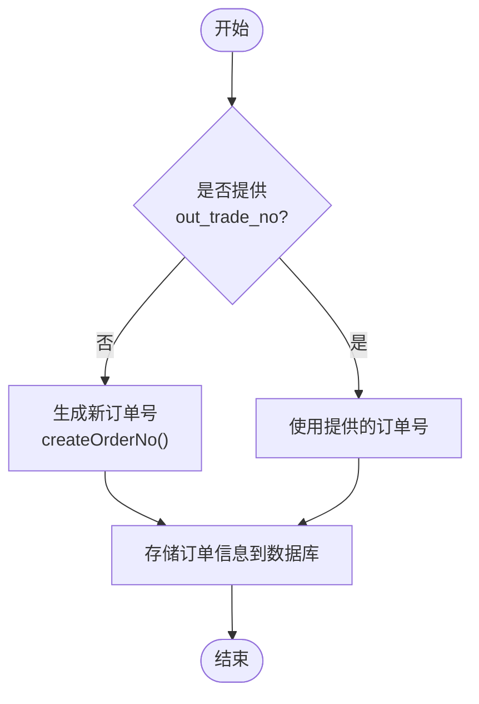
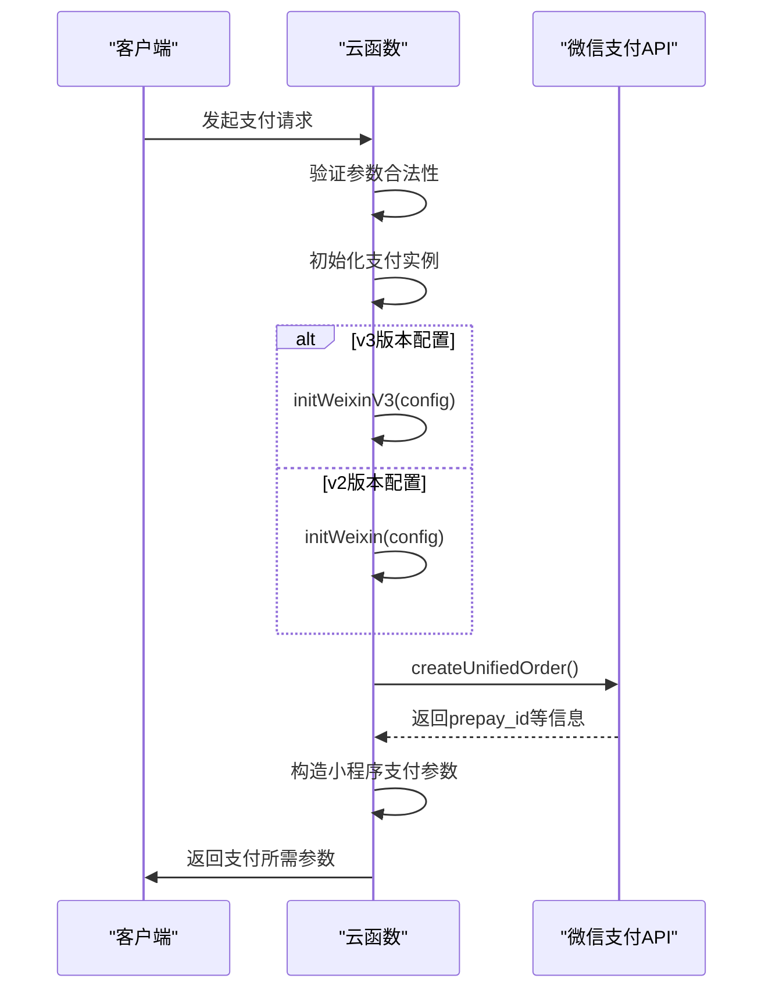
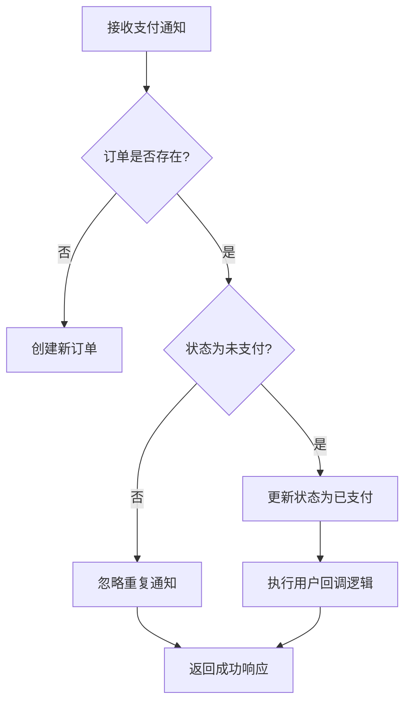

# 统一下单服务

<cite>
**本文档引用的文件**
- [wxpay/index.obj.js](file://uniCloud-aliyun/cloudfunctions/wxpay/index.obj.js)
- [uni-pay-co/service/pay.js](file://uni_modules/uni-pay/uniCloud/cloudfunctions/uni-pay-co/service/pay.js)
</cite>

## 目录
1. [统一下单接口实现逻辑](#统一下单接口实现逻辑)
2. [关键字段处理规则](#关键字段处理规则)
3. [微信支付APIv3调用流程](#微信支付apiv3调用流程)
4. [交易创建与前置业务逻辑](#交易创建与前置业务逻辑)
5. [幂等性保障方案](#幂等性保障方案)
6. [异常处理策略](#异常处理策略)

## 统一下单接口实现逻辑

统一下单接口通过`wxpay/index.obj.js`中的`wxpay`方法实现，该方法接收包含支付参数的对象作为输入。在接收到请求后，首先进行参数验证，确保`openid`、`out_trade_no`和`total_fee`等必需参数存在且格式正确。

核心实现基于`wx-pay`库，通过读取配置文件中的商户信息（appid、mch_id、partner_key）以及证书文件来初始化支付实例。随后调用`createUnifiedOrder`方法向微信支付系统发起预支付请求，该请求包含了商品描述、订单号、金额、通知地址和交易类型等必要信息。

整个过程采用Promise包装以支持异步操作，当微信支付系统返回响应后，将原始响应数据重新构造成小程序支付所需的参数格式，包括时间戳、随机字符串、预支付ID包和签名等，最终返回给客户端用于发起支付。

**Section sources**
- [wxpay/index.obj.js](file://uniCloud-aliyun/cloudfunctions/wxpay/index.obj.js#L0-L116)

## 关键字段处理规则

### total_fee（金额单位转换）

`total_fee`字段表示订单总金额，单位为分。在`wxpay/index.obj.js`中，该字段被直接传递给微信支付API，要求必须是大于0的数字类型。系统不进行额外的单位转换，因此调用方需要确保传入的是以分为单位的整数值。

```mermaid
flowchart TD
A[原始金额(元)] --> B[乘以100]
B --> C[转换为分]
C --> D[作为total_fee传入]
```

**Diagram sources**
- [wxpay/index.obj.js](file://uniCloud-aliyun/cloudfunctions/wxpay/index.obj.js#L25-L35)

### body（商品描述）

`body`字段在`wxpay/index.obj.js`中被硬编码为"会员充值"，表示本次交易的商品或服务描述。这个值会显示在用户的支付确认界面中，帮助用户识别交易内容。

**Section sources**
- [wxpay/index.obj.js](file://uniCloud-aliyun/cloudfunctions/wxpay/index.obj.js#L58-L63)

### out_trade_no（唯一订单号生成策略）

`out_trade_no`是商户系统内部的唯一订单号，在`uni-pay-co/service/pay.js`的`createOrder`方法中，如果未提供此参数，则使用`libs.common.createOrderNo()`函数自动生成。该订单号在整个支付流程中作为关键标识，用于关联商户系统与微信支付系统的交易记录，并保证同一订单不会被重复支付。



**Diagram sources**
- [uni-pay-co/service/pay.js](file://uni_modules/uni-pay/uniCloud/cloudfunctions/uni-pay-co/service/pay.js#L207-L210)

### openid（用户标识绑定）

`openid`是微信用户在商户应用下的唯一标识，在`wxpay/index.obj.js`中作为必填参数参与支付请求。在更完整的`uni-pay-co`体系中，可以通过`getOpenid`方法根据code获取用户的openid，实现用户身份的绑定和验证。

**Section sources**
- [wxpay/index.obj.js](file://uniCloud-aliyun/cloudfunctions/wxpay/index.obj.js#L25-L35)
- [uni-pay-co/service/pay.js](file://uni_modules/uni-pay/uniCloud/cloudfunctions/uni-pay-co/service/pay.js#L953-L980)

## 微信支付APIv3调用流程

虽然当前`wxpay/index.obj.js`实现主要基于微信支付v2 API，但系统架构支持v3版本。在`uni-pay-co/service/pay.js`中，通过检查配置的`version`字段来决定使用哪个版本的API：



**Diagram sources**
- [uni-pay-co/service/pay.js](file://uni_modules/uni-pay/uniCloud/cloudfunctions/uni-pay-co/service/pay.js#L1021-L1064)

## 交易创建与前置业务逻辑

`uni-pay-co/service/pay.js`中的`createOrder`方法负责处理完整的交易创建流程，包括订单状态初始化和库存锁定等前置业务逻辑：

1. **参数验证**：检查支付供应商、金额、用户信息等关键参数的有效性
2. **订单号生成**：若未提供则自动生成唯一的商户订单号
3. **回调地址构建**：根据服务空间ID和支付类型拼接异步通知URL
4. **数据库操作**：
   - 如果订单不存在，则添加新的订单记录，状态初始化为"未支付"(status: 0)
   - 如果订单已存在，则更新支付方式等相关信息

```mermaid
classDiagram
class PayService {
+getConfig()
+createOrder(data)
+getOrder(data)
+refund(data)
+getRefund(data)
+closeOrder(data)
+getOpenid(data)
}
class Dao {
+uniPayOrders
+uniIdUsers
+opendbOpenData
}
class Config {
+wxpay
+alipay
+appleiap
+notifyUrl
}
PayService --> Dao : "数据访问"
PayService --> Config : "读取配置"
PayService ..> "PaymentNotify" : "异步通知处理"
```

**Diagram sources**
- [uni-pay-co/service/pay.js](file://uni_modules/uni-pay/uniCloud/cloudfunctions/uni-pay-co/service/pay.js#L150-L800)

## 幂等性保障方案

系统通过多种机制确保高并发下单时的幂等性：

1. **数据库唯一索引**：在`uniPayOrders`表的`out_trade_no`字段上设置唯一索引，防止重复订单号的插入
2. **条件更新**：在更新订单状态时使用条件查询，例如只有当订单状态为"未支付"时才允许更新为"已支付"
3. **事务处理**：关键操作如支付成功后的状态更新采用原子性操作
4. **重复通知过滤**：在`paymentNotify`方法中，通过检查订单的`status`字段来拦截非首次的回调通知



**Diagram sources**
- [uni-pay-co/service/pay.js](file://uni_modules/uni-pay/uniCloud/cloudfunctions/uni-pay-co/service/pay.js#L550-L580)

## 异常处理策略

系统实现了多层次的异常处理机制：

1. **参数验证异常**：对缺失或格式错误的参数抛出明确的错误信息
2. **支付网关异常**：捕获并记录第三方支付接口的错误，提供详细的错误码和消息
3. **数据库操作异常**：对数据库操作失败的情况进行重试或回滚
4. **幂等性冲突处理**：当检测到重复请求时，返回一致的结果而不改变系统状态

在`createOrder`方法中，所有可能出错的操作都被包裹在try-catch块中，确保任何异常都能被捕获并转化为标准化的错误响应，同时记录详细的错误日志供后续排查。

**Section sources**
- [uni-pay-co/service/pay.js](file://uni_modules/uni-pay/uniCloud/cloudfunctions/uni-pay-co/service/pay.js#L304-L330)
- [uni-pay-co/service/pay.js](file://uni_modules/uni-pay/uniCloud/cloudfunctions/uni-pay-co/service/pay.js#L530-L550)