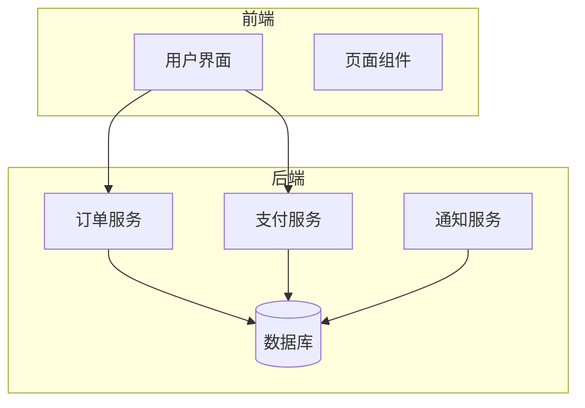
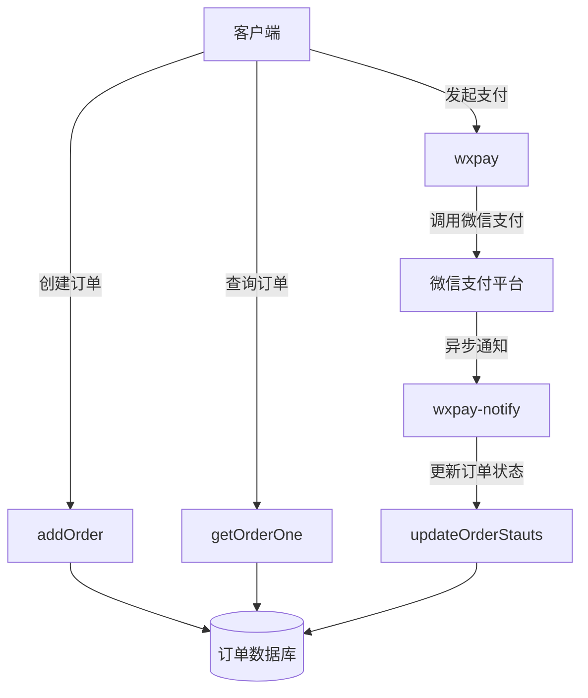
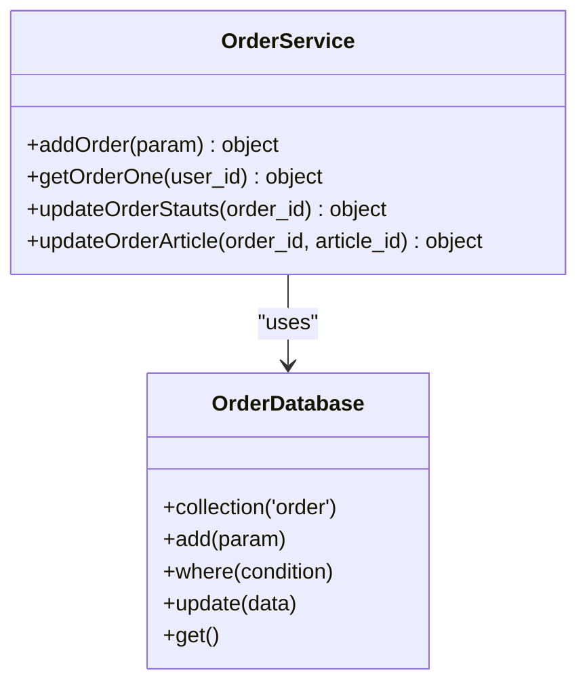
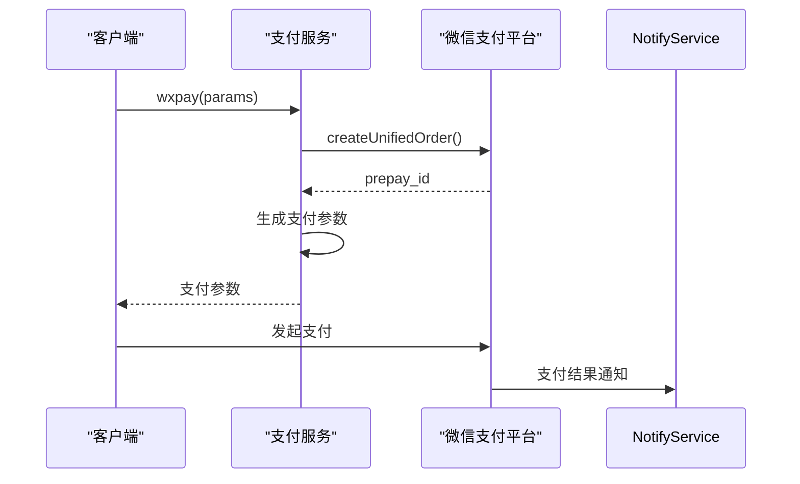
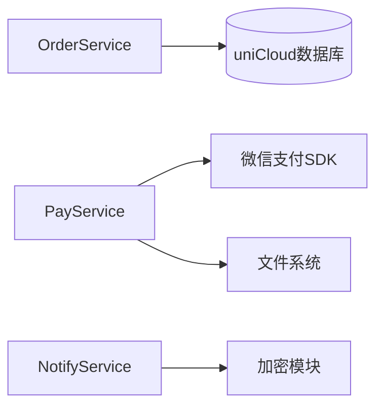

# 高并发与异常处理

<cite>
**Referenced Files in This Document **   
- [index.obj.js](file://uniCloud-aliyun/cloudfunctions/order/index.obj.js)
- [order.schema.json](file://uniCloud-aliyun/database/order.schema.json)
- [wxpay/index.obj.js](file://uniCloud-aliyun/cloudfunctions/wxpay/index.obj.js)
- [wxpay-notify/index.js](file://uniCloud-aliyun/cloudfunctions/wxpay-notify/index.js)
</cite>

## 目录
1. [引言](#引言)
2. [项目结构](#项目结构)
3. [核心组件](#核心组件)
4. [架构概述](#架构概述)
5. [详细组件分析](#详细组件分析)
6. [依赖分析](#依赖分析)
7. [性能考虑](#性能考虑)
8. [故障排除指南](#故障排除指南)
9. [结论](#结论)

## 引言
本文档系统梳理了统一下单服务在高并发场景下的稳定性保障措施，重点描述基于数据库乐观锁实现的幂等性控制机制，防止重复下单。分析网络超时、支付失败、签名验证错误等常见异常的分类处理策略，展示错误码设计规范与日志追踪方案。结合代码说明重试机制与最终一致性补偿事务的设计思路。

## 项目结构
项目采用前后端分离架构，前端使用Vue框架构建用户界面，后端通过uniCloud云函数实现业务逻辑。订单相关功能主要集中在`uniCloud-aliyun/cloudfunctions/order`目录下，支付功能分布在`wxpay`和`wxpay-notify`模块中。数据模型定义在`database`目录的JSON Schema文件中。



**Diagram sources **
- [index.obj.js](file://uniCloud-aliyun/cloudfunctions/order/index.obj.js)
- [order.schema.json](file://uniCloud-aliyun/database/order.schema.json)

**Section sources**
- [index.obj.js](file://uniCloud-aliyun/cloudfunctions/order/index.obj.js)
- [order.schema.json](file://uniCloud-aliyun/database/order.schema.json)

## 核心组件
核心组件包括订单创建服务、支付处理服务和异步通知服务。订单创建服务负责生成唯一订单号并初始化订单状态；支付处理服务对接微信支付接口完成交易；异步通知服务接收微信服务器的支付结果通知并更新订单状态。

**Section sources**
- [index.obj.js](file://uniCloud-aliyun/cloudfunctions/order/index.obj.js)
- [wxpay/index.obj.js](file://uniCloud-aliyun/cloudfunctions/wxpay/index.obj.js)
- [wxpay-notify/index.js](file://uniCloud-aliyun/cloudfunctions/wxpay-notify/index.js)

## 架构概述
系统采用微服务架构模式，各功能模块通过云函数独立部署。订单服务与支付服务解耦，通过消息队列或数据库状态变更进行通信。整体架构遵循单一职责原则，每个云函数只负责特定业务功能。



**Diagram sources **
- [index.obj.js](file://uniCloud-aliyun/cloudfunctions/order/index.obj.js)
- [wxpay/index.obj.js](file://uniCloud-aliyun/cloudfunctions/wxpay/index.obj.js)
- [wxpay-notify/index.js](file://uniCloud-aliyun/cloudfunctions/wxpay-notify/index.js)

## 详细组件分析

### 订单服务分析
订单服务实现了完整的订单生命周期管理，包括创建、查询和状态更新功能。

#### 功能方法


**Diagram sources **
- [index.obj.js](file://uniCloud-aliyun/cloudfunctions/order/index.obj.js)

**Section sources**
- [index.obj.js](file://uniCloud-aliyun/cloudfunctions/order/index.obj.js)

### 支付服务分析
支付服务封装了与微信支付平台的交互逻辑，提供统一的支付接口。

#### 支付流程


**Diagram sources **
- [wxpay/index.obj.js](file://uniCloud-aliyun/cloudfunctions/wxpay/index.obj.js)

### 幂等性控制机制
系统通过数据库唯一索引和业务逻辑双重保障实现幂等性控制。

#### 数据库层面
订单表的`out_trade_no`字段设置为唯一索引，确保同一订单号只能插入一次：
```json
{
  "bsonType": "object",
  "properties": {
    "out_trade_no": {
      "bsonType": "string",
      "description": "订单号"
    }
  }
}
```

#### 业务逻辑层面
在订单创建时进行参数校验，防止空参数导致的异常：
```javascript
if (!param) {
    return {
        errCode: 'PARAM_IS_NULL',
        errMsg: '参数不能为空'
    }
}
```

**Section sources**
- [order.schema.json](file://uniCloud-aliyun/database/order.schema.json)
- [index.obj.js](file://uniCloud-aliyun/cloudfunctions/order/index.obj.js)

### 异常处理策略
系统对各类异常进行了分类处理，确保服务的稳定性和用户体验。

#### 错误码设计
系统采用统一的错误码格式，包含错误代码和描述信息：
```javascript
return {
    errCode: 'PARAM_IS_NULL',
    errMsg: '参数不能为空'
}
```

#### 日志追踪
关键操作均记录日志，便于问题排查：
```javascript
console.log(order_id, '更新订单状态')
```

**Section sources**
- [index.obj.js](file://uniCloud-aliyun/cloudfunctions/order/index.obj.js)
- [wxpay-notify/index.js](file://uniCloud-aliyun/cloudfunctions/wxpay-notify/index.js)

## 依赖分析
系统依赖于uniCloud平台提供的数据库服务和云函数运行环境，以及微信支付SDK完成支付功能。



**Diagram sources **
- [index.obj.js](file://uniCloud-aliyun/cloudfunctions/order/index.obj.js)
- [wxpay/index.obj.js](file://uniCloud-aliyun/cloudfunctions/wxpay/index.obj.js)
- [wxpay-notify/index.js](file://uniCloud-aliyun/cloudfunctions/wxpay-notify/index.js)

**Section sources**
- [index.obj.js](file://uniCloud-aliyun/cloudfunctions/order/index.obj.js)
- [wxpay/index.obj.js](file://uniCloud-aliyun/cloudfunctions/wxpay/index.obj.js)
- [wxpay-notify/index.js](file://uniCloud-aliyun/cloudfunctions/wxpay-notify/index.js)

## 性能考虑
在高并发场景下，系统通过以下方式保证性能：
1. 使用数据库唯一索引快速拦截重复请求
2. 云函数无状态设计支持水平扩展
3. 关键路径减少不必要的计算和IO操作

## 故障排除指南
常见问题及解决方案：

### 订单创建失败
检查参数是否为空，确认`param`对象包含必要字段。

### 支付参数错误
验证`openid`、`out_trade_no`、`total_fee`等必填参数是否存在且格式正确。

### 异步通知处理失败
确保服务器能正确接收POST请求，检查签名验证逻辑。

**Section sources**
- [index.obj.js](file://uniCloud-aliyun/cloudfunctions/order/index.obj.js)
- [wxpay/index.obj.js](file://uniCloud-aliyun/cloudfunctions/wxpay/index.obj.js)
- [wxpay-notify/index.js](file://uniCloud-aliyun/cloudfunctions/wxpay-notify/index.js)

## 结论
本系统通过数据库唯一约束和业务层参数校验实现了有效的幂等性控制，防止重复下单。异常处理机制完善，错误码设计规范，日志记录全面。整体架构清晰，各组件职责明确，具备良好的可维护性和扩展性。建议进一步完善监控告警体系，增加熔断降级机制以应对极端情况。