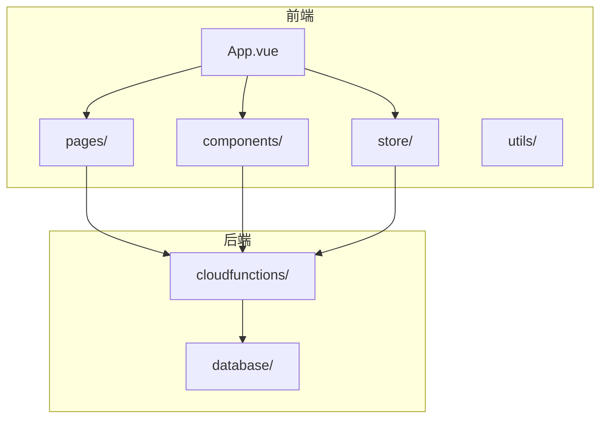
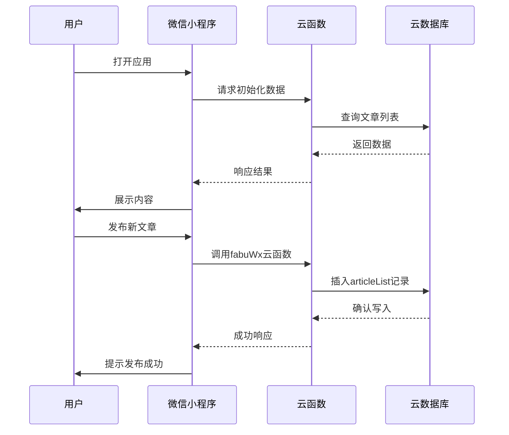
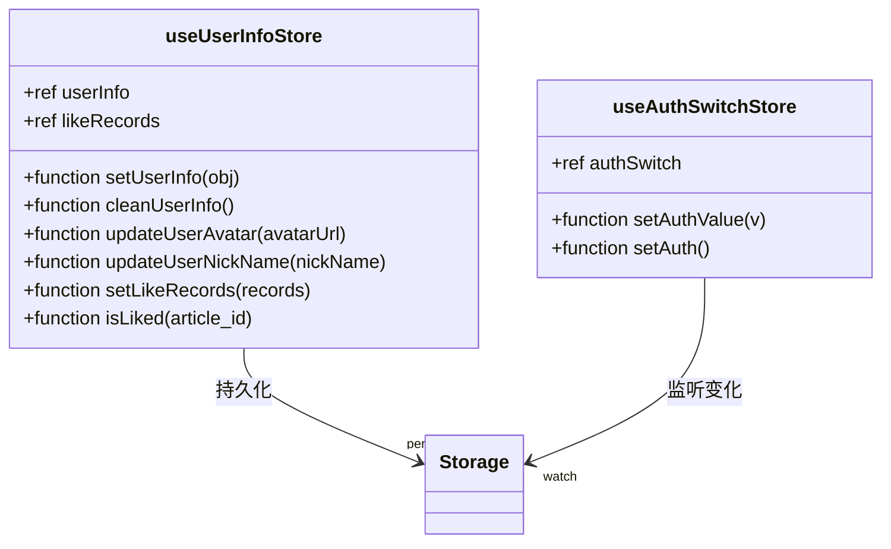
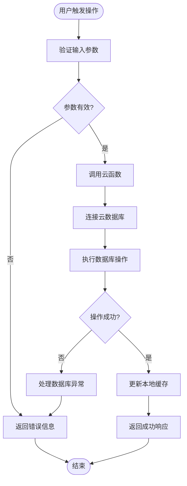
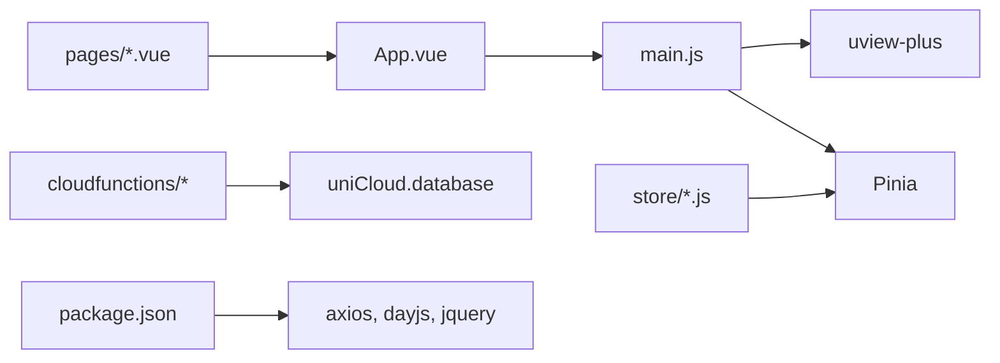

# 项目概述

<cite>
**本文档引用文件**  
- [main.js](file://main.js)
- [App.vue](file://App.vue)
- [pages.json](file://pages.json)
- [manifest.json](file://manifest.json)
- [store/user.js](file://store/user.js)
- [store/authSwitch.js](file://store/authSwitch.js)
- [uniCloud-aliyun/cloudfunctions/articleWx/index.obj.js](file://uniCloud-aliyun/cloudfunctions/articleWx/index.obj.js)
- [uniCloud-aliyun/cloudfunctions/fabuWx/index.obj.js](file://uniCloud-aliyun/cloudfunctions/fabuWx/index.obj.js)
- [uniCloud-aliyun/cloudfunctions/userWx/index.obj.js](file://uniCloud-aliyun/cloudfunctions/userWx/index.obj.js)
- [uniCloud-aliyun/database/articleList.schema.json](file://uniCloud-aliyun/database/articleList.schema.json)
- [uniCloud-aliyun/database/user.schema.json](file://uniCloud-aliyun/database/user.schema.json)
</cite>

## 目录
1. [简介](#简介)
2. [项目结构](#项目结构)
3. [核心组件](#核心组件)
4. [架构概览](#架构概览)
5. [详细组件分析](#详细组件分析)
6. [依赖分析](#依赖分析)
7. [性能考虑](#性能考虑)
8. [故障排除指南](#故障排除指南)
9. [结论](#结论)

## 简介
wx2项目是一款基于uni-app框架开发的微信小程序，专注于旅游酒店领域的社交分享平台。该平台允许用户发布与酒旅相关的内容、进行互动交流，并支持后台管理功能。目标用户群体包括旅游爱好者、酒店从业者以及希望获取或分享旅行经验的普通用户。

本项目采用Vue 3作为前端框架，结合Pinia进行状态管理，实现了高效且可维护的状态控制机制。后端集成uniCloud阿里云云函数，提供稳定可靠的云端服务，涵盖用户认证、内容发布、评论系统等核心业务逻辑。通过这种前后端分离的设计模式，提升了开发效率和系统的可扩展性。

## 项目结构
项目遵循标准的uni-app目录结构，主要分为以下几个部分：
- `components/`：存放可复用的UI组件，如文章详情、评论列表、浮动按钮等。
- `pages/`：包含各个页面的实现，例如首页、个人中心、登录页、文章详情页等。
- `subPages/`：子包页面，用于按需加载以优化启动速度，包括各类管理界面。
- `store/`：使用Pinia管理全局状态，包含用户信息和权限开关两个模块。
- `uniCloud-aliyun/`：阿里云云函数及相关数据库配置，支撑后端逻辑处理。
- `utils/`：工具类函数集合，如时间格式化、路径生成等辅助方法。

**图示来源**
- [App.vue](file://App.vue)
- [pages.json](file://pages.json)
- [uniCloud-aliyun/cloudfunctions](file://uniCloud-aliyun/cloudfunctions)

**章节来源**
- [App.vue](file://App.vue#L1-L20)
- [pages.json](file://pages.json#L1-L186)

## 核心组件
项目的核心功能由多个关键组件协同完成，主要包括内容发布、社交互动和后台管理三大模块。

### 内容发布模块
用户可以通过`fabu/fabu.vue`页面发布图文内容，上传图片时调用`imageService`云函数处理文件存储。发布的文章数据将被保存至`articleList`集合中，支持分类选择、地理位置标记等功能。

### 社交互动模块
用户可以在文章详情页（`article/articleDetail.vue`）查看他人分享的内容，并进行点赞、评论操作。点赞记录通过`likeRecord`表进行持久化存储，确保跨设备同步体验一致。

### 后台管理模块
管理员可通过`subPages/adminManage.vue`进入管理后台，对文章、用户、反馈等内容进行审核与管理。各管理页面分别对应独立的云函数接口，保障数据安全与访问控制。

**章节来源**
- [pages/fabu/fabu.vue](file://pages/fabu/fabu.vue)
- [pages/article/articleDetail.vue](file://pages/article/articleDetail.vue)
- [subPages/adminManage.vue](file://subPages/adminManage.vue)

## 架构概览
整个系统采用典型的前后端分离架构，前端运行在微信小程序环境中，后端依托uniCloud提供的云函数与数据库服务。

**图示来源**
- [uniCloud-aliyun/cloudfunctions/fabuWx/index.obj.js](file://uniCloud-aliyun/cloudfunctions/fabuWx/index.obj.js)
- [uniCloud-aliyun/database/articleList.schema.json](file://uniCloud-aliyun/database/articleList.schema.json)

## 详细组件分析

### 用户状态管理分析
项目使用Pinia进行状态管理，定义了`userInfo`和`authSwitch`两个store来分别管理用户信息和权限状态。

#### Pinia状态管理类图

**图示来源**
- [store/user.js](file://store/user.js#L1-L90)
- [store/authSwitch.js](file://store/authSwitch.js#L1-L53)

**章节来源**
- [store/user.js](file://store/user.js#L1-L90)
- [store/authSwitch.js](file://store/authSwitch.js#L1-L53)

### 云函数调用流程分析
当用户执行特定操作（如发布文章）时，前端会调用对应的云函数接口，后者再与数据库交互完成数据持久化。

**图示来源**
- [uniCloud-aliyun/cloudfunctions/articleWx/index.obj.js](file://uniCloud-aliyun/cloudfunctions/articleWx/index.obj.js)
- [uniCloud-aliyun/cloudfunctions/userWx/index.obj.js](file://uniCloud-aliyun/cloudfunctions/userWx/index.obj.js)

## 依赖分析
项目依赖关系清晰，前端依赖uni-app生态中的多个官方插件，如uview-plus、uni-id-common等，简化UI开发与用户认证流程。后端依赖uniCloud JQL扩展实现数据库查询能力。

**图示来源**
- [main.js](file://main.js#L1-L70)
- [package.json](file://package.json#L1-L12)
- [uniCloud-aliyun/cloudfunctions](file://uniCloud-aliyun/cloudfunctions)

**章节来源**
- [main.js](file://main.js#L1-L70)
- [package.json](file://package.json#L1-L12)

## 性能考虑
为提升用户体验，项目在多个层面进行了性能优化：
- 使用分包子包（subPackages）减少主包体积，加快首次加载速度。
- 利用Pinia持久化插件缓存用户状态，避免重复登录。
- 云函数启用JQL扩展，提高数据库查询效率。
- 图片资源通过七牛云CDN加速访问。

此外，建议进一步引入懒加载机制，仅在需要时加载非关键组件，持续优化内存占用与响应时间。

## 故障排除指南
常见问题及解决方案如下：

### 登录状态丢失
检查`uni.setStorageSync`是否正常执行，确认`userInfo`键值未被意外清除。

### 云函数调用失败
查看控制台日志输出，确认网络连接正常，检查云函数部署状态与权限配置。

### 页面白屏
排查`pages.json`路由配置是否正确，确保所有引用页面路径无误。

**章节来源**
- [store/user.js](file://store/user.js#L30-L40)
- [main.js](file://main.js#L50-L60)

## 结论
wx2项目构建了一个功能完整、架构清晰的旅游酒店社交分享平台。通过合理的技术选型与模块划分，实现了良好的可维护性与扩展性。未来可进一步增强数据分析能力，引入推荐算法提升内容匹配度，打造更智能的用户体验。