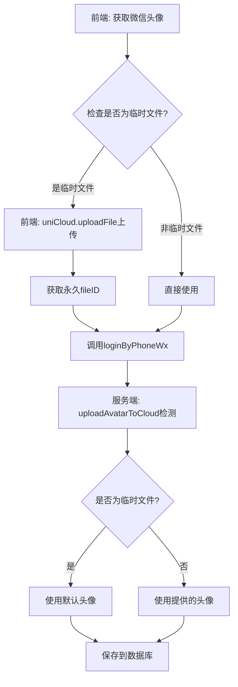
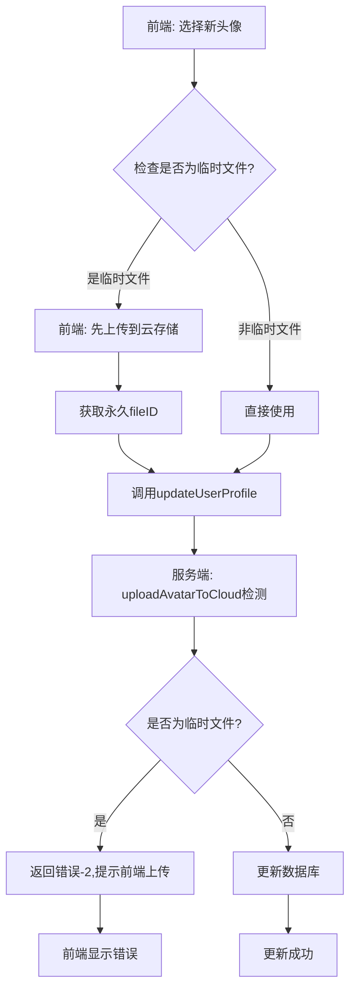

# 服务端头像上传优化说明

## 优化目标

在用户登录和更新资料时，自动检测并处理微信临时头像，确保只有永久链接被保存到数据库中。

## 修改内容

### 1. 新增 `uploadAvatarToCloud` 方法

**文件**: `uniCloud-aliyun/cloudfunctions/userWx/index.obj.js`

这个方法负责检测和处理头像URL：

```javascript
async uploadAvatarToCloud(avatarUrl) {
    // 1. 检查是否为空或默认头像
    if (!avatarUrl || avatarUrl === '/static/images/default-avatar.png') {
        return { code: 0, data: { avatarUrl, isDefault: true } };
    }
    
    // 2. 检测是否为微信临时文件（http://tmp/、wxfile://）
    const isTempFile = avatarUrl.startsWith('http://tmp/') || 
                      avatarUrl.startsWith('wxfile://') ||
                      avatarUrl.includes('/tmp/');
    
    if (isTempFile) {
        // 临时文件，提示前端先上传
        return {
            code: 1,
            message: '检测到临时文件，请前端先上传到云存储',
            data: { avatarUrl, isTempFile: true }
        };
    }
    
    // 3. 非临时文件，直接返回
    return { code: 0, data: { avatarUrl, isDefault: false } };
}
```

#### 返回值说明

- `code: 0` - 头像URL有效，可以直接使用
  - `data.isDefault: true` - 是默认头像
  - `data.isDefault: false` - 是有效的自定义头像
  
- `code: 1` - 检测到临时文件，需要前端先上传
  - `data.isTempFile: true` - 标识为临时文件
  
- `code: -1` - 处理失败，使用默认头像

### 2. 优化 `loginByPhoneWx` 方法

在用户登录时自动处理头像：

```javascript
async loginByPhoneWx(params) {
    const { code, encryptedData, iv, nickName, avatarUrl } = params;
    
    // 处理头像：检查是否为临时文件
    let processedAvatarUrl = avatarUrl;
    if (avatarUrl) {
        const avatarResult = await this.uploadAvatarToCloud(avatarUrl);
        if (avatarResult.code === 1) {
            // 临时文件，使用默认头像
            console.warn('检测到临时头像，使用默认头像');
            processedAvatarUrl = '/static/images/default-avatar.png';
        } else if (avatarResult.code === 0) {
            processedAvatarUrl = avatarResult.data.avatarUrl;
        }
    }
    
    // ... 微信登录逻辑 ...
    
    // 创建新用户时使用处理后的头像
    const finalAvatarUrl = processedAvatarUrl || '/static/images/default-avatar.png';
    
    // ... 其余代码 ...
}
```

### 3. 优化 `updateUserProfile` 方法

在更新用户资料时自动处理头像：

```javascript
async updateUserProfile(params) {
    const { uid, nickName, avatarUrl } = params;
    
    const updateData = {};
    if (nickName) updateData.nickName = nickName;
    
    // 处理头像：检查是否为临时文件
    if (avatarUrl) {
        const avatarResult = await this.uploadAvatarToCloud(avatarUrl);
        if (avatarResult.code === 1) {
            // 临时文件，提示前端先上传
            return {
                code: -2,
                message: '检测到临时头像，请先上传到云存储'
            };
        } else if (avatarResult.code === 0) {
            updateData.avatarUrl = avatarResult.data.avatarUrl;
        }
    }
    
    // ... 更新数据库 ...
}
```

## 工作流程

### 用户登录流程



### 更新资料流程



## 前端配合改造

虽然服务端已经做了保护，但前端最好也在上传前做好处理。参考 `pages/login/login.vue` 的实现：

```javascript
// 选择头像时的处理
const onChooseAvatar = async (e) => {
    const avatarUrl = e.detail.avatarUrl;
    
    // 检查是否为临时文件
    if (avatarUrl.startsWith('http://tmp/') || avatarUrl.startsWith('wxfile://')) {
        uni.showLoading({ title: '上传头像中...' });
        
        try {
            // 上传到云存储
            const uploadResult = await uniCloud.uploadFile({
                filePath: avatarUrl,
                cloudPath: `avatar/${Date.now()}_${Math.floor(Math.random() * 1000)}.jpeg`
            });
            
            if (uploadResult.fileID) {
                // 使用永久链接
                this.avatarUrl = uploadResult.fileID;
            } else {
                // 上传失败，使用默认头像
                this.avatarUrl = '/static/images/default-avatar.png';
            }
        } catch (error) {
            console.error('上传失败:', error);
            this.avatarUrl = '/static/images/default-avatar.png';
        } finally {
            uni.hideLoading();
        }
    } else {
        // 非临时文件，直接使用
        this.avatarUrl = avatarUrl;
    }
};
```

## 临时文件检测规则

以下情况会被识别为临时文件：
- 以 `http://tmp/` 开头
- 以 `wxfile://` 开头  
- 包含 `/tmp/` 路径

以下情况会被识别为有效的永久链接：
- 以 `cloud://` 开头（uniCloud云存储）
- 包含 `tcb-` 关键词（腾讯云云存储）
- 包含 `aliyuncs.com` （阿里云云存储）
- 以 `http://` 或 `https://` 开头的其他CDN链接

## 优势

### 1. 双重保护
- 前端可以主动上传临时文件
- 服务端也会检测并拒绝临时文件

### 2. 数据一致性
- 确保数据库中只存储永久链接
- 避免临时文件过期导致头像丢失

### 3. 用户体验
- 登录时自动处理，用户无感知
- 更新资料时给出明确提示

### 4. 易于维护
- 集中的头像处理逻辑
- 统一的错误处理

## 后续优化建议

### 1. 定时任务清理
可以添加定时任务，定期检查数据库中的临时头像并替换为默认头像：

```javascript
// 伪代码
async function cleanupTempAvatars() {
    const users = await db.collection('user')
        .where({
            avatarUrl: db.RegExp({ regexp: '^(http://tmp/|wxfile://)', options: 'i' })
        })
        .get();
    
    for (const user of users.data) {
        await db.collection('user').doc(user._id).update({
            avatarUrl: '/static/images/default-avatar.png'
        });
    }
}
```

### 2. 添加监控告警
监控临时头像的数量，如果突然增加可能是前端上传逻辑失效：

```javascript
const tempAvatarCount = await db.collection('user')
    .where({
        avatarUrl: db.RegExp({ regexp: '^(http://tmp/|wxfile://)', options: 'i' })
    })
    .count();

if (tempAvatarCount.total > 100) {
    // 发送告警通知
}
```

### 3. 支持URL下载上传
未来可以支持服务端直接下载HTTP头像并上传到云存储：

```javascript
// 未来优化：服务端下载并上传
async function downloadAndUpload(url) {
    const res = await uniCloud.httpclient.request(url, {
        method: 'GET',
        dataType: 'arraybuffer'
    });
    
    const result = await uniCloud.uploadFile({
        cloudPath: `avatar/${Date.now()}.jpg`,
        fileContent: Buffer.from(res.data)
    });
    
    return result.fileID;
}
```

## 测试建议

### 1. 测试场景1：新用户注册
- 使用临时头像注册 → 应该保存默认头像
- 使用永久链接注册 → 应该保存正确的头像

### 2. 测试场景2：更新头像
- 更新为临时头像 → 应该返回错误提示
- 更新为永久链接 → 应该更新成功

### 3. 测试场景3：老用户登录
- 已有临时头像的老用户登录 → 头像保持不变（或定时任务清理）
- 已有永久头像的老用户登录 → 头像保持不变

## 总结

通过这次优化，我们在服务端添加了头像处理的保护机制，确保数据库中只保存有效的永久头像链接。结合前端的主动上传，形成了完整的头像管理流程。

**修改的文件**:
- ✅ `uniCloud-aliyun/cloudfunctions/userWx/index.obj.js`

**新增的方法**:
- ✅ `uploadAvatarToCloud` - 头像检测和处理

**优化的方法**:
- ✅ `loginByPhoneWx` - 登录时处理头像
- ✅ `updateUserProfile` - 更新资料时处理头像

---

修复日期: 2025-10-15
修复版本: v2.0
